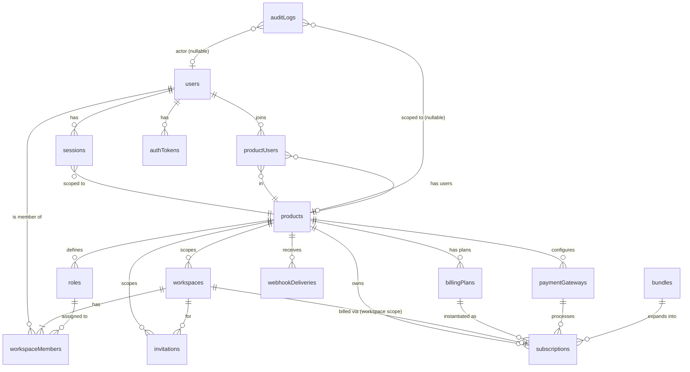

# YoCore — Complete System Design

**Version:** 1.0
**Date:** April 26, 2026
**Status:** ✅ Final — Implementation in progress
**Source documents:** [YoCore-PRD.md](YoCore-PRD.md), [YoCore-Flows.html](YoCore-Flows.html)

---

## Reading Guide

- `[MVP]` = ship in v1
- `[POST-MVP]` = schema is in place but flow/handler not built for v1
- All collections are MongoDB. ObjectIds are written as `ObjectId` in examples; in production use `_id` as the primary key (we use string typed IDs like `usr_xxx`, `ws_xxx` for human-readable cross-references — feel free to switch to plain ObjectIds, the relations are the same).
- Encryption: any field suffixed `Encrypted` is AES-256-GCM with a key from KMS / env (`YOCORE_KMS_KEY`). The ciphertext stores `{ iv, tag, ct }`.
- All hashes of secrets/tokens use SHA-256 (fast lookup, plus the secret has high entropy already). Passwords use Argon2id.

---

## Table of Contents

1. [MongoDB Schema](#1-mongodb-schema)
2. [Flow-by-Flow DB Impact (A–N)](#2-flow-by-flow-db-impact)
3. [ERD — Mermaid Diagram](#3-erd--mermaid-diagram)
4. [Collection × Flow Hit Matrix](#4-collection--flow-hit-matrix)
5. [Architectural Review & Improvements](#5-architectural-review--improvements)
6. [API Endpoint Summary](#6-api-endpoint-summary)

---

# 1. MongoDB Schema

## 1.1 `users` — Global identity anchor

One document per human. **Email is the only truly global field.** All profile, auth-credentials, and status live in `productUsers`. The sole exception is SUPER_ADMIN: because Super Admin has no product context, their `passwordHash` and auth-security fields stay here.

```js
{
  _id: "usr_01HXXX",                      // string ULID/snowflake; or ObjectId
  email: "karim@example.com",             // UNIQUE, lowercased, trimmed
  emailNormalized: "karim@example.com",   // for lookup (lowercase + dot-strip for gmail optionally)

  // Auth credentials — SUPER_ADMIN only. Always null for role:"END_USER".
  passwordHash: null,                     // Argon2id, m=19456, t=2, p=1  (SUPER_ADMIN only)
  passwordUpdatedAt: null,
  failedLoginAttempts: 0,                 // SUPER_ADMIN only
  lockedUntil: null,                      // SUPER_ADMIN only
  lastLoginAt: null,                      // SUPER_ADMIN only
  lastLoginIp: null,                      // SUPER_ADMIN only

  // Email verification — global because the email address itself is global.
  // Once an email is verified for any product, it is trusted globally.
  emailVerified: true,
  emailVerifiedAt: ISODate,
  emailVerifiedMethod: "email_link",      // email_link | invitation | oauth_google | oauth_github

  role: "END_USER",                       // SUPER_ADMIN | END_USER  (PRODUCT_ADMIN is in productUsers)

  createdAt: ISODate,
  updatedAt: ISODate,

  // Schema version for migration safety
  _v: 1
}
```

**Indexes**
```js
db.users.createIndex({ email: 1 }, { unique: true })
db.users.createIndex({ emailNormalized: 1 })
db.users.createIndex({ createdAt: -1 })
// FIX-G3: Only one SUPER_ADMIN can ever exist
db.users.createIndex({ role: 1 }, { unique: true, partialFilterExpression: { role: "SUPER_ADMIN" } })
```

**Design rationale (v1.3)**
- `passwordHash` is per-product (lives in `productUsers`). Each product has its own independent credential. A user can have different passwords for YoPM and YoSuite — or reset one without affecting the other.
- `emailVerified` stays global: the email address is the shared identity anchor. Once a user proves they own the email for any product, that proof is global. It prevents re-verification friction on subsequent product signups.
- `role:"SUPER_ADMIN"` is a platform-level concept with no product context, so its auth fields must stay in `users`. All END_USER auth data lives in `productUsers`.
- **FIX-AUTH-TIMING:** Signup handler always runs Argon2id hash (even on duplicate email) before returning — prevents email enumeration via timing.
- **FIX-ARGON2ID:** Argon2id `(m=19456, t=2, p=1)` ~80–120ms per hash. Run in a dedicated worker thread pool (`piscina` or `worker_threads`). Never block the main event loop.

---

## 1.2 `sessions` — Active auth sessions

One document per logged-in (user × product × device). Refresh tokens are stored as **hash only**.

```js
{
  _id: "ses_01HXXX",
  userId: "usr_01HXXX",
  productId: "prod_yopm",
  workspaceId: "ws_01HXXX",               // currently selected workspace; mutable on switch
  refreshTokenHash: "sha256:...",         // sha256 of opaque refresh token; UNIQUE
  refreshTokenFamilyId: "rtf_01HXXX",     // detect refresh-token reuse / theft
  jwtId: "jti_01HXXX",                    // current access JWT id; rotated on refresh
  rememberMe: false,

  device: {
    userAgent: "Mozilla/5.0 ...",
    ip: "203.0.113.5",
    fingerprint: "hash_of_ua_plus_ip",
    geo: { country: "BD", city: "Dhaka" }
  },

  createdAt: ISODate,
  lastUsedAt: ISODate,
  refreshExpiresAt: ISODate,              // 30d (or 7d if !rememberMe)
  revokedAt: null,                        // set on logout / forced revocation
  revokedReason: null                     // user_logout | admin | refresh_reuse | password_change
}
```

**Indexes**
```js
db.sessions.createIndex({ refreshTokenHash: 1 }, { unique: true })
db.sessions.createIndex({ userId: 1, productId: 1, revokedAt: 1 })
db.sessions.createIndex({ refreshExpiresAt: 1 }, { expireAfterSeconds: 0 })  // TTL cleanup
db.sessions.createIndex({ refreshTokenFamilyId: 1 })
```

**Notes**
- Access tokens (JWT, 15 min) are **stateless** — never stored. Revocation of access tokens is via short TTL + Redis `jwt:blocklist:<jti>` only when forced.
- Refresh-token-reuse detection: if a refresh token presented is already revoked but its `familyId` matches an active family → revoke the entire family + force re-login.

---

## 1.3 `authTokens` — One-time tokens

Email verify, password reset, email change, product join confirm, magic link.

```js
{
  _id: "atk_01HXXX",
  userId: "usr_01HXXX",
  productId: "prod_yopm",                 // optional; null for global account-level tokens
  type: "email_verify",                   // email_verify | password_reset | email_change | product_join_confirm | magic_link | pkce_code
  tokenHash: "sha256:...",                // never store raw token
  payload: {                              // type-specific
    newEmail: "newkarim@example.com"      // for email_change
  },
  expiresAt: ISODate,                     // 24h verify | 1h reset
  usedAt: null,                           // single-use guard
  createdAt: ISODate,
  ip: "203.0.113.5"
}
```

**Indexes**
```js
db.authTokens.createIndex({ tokenHash: 1 }, { unique: true })
db.authTokens.createIndex({ userId: 1, type: 1 })
db.authTokens.createIndex({ expiresAt: 1 }, { expireAfterSeconds: 0 })  // TTL purge
```

---

## 1.4 `products` — Registered Yo products

```js
{
  _id: "prod_yopm",
  name: "YoPM",
  slug: "yopm",                            // UNIQUE
  domain: "yopm.com",
  allowedOrigins: ["https://yopm.com", "https://app.yopm.com"],
  allowedRedirectUris: ["https://yopm.com/auth/callback"],
  logoUrl: "https://cdn.yo.com/logos/yopm.png",
  description: "Project management for indie teams",
  status: "ACTIVE",                        // INACTIVE | ACTIVE | MAINTENANCE | ABANDONED (YC-021 v1.8)
  // ABANDONED: blocks new signups/checkouts but existing users and subscriptions continue.
  // Set automatically by cron `product.abandoned.flag` (weekly, see API versioning §3.7) or
  // manually by Super Admin via `PATCH /v1/admin/products/:id { status: "ABANDONED" }`.
  abandonedAt: null,                       // set when status transitions to ABANDONED
  apiKeyLastUsedAt: ISODate,               // updated on every authenticated API request from this product

  // API credentials
  apiKey: "yc_live_pk_xxx",                // public-ish prefix; identifies product
  apiSecretHash: "sha256:...",             // raw secret shown ONCE at creation
  apiSecretCreatedAt: ISODate,
  apiSecretRotatedAt: null,

  // Webhook (YoCore → product)
  webhookUrl: "https://yopm.com/webhooks/yocore",
  webhookSecret: "whsec_xxx",              // shared secret used to sign payloads (HMAC-SHA256)
  webhookEvents: ["subscription.activated", "subscription.canceled", "user.created"],

  // Billing scope: subscriptions belong to the user OR to the workspace
  billingScope: "workspace",               // "user" | "workspace"

  billingConfig: {
    // Currency → gateway routing
    gatewayRouting: {
      usd: "stripe",
      eur: "stripe",                       // [POST-MVP] could route to paddle later
      bdt: "sslcommerz",
      default: "stripe"
    },

    // Per-product configurable lifecycle
    gracePeriodDays: 7,
    gracePeriodEmailSchedule: [1, 5, 7],
    holdPeriodDays: 85,
    holdPeriodWarningDays: [30, 60],
    canReactivateDuringHold: true,

    trialDefaultDays: 14,                  // default trial when plan doesn't specify
    trialWarningDays: [3, 1]               // days before trial end to email
  },

  // Onboarding / role defaults
  defaultRoleSlug: "MEMBER",               // role assigned to new productUsers

  // Auth UI mode — Super Admin toggles per product
  authConfig: {
    hostedUiEnabled: false,              // [MVP] false = product owns login/signup UI (calls API directly)
                                         //        true  = YoCore serves hosted pages at auth.yocore.io
    hostedUiTheme: {                     // only used when hostedUiEnabled: true
      primaryColor: "#6366f1",           // hex; applied to buttons / links on hosted pages
      logoUrl: null,                     // falls back to products.logoUrl
      brandName: null                    // falls back to products.name
    },
    allowedRedirectUris: [               // required when hostedUiEnabled: true (PKCE callback whitelist)
      "https://yopm.com/auth/callback"
    ],
    pkceEnabled: true                    // always true for hosted UI; S256 method enforced
  },

  // Per-product email sender config — PRD Decision 12
  settings: {
    fromEmail: null,                     // e.g. "noreply@yopm.com"; falls back to YoCore default if null
    fromName:  null                      // e.g. "YoPM Team"; falls back to products.name if null
  },

  createdAt: ISODate,
  updatedAt: ISODate,
  createdBy: "usr_superadmin"
}
```

**Indexes**
```js
db.products.createIndex({ slug: 1 }, { unique: true })
db.products.createIndex({ apiKey: 1 }, { unique: true })
db.products.createIndex({ status: 1 })
```

---

## 1.5 `productUsers` — User ↔ Product junction

The presence of this row = the user has joined the product. **All profile, credentials, and status are stored here — not in `users`.** Each product has a fully independent identity for the user.

```js
{
  _id: "pu_01HXXX",
  userId: "usr_01HXXX",
  productId: "prod_yopm",

  // Auth credentials — per-product (independent from other products)
  passwordHash: "$argon2id$v=19$...",     // Argon2id, m=19456, t=2, p=1
  passwordUpdatedAt: ISODate,

  // Profile — per-product
  name: { first: "Karim", last: "Rahman", display: "Karim Rahman" },
  avatarUrl: "https://cdn.yo.com/avatars/usr_01HXXX_yopm.png",
  timezone: "Asia/Dhaka",
  locale: "en-US",
  dateFormat: "DD/MM/YYYY",
  timeFormat: "24h",
  marketingOptIn: false,

  // Status — per-product
  status: "ACTIVE",                        // UNVERIFIED | ACTIVE | SUSPENDED | BANNED | DELETED

  // Auth security — per-product brute-force protection
  failedLoginAttempts: 0,
  lockedUntil: null,                       // ISODate; checked on signin for this product
  lastLoginAt: ISODate,
  lastLoginIp: "203.0.113.5",

  // Lifecycle
  joinedAt: ISODate,
  lastActiveAt: ISODate,
  onboarded: true,                         // product-specific onboarding completion
  deletedAt: null,                         // soft delete; hard-delete after retention window

  // Preferences — product-specific UI settings
  preferences: {
    notifications: { email: true, inApp: true },
    theme: "dark",
    favorites: []
  },

  // Role at the product level (not workspace level)
  productRole: "END_USER",                 // END_USER | PRODUCT_ADMIN

  createdAt: ISODate,
  updatedAt: ISODate
}
```

**Indexes**
```js
db.productUsers.createIndex({ userId: 1, productId: 1 }, { unique: true })
db.productUsers.createIndex({ productId: 1, status: 1, lastActiveAt: -1 })
db.productUsers.createIndex({ productId: 1, lockedUntil: 1 }, { sparse: true })  // lockout cron
```

**Isolation rule:** Every product-side API call MUST filter by `productId` (resolved from API key middleware). Password verification, lockout checks, and profile reads all use `productUsers` — never `users` directly for END_USER calls.

**Password reset scope:** Resetting a password via YoPM resets ONLY `productUsers.passwordHash` for `prod_yopm`. The user's YoSuite password is unaffected. Sessions are revoked only for the product the reset was triggered from.

---

## 1.6 `workspaces` — Teams / orgs scoped to a product

```js
{
  _id: "ws_01HXXX",
  productId: "prod_yopm",                  // INDEXED — every query scoped by this
  name: "Acme Corp",
  slug: "acme-corp",                       // UNIQUE within productId
  logoUrl: null,
  ownerUserId: "usr_01HXXX",
  billingContactUserId: "usr_01HXXX",      // can differ from owner

  status: "ACTIVE",                        // ACTIVE | SUSPENDED | DELETED
  suspended: false,                        // billing-driven flag (denormalized for fast reads)
  suspensionDate: null,                    // when status moved to SUSPENDED
  suspensionReason: null,                  // payment_failed | trial_expired | admin_action

  // Lifecycle warning flags (for cron idempotency)
  suspensionWarning30Sent: false,
  suspensionWarning60Sent: false,
  trialWarningSent: { days3: false, days1: false },
  trialConverted: false,                    // once true, trial-end cron skips this workspace

  // Permanent deletion
  dataDeleted: false,                       // set true on Day 85; data is purged
  dataDeletedAt: null,

  // Settings
  timezone: "Asia/Dhaka",
  settings: { },                            // flexible

  createdAt: ISODate,
  updatedAt: ISODate
}
```

**Indexes**
```js
db.workspaces.createIndex({ productId: 1, slug: 1 }, { unique: true })
db.workspaces.createIndex({ productId: 1, ownerUserId: 1 })
db.workspaces.createIndex({ suspended: 1, suspensionDate: 1 })  // cron lifecycle queries
db.workspaces.createIndex({ status: 1 })
```

---

## 1.7 `workspaceMembers` — Membership + role

```js
{
  _id: "wm_01HXXX",
  workspaceId: "ws_01HXXX",
  productId: "prod_yopm",                  // denormalized for fast scoping
  userId: "usr_01HXXX",
  roleId: "role_01HXXX",                   // FK → roles
  roleSlug: "ADMIN",                       // denormalized for fast permission checks
  status: "ACTIVE",                        // ACTIVE | INVITED | REMOVED
  addedBy: "usr_01HXXY",                   // user who added them (or null = self/owner)
  joinedAt: ISODate,
  removedAt: null,
  removedBy: null
}
```

**Indexes**
```js
db.workspaceMembers.createIndex({ workspaceId: 1, userId: 1 }, { unique: true })
db.workspaceMembers.createIndex({ userId: 1, productId: 1, status: 1 })
db.workspaceMembers.createIndex({ workspaceId: 1, status: 1 })  // seat counting
```

---

## 1.8 `roles` — Per-product role definitions

```js
{
  _id: "role_01HXXX",
  productId: "prod_yopm",
  slug: "ADMIN",                            // OWNER | ADMIN | MEMBER | VIEWER + custom
  name: "Administrator",
  description: "Can manage workspace settings and members.",
  isPlatform: true,                         // true = built-in (read-only) | false = custom
  isDefault: false,                          // true = assigned to new joiners
  permissions: [
    "workspace.read", "workspace.update",
    "member.invite", "member.remove",
    "billing.read"
  ],
  inheritsFrom: null,                       // optional roleId to inherit perms
  createdAt: ISODate,
  updatedAt: ISODate
}
```

**Indexes**
```js
db.roles.createIndex({ productId: 1, slug: 1 }, { unique: true })
```

---

## 1.9 `billingPlans` — Plan definitions per product

```js
{
  _id: "plan_01HXXX",
  productId: "prod_yopm",
  name: "Pro",
  slug: "pro",                              // UNIQUE within productId
  description: "For growing teams",

  isFree: false,
  amount: 2900,                             // smallest currency unit (cents/paisa)
  currency: "usd",                          // matches gatewayRouting key
  interval: "month",                         // month | year | one_time
  intervalCount: 1,
  trialDays: 14,

  // Gateway-specific price/plan IDs (flexible — add new gateway by adding key)
  gatewayPriceIds: {
    stripe: "price_1QXxx",
    sslcommerz: null,                       // SSLCommerz has no plan object
    paypal: null,                           // [POST-MVP] "P-1AB23..."
    paddle: null                            // [POST-MVP] "pri_01h..."
  },

  // Feature limits enforced by products
  limits: {
    maxWorkspaces: 5,                        // -1 = unlimited
    maxMembers: 25,
    maxProjects: -1,
    storageMb: 10240,
    custom: { }                              // product-defined extra limits
  },

  // Seat-based pricing
  seatBased: false,
  perSeatAmount: null,
  includedSeats: null,

  status: "ACTIVE",                          // DRAFT | ACTIVE | ARCHIVED
  visibility: "public",                      // public | private | grandfathered

  createdAt: ISODate,
  updatedAt: ISODate,
  createdBy: "usr_superadmin"
}
```

**Indexes**
```js
db.billingPlans.createIndex({ productId: 1, slug: 1 }, { unique: true })
db.billingPlans.createIndex({ productId: 1, status: 1, visibility: 1 })
```

---

## 1.10 `subscriptions` — Active/past subscriptions

Subject is either a `userId` (when `billingScope: "user"`) or a `workspaceId` (when `billingScope: "workspace"`). Exactly one of `subjectUserId` / `subjectWorkspaceId` is set.

```js
{
  _id: "sub_01HXXX",
  productId: "prod_yopm",
  planId: "plan_01HXXX",

  // Subject — exactly one is set based on product.billingScope
  subjectType: "workspace",                  // "user" | "workspace"
  subjectUserId: null,                       // set if subjectType === "user"
  subjectWorkspaceId: "ws_01HXXX",           // set if subjectType === "workspace"

  // Gateway tracking
  gateway: "stripe",                         // "stripe" | "sslcommerz" | "paypal" | "paddle" | null (free)
  gatewayRefs: {                             // flexible — only populated for active gateway
    // Stripe
    stripeCustomerId: "cus_xxx",
    stripeSubscriptionId: "sub_xxx",
    stripeLatestInvoiceId: "in_xxx",
    // SSLCommerz (Stripe still tracks calendar)
    sslcommerzTranId: null,
    sslcommerzValId: null,
    // PayPal [POST-MVP]
    paypalSubscriptionId: null,
    paypalOrderId: null,
    // Paddle [POST-MVP]
    paddleSubscriptionId: null,
    paddleCheckoutId: null,
    paddleTransactionId: null
  },

  // Status — single source of truth for "can the user use the product?"
  status: "ACTIVE",                          // TRIALING | ACTIVE | PAST_DUE | CANCELED | INCOMPLETE | PAUSED
  cancelAtPeriodEnd: false,
  canceledAt: null,
  cancelReason: null,

  // Billing periods
  currentPeriodStart: ISODate,
  currentPeriodEnd: ISODate,
  trialStartsAt: null,
  trialEndsAt: null,

  // Seat-based
  quantity: 1,                                // seats currently billed

  // Lifecycle flags (for cron idempotency)
  paymentFailedAt: null,
  graceEmailsSent: { day1: false, day5: false, day7: false },

  // Money (denormalized for reporting; source of truth = gateway invoice)
  amount: 2900,
  currency: "usd",

  // Plan grandfathering (v1.7 — NEW)
  // Populated on subscription creation; never updated unless subscriber explicitly changes plan.
  // Products can compare planLimitsSnapshot vs current billingPlan.limits to check drift.
  planVersion: 3,                             // billingPlans._v at subscribe time
  planSnapshotAt: ISODate,                    // when planLimitsSnapshot was last locked
  planLimitsSnapshot: {                       // deep-copy of billingPlans.limits at subscribe time
    // e.g. maxMembers: 10, maxProjects: -1, storageMb: 5120, apiCallsPerMonth: 50000
    // structure mirrors billingPlans.limits — product-defined; stored opaque
  },

  // Idempotency
  lastWebhookEventId: null,                   // last gateway event_id processed
  lastWebhookProcessedAt: null,

  createdAt: ISODate,
  updatedAt: ISODate
}
```

**Indexes**
```js
db.subscriptions.createIndex({ productId: 1, subjectWorkspaceId: 1, status: 1 })
db.subscriptions.createIndex({ productId: 1, subjectUserId: 1, status: 1 })
db.subscriptions.createIndex({ "gatewayRefs.stripeSubscriptionId": 1 }, { sparse: true, unique: true })
db.subscriptions.createIndex({ "gatewayRefs.paypalSubscriptionId": 1 }, { sparse: true, unique: true })
db.subscriptions.createIndex({ "gatewayRefs.paddleSubscriptionId": 1 }, { sparse: true, unique: true })
db.subscriptions.createIndex({ status: 1, currentPeriodEnd: 1 })       // renewal/expiry cron
db.subscriptions.createIndex({ status: 1, trialEndsAt: 1 })            // trial cron
db.subscriptions.createIndex({ status: 1, paymentFailedAt: 1 })        // grace cron
```

---

## 1.11 `paymentGateways` — Per-product gateway config

Provider-agnostic credentials. Adding a new gateway = inserting a row + writing a handler. **No schema migration ever.**

```js
{
  _id: "pg_01HXXX",
  productId: "prod_yopm",
  provider: "stripe",                        // "stripe" | "sslcommerz" | "paypal" | "paddle"
  mode: "live",                              // "live" | "test"
  status: "ACTIVE",                          // ACTIVE | DISABLED | INVALID_CREDENTIALS
  displayName: "Stripe — Production",

  // Flexible per-provider credentials, all encrypted (AES-256-GCM)
  credentialsEncrypted: {
    // Stripe
    secretKey: { iv, tag, ct },             // sk_live_xxx
    webhookSecret: { iv, tag, ct }          // whsec_xxx

    // SSLCommerz example shape
    // storeId: { ... },
    // storePasswd: { ... },
    // webhookSecret: { ... }

    // PayPal [POST-MVP]
    // clientId, clientSecret, webhookId

    // Paddle [POST-MVP]
    // vendorId, vendorAuthCode, webhookSecret, publicKey
  },

  // Last credential test result
  lastVerifiedAt: ISODate,
  lastVerificationStatus: "ok",              // ok | failed
  lastVerificationError: null,

  createdAt: ISODate,
  updatedAt: ISODate,
  createdBy: "usr_superadmin"
}
```

**Indexes**
```js
db.paymentGateways.createIndex({ productId: 1, provider: 1, mode: 1 }, { unique: true })
db.paymentGateways.createIndex({ productId: 1, status: 1 })
```

**Security**
- The plaintext secret is **never** logged or returned via API. The Super Admin UI shows masked values only after creation.
- Decryption only inside the gateway handler at request time; result lives in memory for that call.

---

## 1.12 `invitations` — Workspace invitations

```js
{
  _id: "inv_01HXXX",
  productId: "prod_yopm",
  workspaceId: "ws_01HXXX",
  email: "newuser@example.com",              // lowercased
  roleId: "role_member",
  roleSlug: "MEMBER",
  invitedBy: "usr_01HXXX",
  tokenHash: "sha256:...",                   // raw token only emailed; never in DB
  isExistingUser: false,                     // resolved at send time; informs link target
  status: "PENDING",                          // PENDING | ACCEPTED | EXPIRED | REVOKED
  expiresAt: ISODate,                         // now + 72h
  createdAt: ISODate,
  acceptedAt: null,
  acceptedByUserId: null,
  revokedAt: null,
  revokedBy: null,
  resendCount: 0,
  lastSentAt: ISODate
}
```

**Indexes**
```js
db.invitations.createIndex({ tokenHash: 1 }, { unique: true })
db.invitations.createIndex({ workspaceId: 1, email: 1, status: 1 })
db.invitations.createIndex({ expiresAt: 1 }, { expireAfterSeconds: 0 })  // auto-purge
db.invitations.createIndex({ status: 1, expiresAt: 1 })
```

---

## 1.13 `webhookDeliveries` — YoCore → Product event log

```js
{
  _id: "whd_01HXXX",
  productId: "prod_yopm",
  event: "subscription.activated",
  eventId: "evt_01HXXX",                      // idempotency key the product sees
  url: "https://yopm.com/webhooks/yocore",
  payloadRef: "evt_01HXXX",                   // FIX-STORAGE: store gateway eventId reference only, NOT full body
  // Full payload stored compressed in S3: s3://yocore-webhooks/<productId>/<eventId>.json.gz
  // Retrieve on-demand via GET /v1/admin/webhook-deliveries/:id/payload
  signatureHeader: "t=...,v1=...",            // sent in `YoCore-Signature` header
  status: "DELIVERED",                         // PENDING | DELIVERED | FAILED | DEAD
  attempts: [
    { at: ISODate, statusCode: 200, durationMs: 142, error: null }
  ],
  attemptCount: 1,
  nextRetryAt: null,                            // exponential backoff: 30s, 5m, 30m, 2h, 6h
  deliveredAt: ISODate,
  createdAt: ISODate
}
```

**Indexes**
```js
db.webhookDeliveries.createIndex({ productId: 1, status: 1, nextRetryAt: 1 })
db.webhookDeliveries.createIndex({ eventId: 1 }, { unique: true })
db.webhookDeliveries.createIndex({ createdAt: 1 }, { expireAfterSeconds: 7776000 })  // 90d retention
```

---

## 1.14 `auditLogs` — Immutable event trail

Append-only. Never updated. Used for compliance (SOC 2 / future).

```js
{
  _id: "log_01HXXX",
  ts: ISODate,                                  // event time
  productId: "prod_yopm",                        // null for platform-level (super admin)
  workspaceId: "ws_01HXXX",                      // optional
  actor: {
    type: "user",                                // user | super_admin | product (api_key) | system | webhook
    id: "usr_01HXXX",
    ip: "203.0.113.5",
    userAgent: "...",
    apiKeyId: null                               // when actor is product
  },
  action: "subscription.created",                // dotted namespace; closed enum maintained in code
  resource: { type: "subscription", id: "sub_01HXXX" },
  outcome: "success",                            // success | failure | denied
  reason: null,                                  // populated on failure/denied
  metadata: { /* action-specific */ },
  // Tamper detection
  prevHash: "sha256:...",                        // hash of previous log entry for the same productId
  hash: "sha256:..."                             // hash(prevHash + canonical(this))
}
```

**Indexes**
```js
db.auditLogs.createIndex({ productId: 1, ts: -1 })
db.auditLogs.createIndex({ "actor.id": 1, ts: -1 })
db.auditLogs.createIndex({ action: 1, ts: -1 })
db.auditLogs.createIndex({ "resource.type": 1, "resource.id": 1, ts: -1 })
```

**Compliance notes**
- Hash chain (`prevHash` → `hash`) gives tamper-evidence per product.
- Retention: 7 years for billing-related actions, 2 years for auth.
- **FIX-AUDIT-COMPLETENESS:** Actor must include `sessionId` and `correlationId` (request trace ID) on every log entry. State-change entries must include `before`/`after` snapshots for billing-relevant actions (plan changes, cancellations, suspensions).
- **FIX-ARCHIVAL-CHUNKING:** Background archival job runs daily, processes max 10,000 rows per run (cursor-paginated, keyed on `_id`), compresses to gzip and uploads to `s3://yocore-auditlogs/<productId>/YYYY/MM/DD/<batch_id>.json.gz`. Tracks progress in `cronLocks` with `{jobName:"auditlog.archive", dateKey}`. Never deletes from Mongo before S3 upload is confirmed (verify via `HeadObject`).

---

## 1.15 `bundles` — Cross-product packages (v1.6 expanded)

```js
{
  _id: "bdl_01HXXX",
  name: "Yo Power Bundle",
  slug: "yo-power-bundle",
  description: "YoSuite Business + YoHM Pro + YoCRM Starter — save 33%",
  heroImageUrl: "https://cdn.yocore.io/bundles/yo-power.png",

  components: [
    { productId: "prod_yosuite", planId: "plan_yosuite_biz" },
    { productId: "prod_yohm",    planId: "plan_yohm_pro" },
    { productId: "prod_yocrm",   planId: "plan_yocrm_starter" }
  ],

  // === Pricing ===
  pricingModel: "fixed",                         // "fixed" | "percent_discount" | "per_component_override"
  amount: 4900,                                  // cents — only when pricingModel="fixed"
  percentDiscount: null,                         // 0–100 — only when pricingModel="percent_discount"
  componentPriceOverrides: [                     // only when pricingModel="per_component_override"
    // { productId, amount } — sum must equal computed bundle price
  ],
  currency: "usd",                               // primary/default currency

  // === Per-currency variants (v1.6) ===
  currencyVariants: [
    {
      currency: "usd",
      amount: 4900,
      gatewayPriceIds: { stripe: "price_usd_xxx", sslcommerz: null, paypal: null, paddle: null }
    },
    {
      currency: "bdt",
      amount: 399900,                            // ৳3,999.00
      gatewayPriceIds: { stripe: null, sslcommerz: "sslc_bdt_xxx", paypal: null, paddle: null }
    }
  ],

  interval: "month",                             // "month" | "year"
  intervalCount: 1,

  // === Trial (bundle-wide; not per-component) ===
  trialDays: 0,

  // === Per-component seat overrides (v1.6, P1) ===
  componentSeats: {                              // map productId → included seat count for that component
    // "prod_yosuite": 5,
    // omitted = use plan default
  },

  // === Eligibility & conflict resolution (v1.6) ===
  eligibilityPolicy: "block",                    // "block" | "cancel_and_credit" | "replace_immediately"

  // === Visibility (v1.6) ===
  visibility: "public",                          // "public" | "unlisted" | "private"
  grantedAccess: [],                             // [{userId|workspaceId, grantedBy, grantedAt}] — only for visibility="private"

  // === Limits ===
  maxRedemptions: null,                          // null = unlimited; otherwise hard cap across all users
  redemptionCount: 0,                            // monotonic; incremented on bundle.subscription.activated

  // === Lifecycle ===
  status: "ACTIVE",                              // DRAFT | ACTIVE | ARCHIVED
  startsAt: ISODate,
  endsAt: null,

  // === Audit (v1.6 — see Flow AL) ===
  changeHistory: [
    // { at: ISODate, actor: "usr_superadmin", action: "published"|"price_updated"|"component_swapped"|"archived"|...,
    //   before: { ...snapshot }, after: { ...snapshot }, correlationId: "req_xxx" }
  ],

  metadata: {},                                  // free-form for marketing analytics

  createdAt: ISODate,
  createdBy: "usr_superadmin",
  updatedAt: ISODate,
  publishedAt: null,                             // set on first DRAFT→ACTIVE transition
  archivedAt: null,
  _v: 2                                          // schema version (was 1 in v1.5)
}
```

**Indexes**
```js
db.bundles.createIndex({ slug: 1 }, { unique: true })
db.bundles.createIndex({ status: 1 })
db.bundles.createIndex({ visibility: 1, status: 1 })
db.bundles.createIndex({ "components.productId": 1, status: 1 })
db.bundles.createIndex({ "grantedAccess.userId": 1 }, { sparse: true })
db.bundles.createIndex({ "grantedAccess.workspaceId": 1 }, { sparse: true })
```

**Validation rules (enforced at API + Mongo `$jsonSchema`):**
- `components.length` between 2 and 10.
- All `components[].productId` resolve to ACTIVE products with the **same** `billingScope`.
- All `components[].planId` resolve to PUBLISHED plans owned by their respective product.
- Exactly one of `amount` (FIXED), `percentDiscount` (PERCENT_DISCOUNT), `componentPriceOverrides` (PER_COMPONENT_OVERRIDE) per `pricingModel`.
- `currencyVariants` contains at least one entry; each `currency` is unique within the array.
- For each `currencyVariants[i]`, at least one `gatewayPriceIds.*` is non-null when `status="ACTIVE"` (enforced at publish, not at draft).
- `componentSeats` keys must all exist in `components[].productId`.
- `grantedAccess` is empty unless `visibility="private"`.
- `redemptionCount <= maxRedemptions` when `maxRedemptions` is set.

A subscription created from a bundle has `subscriptions.bundleSubscriptionId` set so individual product subs know they're "bundle-derived" and shouldn't be canceled independently. See [§5.7](#57-bundles--subscriptions).

---

## 1.16 `webhookEventsProcessed` — Inbound webhook dedup 🆕 FIX-G1

Prevents double-processing when gateways deliver the same event twice (Stripe guarantees at-least-once delivery).

```js
{
  _id: "wep_01HXXX",
  provider: "stripe",                        // "stripe" | "sslcommerz" | "paypal" | "paddle"
  eventId: "evt_1QXxx",                      // gateway-issued event/transaction ID
  productId: "prod_yopm",
  processedAt: ISODate,
  handlerAction: "subscription.activated"    // what action was taken (for debugging)
}
```

**Indexes**
```js
// FIX-G1: Unique constraint is the idempotency lock
db.webhookEventsProcessed.createIndex({ provider: 1, eventId: 1 }, { unique: true })
db.webhookEventsProcessed.createIndex({ processedAt: 1 }, { expireAfterSeconds: 7776000 })  // 90d TTL
```

**Usage pattern — every webhook handler:**
```js
// Step 1: Try to claim the event
try {
  await db.webhookEventsProcessed.insertOne({ provider, eventId, productId, processedAt: now, handlerAction });
} catch (e) {
  if (e.code === 11000) return res.status(200).send('already processed'); // idempotent
  throw e;
}
// Step 2: Redis belt-and-suspenders (catches burst before Mongo write flushes)
// SET lock:webhook:<provider>:<eventId> 1 NX EX 30 → if 0, return 200 immediately
// Step 3: Only now run the actual business logic
```

**SSLCommerz note:** SSLCommerz does not have a globally unique event ID. Use `tran_id` (merchant-generated UUID) as the `eventId`. Ensure `tran_id` is a UUID generated by YoCore at J4.5, stored in `subscriptions.gatewayRefs.sslcommerzTranId`, and used for the dedup check.

---

## 1.17 `cronLocks` — Distributed cron idempotency 🆕 FIX-CRON

Prevents multiple server instances running the same cron job simultaneously.

```js
{
  _id: "cronlock_01HXXX",
  jobName: "billing.grace.tick",             // unique job identifier
  dateKey: "2026-04-22",                     // YYYY-MM-DD (or YYYY-MM-DD-HH for hourly)
  lockedAt: ISODate,
  lockedByInstanceId: "instance_abc123",    // server instance ID from env
  completedAt: null,                         // set when job finishes successfully
  error: null                                // set on failure
}
```

**Indexes**
```js
db.cronLocks.createIndex({ jobName: 1, dateKey: 1 }, { unique: true })
db.cronLocks.createIndex({ lockedAt: 1 }, { expireAfterSeconds: 86400 })  // auto-purge after 24h
```

**Usage pattern:**
```js
// At start of every cron job:
try {
  await db.cronLocks.insertOne({ jobName, dateKey, lockedAt: now, lockedByInstanceId: INSTANCE_ID });
} catch (e) {
  if (e.code === 11000) return; // another instance already ran this job today
  throw e;
}
// ... run job logic ...
await db.cronLocks.updateOne({ jobName, dateKey }, { $set: { completedAt: now } });
```

Redis `SET lock:cron:<jobName>:<dateKey> 1 NX EX 3600` is the fast-path check before the Mongo insert.

---

## 1.18 `mfaFactors` — TOTP secrets + recovery codes 🆕 v1.4

Required for SUPER_ADMIN, optional for END_USER.

```js
{
  _id: "mfa_01HXXX",
  userId: "usr_01HXXX",
  productId: null,                          // null for SUPER_ADMIN; productId for END_USER per-product MFA
  type: "totp",                             // "totp" | "recovery_code"

  // TOTP fields (type:"totp")
  secretEncrypted: { iv, tag, ct },         // AES-256-GCM, base32 secret inside
  issuer: "YoCore",                         // shown in authenticator app
  accountLabel: "admin@yo.com",             // shown in authenticator app
  algorithm: "SHA1",                        // RFC 6238 default
  digits: 6,
  period: 30,
  verifiedAt: ISODate,                      // null until first successful TOTP verify
  lastUsedAt: ISODate,
  lastUsedCounter: 1234567,                 // unix/30s — prevents same-window replay

  // Recovery code fields (type:"recovery_code")
  codeHash: "argon2id$...",                 // single recovery code (one doc per code, 10 docs at enrollment)
  usedAt: null,                             // single-use guard

  createdAt: ISODate,
  updatedAt: ISODate
}
```

**Indexes**
```js
db.mfaFactors.createIndex({ userId: 1, productId: 1, type: 1 })
db.mfaFactors.createIndex({ userId: 1, type: 1, verifiedAt: 1 })
// One verified TOTP per (user, product)
db.mfaFactors.createIndex(
  { userId: 1, productId: 1, type: 1 },
  { unique: true, partialFilterExpression: { type: "totp", verifiedAt: { $ne: null } } }
)
```

**Notes**
- Replay guard: `lastUsedCounter` stores the 30-second window of the last accepted code. Reject if presented code's counter ≤ stored counter.
- Recovery code regeneration: when consumed, mark `usedAt`. When user re-enrolls (lost authenticator), all `recovery_code` docs deleted + 10 fresh ones inserted.
- Bootstrap script enforces TOTP enrollment before granting first SUPER_ADMIN session.

---

## 1.19 `dataExportJobs` — GDPR data export queue 🆕 v1.4

```js
{
  _id: "exp_01HXXX",
  userId: "usr_01HXXX",
  scope: "all",                             // "all" | array of productIds e.g. ["prod_yopm"]
  status: "PENDING",                        // PENDING | RUNNING | COMPLETE | FAILED
  s3Key: null,                              // s3://yocore-exports/<userId>/<jobId>.json.gz once complete
  s3SignedUrlExpiresAt: null,               // 7 days from completion
  errorMessage: null,
  startedAt: null,
  completedAt: null,
  emailSentAt: null,
  requestedFromIp: "203.0.113.5",
  createdAt: ISODate,
  _v: 1
}
```

**Indexes**
```js
db.dataExportJobs.createIndex({ userId: 1, status: 1, createdAt: -1 })
db.dataExportJobs.createIndex({ status: 1, createdAt: 1 })   // worker pickup
db.dataExportJobs.createIndex({ createdAt: 1 }, { expireAfterSeconds: 2592000 }) // 30d TTL
```

**Cooldown enforcement (24h):** before insert, count `{userId, createdAt: {$gte: now-24h}}`. If ≥1 PENDING/COMPLETE → reject `429 export_cooldown`.

---

## 1.20 `deletionRequests` — Soft-delete grace tracking 🆕 v1.4

One row per pending deletion (user-initiated). Cron `gdpr.deletion.tick` finalizes after 30 days.

```js
{
  _id: "del_01HXXX",
  userId: "usr_01HXXX",
  scope: "product",                         // "product" | "account"
  productId: "prod_yopm",                   // null when scope:"account"
  requestedAt: ISODate,
  finalizeAt: ISODate,                      // requestedAt + 30d
  status: "PENDING",                        // PENDING | CANCELED | FINALIZED | BLOCKED
  blockedReason: null,                      // "active_subscription" | "workspace_ownership" | null
  blockedDetails: { },                      // e.g. {workspaceIds:[...]}
  canceledAt: null,                         // user re-activated within 30d
  finalizedAt: null,
  finalizedByCronRun: null,                 // dateKey of cron run that finalized
  createdAt: ISODate,
  _v: 1
}
```

**Indexes**
```js
db.deletionRequests.createIndex({ userId: 1, status: 1 })
db.deletionRequests.createIndex({ status: 1, finalizeAt: 1 })   // cron query
db.deletionRequests.createIndex(
  { userId: 1, productId: 1 },
  { unique: true, partialFilterExpression: { status: "PENDING" } }
)
```

---

## 1.21 `jwtSigningKeys` — JWT key rotation registry 🆕 v1.4

Dual-keyring strategy: at any moment, exactly one key is `active` (used to sign new JWTs) and 0–N keys are `verifying` (still accepted on incoming verification until their `verifyUntil` passes).

```js
{
  _id: "kid_01HXXX",                        // also used as `kid` claim in JWT header
  algorithm: "EdDSA",                       // EdDSA (Ed25519) preferred; RS256 fallback
  publicKey: "-----BEGIN PUBLIC KEY-----\n...",
  privateKeyEncrypted: { iv, tag, ct },     // AES-256-GCM via KMS key
  status: "active",                         // active | verifying | retired
  activatedAt: ISODate,
  rotatedAt: null,                          // when status moved to verifying
  verifyUntil: null,                        // when verifying → retired (= max access-token TTL × 2 = 30 min)
  retiredAt: null,
  createdAt: ISODate,
  _v: 1
}
```

**Indexes**
```js
db.jwtSigningKeys.createIndex({ status: 1, activatedAt: -1 })
db.jwtSigningKeys.createIndex(
  { status: 1 },
  { unique: true, partialFilterExpression: { status: "active" } }
)
```

**Rotation procedure (Flow Y):**
1. Generate new keypair.
2. Insert `{status:"active", activatedAt:now}`.
3. Old active row → `{status:"verifying", rotatedAt:now, verifyUntil:now+30m}`.
4. Wait `verifyUntil`. Cron `jwt.key.retire` flips `verifying → retired` after expiry.
5. Retired keys retained 90 days for audit log signature verification, then purged.

**Loaded once per minute** into in-memory keyring on every API node. JWT verification iterates active + verifying keys until match (`kid` header pinpoints which).

---

## 1.22 `emailQueue` — Outbound mail with retry 🆕 v1.4

```js
{
  _id: "mq_01HXXX",
  productId: "prod_yopm",                   // null for Super Admin / system mail
  userId: "usr_01HXXX",                     // null for system broadcast
  toAddress: "karim@example.com",
  fromAddress: "noreply@yopm.com",
  fromName: "YoPM Team",
  subject: "Verify your email",
  templateId: "auth.verify",                // matches src/emails/* React Email template
  templateData: { name: "Karim", verifyUrl: "https://..." },

  provider: "resend",                       // "resend" | "ses"
  providerMessageId: null,                  // set after send
  status: "PENDING",                        // PENDING | SENT | FAILED | DEAD
  attempts: [
    { at: ISODate, provider: "resend", statusCode: 503, error: "rate_limited" }
  ],
  attemptCount: 0,
  nextAttemptAt: ISODate,                   // 1m, 5m, 30m, 2h, 6h backoff
  sentAt: null,
  failedAt: null,                           // DEAD = 5 attempts failed
  priority: "normal",                       // critical | normal | bulk
  category: "transactional",                // transactional | billing | marketing | security
  createdAt: ISODate,
  _v: 1
}
```

**Indexes**
```js
db.emailQueue.createIndex({ status: 1, nextAttemptAt: 1, priority: 1 })
db.emailQueue.createIndex({ providerMessageId: 1 }, { sparse: true })
db.emailQueue.createIndex({ userId: 1, category: 1, createdAt: -1 })
db.emailQueue.createIndex({ createdAt: 1 }, { expireAfterSeconds: 7776000 }) // 90d TTL
```

**Suppression check:** Before insert, look up `productUsers.emailDeliverable`. If `false` AND `category != "security"` → skip insert + log to `auditLogs`.

---

## 1.23 `emailEvents` — Inbound delivery webhooks (Resend / SES) 🆕 v1.4

```js
{
  _id: "evt_01HXXX",
  provider: "resend",
  providerMessageId: "msg_01HXXX",
  toAddress: "karim@example.com",
  userId: "usr_01HXXX",
  productId: "prod_yopm",
  event: "delivered",                        // delivered | bounced | complained | opened | clicked
  bounceType: null,                          // "hard" | "soft" | null
  ts: ISODate,
  rawPayload: { },                           // gateway-specific
  createdAt: ISODate,
  _v: 1
}
```

**Indexes**
```js
db.emailEvents.createIndex({ providerMessageId: 1, event: 1 })
db.emailEvents.createIndex({ userId: 1, event: 1, ts: -1 })
db.emailEvents.createIndex({ createdAt: 1 }, { expireAfterSeconds: 15552000 }) // 180d TTL
```

**Reputation handler:**
- `event:"bounced"` AND `bounceType:"hard"` → `productUsers.emailDeliverable = false`.
- `event:"complained"` → `productUsers.marketingOptIn = false` + audit log entry.

---

# 2. Flow-by-Flow DB Impact

Conventions:
- **R** = Read, **W** = Insert, **U** = Update, **D** = Delete
- Field lists in `{ }` show **which fields are accessed/written** — not the full schema
- All Redis ops follow the naming convention from [§5.8]
- External API calls in _italics_
- Flows A–N = original scope; Flows O–T = additions covering the full user journey

---

## Coverage map

| Flow | Topic | Status |
|------|-------|--------|
| A–N | Original flows | ✅ Upgraded — all DB columns show field-level detail |
| H3 | Logout (single + all sessions) | 🆕 Added |
| O | Forgot password / reset password | 🆕 Added |
| P | Email change | 🆕 Added |
| Q | SSO cross-product login | ❌ Removed (v1.3 — no SSO, per-product identity model) |
| R | Plan upgrade / downgrade | 🆕 Added |
| S | Seat change (seat-based plans) | 🆕 Added |
| T | Bundle checkout | 🆕 Added |
| U | Hosted Auth redirect + PKCE exchange | 🆕 Added |
| V | Super Admin MFA enrollment + signin | 🆕 v1.4 |
| W | GDPR data export | 🆕 v1.4 |
| X | Account / per-product self-deletion + Day 30 finalization | 🆕 v1.4 |
| Y | JWT signing key rotation | 🆕 v1.4 |

---

## Flow A — Super Admin: Signup → Login → Dashboard

| Step | Endpoint | Action | DB — fields touched | Redis | External |
|------|----------|--------|---------------------|-------|----------|
| A1 | `POST /v1/admin/bootstrap` | First-run. Header `X-Bootstrap-Secret` MUST equal env `BOOTSTRAP_SECRET` (random 64-byte hex, set once in Secrets Manager, never rotated except by manual ops). Verify no SUPER_ADMIN exists, create account. Account is in `mfa_enrollment_required` state — no session issued yet. | `users` R `{role}` (abort if SUPER_ADMIN exists) → `users` W `{_id, email, emailNormalized, passwordHash, name, status:"ACTIVE", emailVerified:true, role:"SUPER_ADMIN", failedLoginAttempts:0, mfaEnrolledAt:null, createdAt, _v:1}` → `auditLogs` W `{action:"user.bootstrap", actor:{type:"system"}, outcome:"success"}` | — | — |
| A1b | `POST /v1/admin/mfa/enroll` | One-time TOTP setup. Generates secret, returns provisioning URI for authenticator app QR. | `mfaFactors` W `{userId, type:"totp", secretEncrypted, verifiedAt:null, createdAt}` | — | — |
| A1c | `POST /v1/admin/mfa/verify-enrollment {totp}` | User scans QR + enters code. On match, generates 10 recovery codes (returned ONCE). | `mfaFactors` U `{verifiedAt:now, lastUsedCounter:counter}` → `mfaFactors` W ×10 `{type:"recovery_code", codeHash:argon2id, usedAt:null}` → `users` U `{mfaEnrolledAt:now}` → `auditLogs` W `{action:"user.mfa.enrolled"}` | — | — |
| A2 | `POST /v1/auth/signin` (admin) | Two-step: 1) email + password → issues short-lived `mfa_pending_token` (60s, JWT, scope=`mfa_required`). 2) `POST /v1/auth/signin/mfa {mfaPendingToken, totp}` validates TOTP (or recovery code), then mints JWT 15m + refresh 30d. | `users` R `{email, passwordHash, role, mfaEnrolledAt}` → `mfaFactors` R `{type:"totp", verifiedAt, lastUsedCounter, secretEncrypted}` → verify TOTP (window ±1 step tolerance) → `mfaFactors` U `{lastUsedAt:now, lastUsedCounter:counter}` → `users` U `{lastLoginAt:now, lastLoginIp, failedLoginAttempts:0, lockedUntil:null}` → `sessions` W `{userId, productId:null, refreshTokenHash, refreshTokenFamilyId, jwtId, device, createdAt, refreshExpiresAt:now+30d, mfaVerifiedAt:now}` → `auditLogs` W `{action:"user.signin", actor:{type:"super_admin",sessionId,correlationId}, outcome:"success", metadata:{mfaMethod:"totp"}}` | INCR `ratelimit:signin:<ip>` (5/15 min) + INCR `ratelimit:mfa:<userId>` (10/15 min) | — |
| A3 | `GET /v1/admin/dashboard` | Aggregations across all products. | `products` R `{_id, name, status, createdAt}` → `subscriptions` aggregate R `{productId, status, amount, currency}` → SUM `amount WHERE status:"ACTIVE"` per product (MRR) → `productUsers` R `{productId}` → COUNT by `productId` | GET `cache:dashboard:overview` (60s TTL; miss → compute + SET). **FIX-DASHBOARD:** Cache miss triggers background recompute job (not blocking request). On first-ever load, returns `{status:"computing"}` and streams result via SSE or polling. Aggregations must use `allowDiskUse:true` and run on MongoDB secondary replica to avoid blocking primary. | — |

**Error path:** Wrong password → `users` U `{failedLoginAttempts:+1}`. At 5 → U `{lockedUntil:now+15m}` + `auditLogs` W `{outcome:"failure", reason:"lockout_triggered"}` + send locked email.

---

## Flow B — Super Admin: Register a New Product

| Step | Endpoint | Action | DB — fields touched | Redis | External |
|------|----------|--------|---------------------|-------|----------|
| B1 | `POST /v1/admin/products` | Validate slug unique, generate credentials. | `products` R `{slug}` (uniqueness check) → `products` W `{_id:"prod_xxx", name, slug, domain, allowedOrigins, logoUrl, apiKey:"yc_live_pk_...", apiSecretHash:"sha256:...", apiSecretCreatedAt:now, status:"INACTIVE", billingScope, billingConfig:{gatewayRouting:{},gracePeriodDays:7,...}, defaultRoleSlug:"MEMBER", webhookUrl, webhookEvents:[], createdAt, createdBy}` → `auditLogs` W `{action:"product.created", resource:{type:"product",id}}` | — | — |
| B2 | (same txn) | Seed 4 platform roles. | `roles` W ×4 `{productId, slug:"OWNER"\|"ADMIN"\|"MEMBER"\|"VIEWER", name, isPlatform:true, isDefault:false, permissions:[...], createdAt}` | — | — |
| B3 | Response | Return plaintext `apiSecret` once only. | — | — | — |
| B4 | `PATCH /v1/admin/products/:id` | Activate. | `products` U `{status:"ACTIVE", updatedAt}` → `auditLogs` W `{action:"product.activated"}` | DEL `cache:product:apikey:<apiKey>` | — |

---

## Flow C — Super Admin: Configure Payment Gateways

### C1 — Add Stripe
| Step | Action | DB — fields touched | External |
|------|--------|---------------------|----------|
| C1.1 | Encrypt credentials (AES-256-GCM, in memory) | — | — |
| C1.2 | Verify API key | — | *Stripe `GET /v1/account` — must 200* |
| C1.3 | Persist encrypted config | `paymentGateways` W `{productId, provider:"stripe", mode:"live", status:"ACTIVE", credentialsEncrypted:{secretKey:{iv,tag,ct}, webhookSecret:{iv,tag,ct}}, lastVerifiedAt:now, lastVerificationStatus:"ok", createdAt, createdBy}` → `auditLogs` W `{action:"gateway.created", resource:{type:"paymentGateway",id}, metadata:{provider:"stripe"}}` | — |

**Failure:** C1.2 fails → `auditLogs` W `{outcome:"failure", reason:"credential_verify_failed"}`. Do **not** insert `paymentGateways` row.

### C2 — Add SSLCommerz
Same as C1; `credentialsEncrypted: {storeId:{iv,tag,ct}, storePasswd:{iv,tag,ct}, webhookSecret:{iv,tag,ct}}`. Verify via SSLCommerz test session.

### C3 — Add PayPal `[POST-MVP]`
Schema row created with `credentialsEncrypted: { clientId, clientSecret, webhookId }`. UI shows "Coming Soon" pill. No checkout flow wired.

### C4 — Add Paddle `[POST-MVP]`
Same — `{ vendorId, vendorAuthCode, webhookSecret, publicKey }`.

### C5 — Configure routing
`PATCH /v1/admin/products/:id/billing-config` →
`products` U `{billingConfig.gatewayRouting:{usd:"stripe",bdt:"sslcommerz",default:"stripe"}, updatedAt}` → `auditLogs` W `{action:"product.billingConfig.updated", metadata:{changed:["gatewayRouting"]}}`. Invalidate `cache:product:apikey:<apiKey>`.

---

## Flow D — Super Admin: Create a Billing Plan

| Step | Endpoint | DB — fields touched | External |
|------|----------|--------------------|----------|
| D1 | `POST /v1/admin/products/:id/plans` | `billingPlans` W `{productId, name, slug, amount, currency, interval, intervalCount:1, trialDays, gatewayPriceIds:{stripe:null,sslcommerz:null,paypal:null,paddle:null}, limits:{maxWorkspaces,maxMembers,maxProjects,storageMb,custom:{}}, seatBased:false, status:"DRAFT", visibility:"public", createdAt, createdBy}` | — |
| D2 | Auto-create price in Stripe | — | *Stripe `prices.create({unit_amount:amount, currency, recurring:{interval}, metadata:{yocorePlanId}})` → returns `{id:"price_1QXxx"}`* |
| D3 | Store price ID | `billingPlans` U `{gatewayPriceIds.stripe:"price_1QXxx", updatedAt}` | — |
| D4 | `POST /v1/admin/plans/:id/publish` | `billingPlans` U `{status:"ACTIVE", updatedAt}` → `auditLogs` W `{action:"plan.published", resource:{type:"billingPlan",id}}` | — |

After D4: DEL `cache:plans:<productId>`. **Edit guard:** `amount` and `currency` immutable once ACTIVE (Stripe constraint) — must ARCHIVE + create new plan.

---

## Flow E — Product ↔ YoCore Integration (API Key Middleware)

Runs on every inbound product API call before any handler.

| Step | Action | DB — fields touched | Redis |
|------|--------|---------------------|-------|
| E1 | Extract `Authorization: Bearer <apiKey>` + `X-API-Secret` headers | — | GET `cache:product:apikey:<apiKey>` (60s TTL) |
| E2 | Cache miss — lookup from DB | `products` R `{apiKey, apiSecretHash, status, _id, billingConfig, allowedOrigins, webhookUrl}` | SETEX `cache:product:apikey:<apiKey>` 60s `{productId, apiSecretHash, status, billingConfig, allowedOrigins}` |
| E3 | `timingSafeEqual(sha256(secret), apiSecretHash)`. Mismatch → 401 | If fail: `auditLogs` W `{action:"auth.api_key.invalid", outcome:"failure", actor:{type:"product",apiKeyId}, ip}` | — |
| E4 | `product.status !== "ACTIVE"` → 403 | — | — |
| E5 | **CORS enforcement (browser-origin requests only).** If request has `Origin` header AND request is from a browser context: validate `Origin ∈ product.allowedOrigins` (exact match, scheme+host+port). Mismatch → 403 `cors_origin_not_allowed`. Server-to-server requests have no `Origin` header → skip. CORS preflight `OPTIONS` returns `Access-Control-Allow-Origin: <validated origin>` (never `*`). | If fail: `auditLogs` W `{action:"auth.api_key.cors_violation", outcome:"denied", metadata:{origin}}` | — |
| E6 | **Per-API-key rate limit.** INCR `ratelimit:apikey:<apiKey>` window 60s. Default cap 1000 req/min per product (configurable per-product via `products.rateLimitPerMinute` field). Excess → 429 + `Retry-After` header. | — | INCR + EXPIRE 60s |
| E7 | Inject `req.productId`, `req.product` for all downstream handlers. Every query **must** include `productId`. | — | — |

---

## Flow F — End User: First Signup (New Account)

| Step | Endpoint | DB — fields touched | Redis | External |
|------|----------|---------------------|-------|----------|
| F1 | `POST /v1/auth/signup {email, password, name, productId}` | — | INCR `ratelimit:signup:ip:<ip>` (limit 10/h) | — |
| F2 | Duplicate check | `users` R `{emailNormalized, _id, emailVerified}` | — | — |
| F2a | If found → branch to **Flow I**. Otherwise continue: | | | |
| F3 | Argon2id hash password (in memory) | — | — | — |
| F4 | Insert user (global anchor only) | `users` W `{_id, email, emailNormalized, emailVerified:false, role:"END_USER", createdAt, updatedAt, _v:1}` | — | — |
| F5 | Insert productUsers (all profile + auth credentials here) | `productUsers` W `{_id, userId, productId, passwordHash:argon2id(password), passwordUpdatedAt:now, name:{first,last,display}, timezone, locale, dateFormat, timeFormat, marketingOptIn:false, status:"UNVERIFIED", failedLoginAttempts:0, lockedUntil:null, lastLoginAt:null, joinedAt:now, onboarded:false, preferences:{notifications:{email:true,inApp:true},theme:"dark",favorites:[]}, productRole:"END_USER", createdAt, updatedAt}` | — | — |
| F6 | Generate + store verify token | `authTokens` W `{_id, userId, productId, type:"email_verify", tokenHash:"sha256:<32_byte_raw>", payload:{}, expiresAt:now+24h, usedAt:null, createdAt, ip}` | — | — |
| F7 | Send verification email | — | — | *Resend `POST /emails` — raw token in link* |
| F8 | Audit | `auditLogs` W `{ts:now, productId, actor:{type:"system"}, action:"user.created", resource:{type:"user",id:userId}, outcome:"success"}` | — | — |
| F10 | `GET /v1/auth/verify-email?token=...` | `authTokens` R `{tokenHash, expiresAt, usedAt, userId, productId, type}` → `authTokens` U `{usedAt:now}` → `users` U `{emailVerified:true, emailVerifiedAt:now, emailVerifiedMethod:"email_link", updatedAt}` → `productUsers` U `{status:"ACTIVE", updatedAt}` → `auditLogs` W `{action:"user.email_verified"}` | — | — |
| F11 | Auto-login after verify | `sessions` W `{userId, productId, workspaceId:null, refreshTokenHash:"sha256:...", refreshTokenFamilyId:"rtf_new", jwtId:"jti_new", rememberMe:false, device:{userAgent,ip,fingerprint,geo}, createdAt, lastUsedAt:now, refreshExpiresAt:now+30d, revokedAt:null}` | — | — |
| F12 | `POST /v1/auth/finalize-onboarding` | `workspaces` W `{productId, name, slug, ownerUserId:userId, billingContactUserId:userId, status:"ACTIVE", suspended:false, dataDeleted:false, timezone, settings:{}, createdAt, updatedAt}` → `workspaceMembers` W `{workspaceId, productId, userId, roleId:"role_owner", roleSlug:"OWNER", status:"ACTIVE", addedBy:null, joinedAt:now}` → `productUsers` U `{onboarded:true, lastActiveAt:now, updatedAt}` → `auditLogs` W `{action:"workspace.created"}` | — | *Resend welcome email* |

**Error paths:**
- Token expired → 410. Resend: `authTokens` W new row (old row stays, TTL purges it).
- Token already used + user already verified → 200 idempotent (skip re-verify, re-issue session).

---

## Flow G — Signup with Plan Selection

### G — Path 1: Free plan
After F12 → `subscriptions` W `{productId, planId:"<free_plan_id>", subjectType:"workspace", subjectWorkspaceId, gateway:null, gatewayRefs:{}, status:"ACTIVE", quantity:1, currentPeriodStart:now, currentPeriodEnd:null, amount:0, currency:"usd", createdAt, updatedAt}`. No gateway customer created (lazy).

### G — Path 2: Free trial
`subscriptions` W `{..., status:"TRIALING", gateway:null, trialStartsAt:now, trialEndsAt:now+14d}` + `workspaces` U `{trialConverted:false, trialWarningSent:{days3:false,days1:false}}`.

**Day 11 cron** (`trialEndsAt - now ≤ 3d AND workspaces.trialWarningSent.days3 = false`):
→ `workspaces` U `{trialWarningSent.days3:true, updatedAt}` + send trial warning email.

**Day 14 cron** (`trialEndsAt ≤ now AND subscriptions.status:"TRIALING"`):
- **Scenario A** (PM on file): gateway sub created → `subscriptions` U `{status:"ACTIVE", gateway:"stripe", gatewayRefs:{stripeCustomerId,stripeSubscriptionId}, currentPeriodStart, currentPeriodEnd, updatedAt}` + `workspaces` U `{trialConverted:true, updatedAt}`.
- **Scenario B** (no PM): `subscriptions` U `{status:"CANCELED", canceledAt:now, cancelReason:"trial_no_payment_method"}` → `workspaces` U `{suspended:true, suspensionDate:now, suspensionReason:"trial_expired"}` → `auditLogs` W.

### G — Path 3: Direct paid plan
After F12: resolve gateway → run **Flow J** branch. `subscriptions` row created by webhook handler, not synchronously.

---

## Flow H — Login + Token Refresh + Logout

### H1 — Signin
| Step | DB — fields touched | Redis |
|------|---------------------|-------|
| Rate limit | — | INCR `ratelimit:signin:email:<emailHash>` (5/15m) + INCR `ratelimit:signin:ip:<ip>` |
| Lookup user (global) | `users` R `{emailNormalized, _id, role, emailVerified}` | — |
| Lookup product credentials | `productUsers` R `{userId, productId, passwordHash, status, failedLoginAttempts, lockedUntil}` (END_USER). SUPER_ADMIN: read from `users` directly. | — |
| Lockout check | If `productUsers.lockedUntil > now` → 429 (no further DB access) | — |
| Argon2id verify | — (CPU-bound, no DB — verify against `productUsers.passwordHash`) | — |
| **Success** | `productUsers` U `{lastLoginAt:now, lastLoginIp, failedLoginAttempts:0, lockedUntil:null, updatedAt}` → `sessions` W `{userId, productId, workspaceId, refreshTokenHash:"sha256:...", refreshTokenFamilyId:"rtf_new", jwtId:"jti_new", rememberMe, device:{userAgent,ip,fingerprint,geo}, createdAt, lastUsedAt:now, refreshExpiresAt}` → `auditLogs` W `{action:"user.signin", outcome:"success", metadata:{productId, workspaceId, ip}}` | — |
| **Failure** | `productUsers` U `{failedLoginAttempts:+1, updatedAt}` → if ≥5: U `{lockedUntil:now+15m}` → `auditLogs` W `{action:"user.signin", outcome:"failure", reason:"invalid_password"|"account_locked"}` | — |

### H2 — Refresh token rotation
| Step | DB — fields touched | Redis |
|------|---------------------|-------|
| Lookup by hash | `sessions` R `{refreshTokenHash, revokedAt, refreshTokenFamilyId, userId, jwtId, productId, workspaceId, refreshExpiresAt, rememberMe}` | — |
| Expired check | If `refreshExpiresAt < now` → 401 (no DB write) | — |
| **REUSE DETECTED** (session revoked but family has active sibling) | `sessions` U `{revokedAt:now, revokedReason:"refresh_reuse"}` for **all** docs with matching `refreshTokenFamilyId` → `auditLogs` W `{action:"session.theft_detected", metadata:{familyId}}` | SET `jwt:blocklist:<jti>` (TTL = remaining exp) for every active sibling jti |
| **Normal rotation** | `sessions` U `{revokedAt:now, revokedReason:"rotated", updatedAt}` (old) → `sessions` W `{same refreshTokenFamilyId, new refreshTokenHash:"sha256:...", new jwtId, lastUsedAt:now, refreshExpiresAt:extended}` (new) | — |

### H3 — Logout
| Step | Endpoint | DB — fields touched | Redis |
|------|----------|---------------------|-------|
| Single session logout | `POST /v1/auth/logout` | `sessions` R `{jwtId, _id, revokedAt}` (current session) → `sessions` U `{revokedAt:now, revokedReason:"user_logout", updatedAt}` → `auditLogs` W `{action:"user.logout"}` | SET `jwt:blocklist:<jti>` (TTL = remaining JWT exp) |
| Logout all sessions | `POST /v1/auth/logout-all` | `sessions` R `{jwtId, refreshExpiresAt}` WHERE `{userId, productId, revokedAt:null}` → `sessions` U `{revokedAt:now, revokedReason:"user_logout"}` (all matching) → `auditLogs` W `{action:"user.logout_all", metadata:{sessionCount}}` | SET `jwt:blocklist:<jti>` for each active jti |

---

## Flow I — Same User, Second Product (Same Email) 🔄

Products are fully independent. No cross-product password check. Ownership of the email is re-confirmed via a lightweight email confirmation before the new `productUsers` record is created.

State **before**: user exists in `users`, `productUsers` for `prod_yopm` only.

| Step | Endpoint | DB — fields touched |
|------|----------|---------------------|
| I1 | `POST /v1/auth/signup {email, name, password, productId:"prod_yosuite"}` | `users` R `{emailNormalized, _id, emailVerified}` |
| I2 | Email exists + `emailVerified:true` → **do NOT verify password** (different product, different credential). Instead: send ownership confirmation email to the address. | `authTokens` W `{userId, productId:"prod_yosuite", type:"product_join_confirm", tokenHash:"sha256:<32_bytes>", payload:{pendingPasswordHash:argon2id(password), pendingName, pendingProductId}, expiresAt:now+1h, usedAt:null, createdAt, ip}` |
| I2a | Return `{status:"confirm_email_sent"}` — product shows "Check your email to confirm" screen. | — |
| I3 | User clicks confirmation link → `POST /v1/auth/confirm-product-join {token}` | `authTokens` R `{tokenHash, expiresAt, usedAt, payload, userId}` → `authTokens` U `{usedAt:now}` |
| I4 | Check existing junction | `productUsers` R `{userId, productId:"prod_yosuite", status}` → if found → 409 |
| I5 | Create `productUsers` for new product (full profile + credentials from token payload) | `productUsers` W `{userId, productId:"prod_yosuite", passwordHash:payload.pendingPasswordHash, passwordUpdatedAt:now, name:payload.pendingName, status:"ACTIVE", failedLoginAttempts:0, joinedAt:now, onboarded:false, productRole:"END_USER", preferences:{...}, createdAt, updatedAt}` |
| I6 | Mint session for new product | `sessions` W `{userId, productId:"prod_yosuite", workspaceId:null, refreshTokenHash:"sha256:...", refreshTokenFamilyId:"rtf_new", jwtId:"jti_new", device, createdAt, refreshExpiresAt:now+30d}` |
| I7 | Onboarding → workspace + member | `workspaces` W `{productId:"prod_yosuite", name, slug, ownerUserId:userId, status:"ACTIVE", suspended:false, createdAt}` → `workspaceMembers` W `{workspaceId, productId, userId, roleSlug:"OWNER", status:"ACTIVE", joinedAt:now}` → `productUsers` U `{onboarded:true, updatedAt}` |
| I8 | Audit | `auditLogs` W `{action:"productuser.created.second_product", resource:{type:"productUser",id}, metadata:{productId:"prod_yosuite"}}` |

**Security note — why email confirmation instead of cross-product password:**
- No shared credential exists anymore. Requiring a password from another product would mean YoCore has to reach across product boundaries — violating the per-product isolation model.
- Email confirmation proves the person who triggered the signup owns the email (same proof as initial verification). The 1h expiry limits the attack window.
- If `users.emailVerified = false` (rare): run full email verification flow instead (same as first-ever signup).

State **after**:
- `users`: 1 doc (unchanged)
- `productUsers`: 2 docs (`prod_yopm`, `prod_yosuite`) — each with its own independent `passwordHash`
- `sessions`: new session for `prod_yosuite` only
- `workspaces`: 2 (one per product)

---

## Flow J — Subscribe to a Paid Plan (Gateway-Resolved)

### Resolution step (common)
```
gateway = product.billingConfig.gatewayRouting[user.currency]
       ?? product.billingConfig.gatewayRouting.default
```

### J1 — Stripe `[MVP]`
| Step | DB — fields touched | External |
|------|---------------------|----------|
| J1.1 Read context | `products` R `{billingConfig.gatewayRouting, billingScope}` → `billingPlans` R `{amount, currency, interval, gatewayPriceIds.stripe, trialDays, seatBased}` → `paymentGateways` R `{credentialsEncrypted, status}` (provider:stripe) → `subscriptions` R `{gatewayRefs.stripeCustomerId}` (existing customer lookup) | — |
| J1.2 Find/create Stripe customer | — | *Stripe `customers.create({email, name, metadata:{yocoreUserId}})` or `customers.search` by metadata* |
| J1.3 Create checkout session | — | *Stripe `checkout.sessions.create({customer, line_items:[{price:gatewayPriceIds.stripe, quantity}], mode:"subscription", metadata:{productId, planId, subjectWorkspaceId, yocoreUserId}, success_url, cancel_url})` → `{url, id}`* |
| J1.2b Stripe customer dedup | Before `customers.create`: SET `lock:gateway:customer:<userId>:stripe` NX EX 30 in Redis. If lock fails → wait 1s and re-read `subscriptions` for existing `stripeCustomerId`. This prevents two concurrent checkouts creating duplicate Stripe customers. | *Stripe `customers.create` or `customers.search` by `metadata.yocoreUserId`* |
| J1.6 Webhook `checkout.session.completed` | **FIX-G1:** `webhookEventsProcessed` insertOne `{provider:"stripe", eventId:event.id}` → E11000 = noop 200. Then → `subscriptions` UPSERT `{productId, planId, subjectType:"workspace", subjectWorkspaceId, gateway:"stripe", gatewayRefs:{stripeCustomerId:"cus_xxx", stripeSubscriptionId:"sub_xxx", stripeLatestInvoiceId:"in_xxx"}, status:"ACTIVE", currentPeriodStart, currentPeriodEnd, quantity:1, amount, currency, lastWebhookEventId:event.id, lastWebhookProcessedAt:now, createdAt, updatedAt}` → `webhookDeliveries` W `{event:"subscription.activated", productId, payloadRef:event.id, status:"PENDING", createdAt}` → `auditLogs` W `{action:"subscription.created"}` | *Stripe `subscriptions.retrieve({expand:["latest_invoice"]})` + Resend activation email* |

### J2 — PayPal `[POST-MVP]`
Schema in place. Webhook endpoint `POST /v1/webhooks/paypal` exists but currently logs and 200s. Flow design ready:
1. `POST /v1/billing/checkout` → resolve gateway = paypal → call *PayPal `POST /v1/billing/subscriptions`* with `gatewayPriceIds.paypal`.
2. Return approval URL from `links[rel=approve]`.
3. Webhook `BILLING.SUBSCRIPTION.ACTIVATED` → cert-based event verification → `subscriptions` UPSERT keyed on `gatewayRefs.paypalSubscriptionId`.
4. Renewal: `BILLING.SUBSCRIPTION.RENEWED` → update `currentPeriodEnd`.
5. Failure: `BILLING.SUBSCRIPTION.PAYMENT.FAILED` → enter Flow N.

### J3 — Paddle `[POST-MVP]`
Schema in place. Flow design ready:
1. Resolve gateway = paddle → call *Paddle `POST /transactions` (or `/checkout/sessions`)*.
2. Return Paddle checkout URL or overlay token.
3. Webhook `subscription.created` → HMAC `paddle-signature` validation → `subscriptions` UPSERT.
4. **Never** stack tax — Paddle is MoR.
5. Renewal: `subscription.updated` (`status: active`, new `current_billing_period`).
6. Failure: `subscription.payment.failed` → Flow N.

### J4 — SSLCommerz `[MVP]` — Stripe as billing calendar

| Step | DB — fields touched | External |
|------|---------------------|----------|
| J4.1 Read context | `paymentGateways` R `{credentialsEncrypted}` (both stripe + sslcommerz) → `billingPlans` R `{amount, currency}` | — |
| J4.2 Stripe calendar customer | — | *Stripe `customers.create({email, metadata:{yocoreUserId}})` — calendar only, no PM needed* |
| J4.3 Stripe calendar subscription | — | *Stripe `subscriptions.create({customer, items:[{price}], collection_method:"send_invoice", days_until_due:1})` → `{id:"sub_xxx", latest_invoice:{id:"in_xxx", amount_due}}` — Stripe issues invoices but **never auto-charges*** |
| J4.4 Stripe webhook `invoice.created` | `subscriptions` W `{productId, planId, subjectType:"workspace", subjectWorkspaceId, gateway:"sslcommerz", gatewayRefs:{stripeCustomerId:"cus_xxx", stripeSubscriptionId:"sub_xxx", stripeLatestInvoiceId:"in_xxx", sslcommerzTranId:null, sslcommerzValId:null}, status:"INCOMPLETE", amount, currency:"bdt", createdAt}` | — |
| J4.5 Create SSLCommerz session | — | *SSLCommerz `POST /gwprocess/v4/api.php {store_id, store_passwd, total_amount, currency:"BDT", tran_id:uuid(), success_url, fail_url, cancel_url, ipn_url, cus_name, cus_email}` → `{GatewayPageURL, status:"SUCCESS"}` or error* |
| J4.8 IPN `POST /v1/webhooks/sslcommerz` | **FIX-G1:** `webhookEventsProcessed` insertOne `{provider:"sslcommerz", eventId:tran_id}` → E11000 = noop 200. Then proceed. | — |
| J4.9 Double-validate | `auditLogs` W `{outcome:"failure", reason:"ipn_validation_failed"}` if either check fails → 400 | *Verify HMAC `verify_sign` header. Then SSLCommerz Order Validation API `GET /validator/api/validationserverAPI.php?val_id=...` — compare amount + currency + `status:"VALID"`.* |
| J4.10 Activate | `subscriptions` U `{status:"ACTIVE", currentPeriodEnd, gatewayRefs.sslcommerzTranId:"txn_xxx", gatewayRefs.sslcommerzValId:"val_xxx", lastWebhookEventId:tran_id, lastWebhookProcessedAt:now, updatedAt}` → `webhookDeliveries` W `{event:"subscription.activated", payloadRef:tran_id, ...}` → `auditLogs` W `{action:"subscription.created", metadata:{gateway:"sslcommerz",tran_id}}` | *Stripe `invoices.pay(invoiceId, {paid_out_of_band:true})` — marks invoice paid so Stripe schedules next period. If `invoices.pay` fails: retry with idempotency key `ik_ssl_<tran_id>` for up to 24h via job queue before raising alert. Resend activation email.* |
| J4.11 SSLCommerz Stripe sync failure guard | If `invoices.pay` (J4.10) fails after 24h retries: `auditLogs` W `{action:"billing.sslcommerz_stripe_desync", severity:"critical"}` → alert Super Admin + mark subscription `status:"PAST_DUE"` to avoid false grace period storm. | — |

**Renewal:** Stripe fires `invoice.created` again at next `currentPeriodEnd` → loops back to J4.5.

**SSLCommerz recurring UX:** SSLCommerz has no native auto-charge. At each renewal (`invoice.created`): YoCore sends a payment email to the user with a fresh SSLCommerz checkout link (`/billing/renew?token=<short_lived_jwt>`). The link expires in 48h. If user does not pay within `gracePeriodDays`, Flow N begins. This must be communicated clearly in the product's billing UI — show next payment due date and "Pay now" button.

---

## Flow K — (intentionally skipped — was placeholder in source prompt; reserved)

---

## Flow L — Workspace Management (Multiple Workspaces)

| Step | Endpoint | DB — fields touched |
|------|----------|---------------------|
| L1 — Limit check | `POST /v1/workspaces` | `subscriptions` R `{planId, status, subjectWorkspaceId\|subjectUserId}` (find active sub) → `billingPlans` R `{limits.maxWorkspaces}` → `workspaces` countDocuments `{productId, ownerUserId, status:{$ne:"DELETED"}}` → if count ≥ limit: 402 |
| L2 — Create | | `workspaces` W `{productId, name, slug, ownerUserId, billingContactUserId, status:"ACTIVE", suspended:false, dataDeleted:false, timezone, settings:{}, createdAt, updatedAt}` → `workspaceMembers` W `{workspaceId, productId, userId, roleId:"role_owner", roleSlug:"OWNER", status:"ACTIVE", addedBy:null, joinedAt:now}` → `auditLogs` W `{action:"workspace.created"}` |
| L3 — Switch workspace | `POST /v1/auth/switch-workspace {workspaceId}` | `workspaceMembers` R `{workspaceId, userId, status, roleSlug}` (verify ACTIVE membership) → `workspaces` R `{status, suspended}` (must be ACTIVE + not suspended) → `sessions` U `{workspaceId:newId, jwtId:newJti, lastUsedAt:now, updatedAt}` |

---

## Flow M — Admin Invites a User to Workspace

| Step | Endpoint | DB — fields touched | External |
|------|----------|---------------------|----------|
| M1 — Guards | `POST /v1/workspaces/:id/invitations {email, roleSlug}` | `workspaceMembers` R `{workspaceId, userId, roleSlug, status}` (caller OWNER/ADMIN?) → `billingPlans` R `{limits.maxMembers}` → `workspaceMembers` countDocuments `{workspaceId, status:"ACTIVE"}` → `users` R `{emailNormalized, _id}` (→ sets `isExistingUser`) → `workspaceMembers` R `{workspaceId, userId, status}` (duplicate check) | — |
| M2 — Token + save | | `invitations` UPSERT `{productId, workspaceId, email, roleId, roleSlug, invitedBy:callerId, tokenHash:"sha256:<new_32_bytes>", isExistingUser, status:"PENDING", expiresAt:now+72h, resendCount:0, lastSentAt:now, createdAt}` (upsert filter: `{workspaceId, email, status:"PENDING"}`) | — |
| M3 — Email | | — | *Resend — link = `/invitations/accept` (existing) or `/invitations/signup` (new user)* |

### Path A — Existing user accepts
`POST /v1/invitations/accept {token}` →
`invitations` R `{tokenHash, expiresAt, status, workspaceId, productId, roleId, roleSlug, invitedBy}` →
`workspaceMembers` W `{workspaceId, productId, userId, roleId, roleSlug, status:"ACTIVE", addedBy:invitedBy, joinedAt:now}` →
`productUsers` UPSERT `{userId, productId, status:"ACTIVE", joinedAt:now}` (noop if already exists — **FIX-DEDUP:** use `updateOne({userId, productId}, {$setOnInsert:{...}}, {upsert:true})` not bare `insertOne` to prevent E11000 on race condition) →
`invitations` U `{status:"ACCEPTED", acceptedAt:now, acceptedByUserId}` →
`auditLogs` W `{action:"invitation.accepted", metadata:{workspaceId, roleSlug}}`

### Path B — New user accepts + creates account
`GET /v1/invitations/preview?token=...` → `invitations` R `{email, workspaceId, productId, roleSlug, expiresAt, status, isExistingUser}`

`POST /v1/invitations/accept-new {token, name, password}` →
`users` W `{_id, email, emailNormalized, passwordHash, name, status:"ACTIVE", emailVerified:true, emailVerifiedMethod:"invitation", role:"END_USER", createdAt}` →
`productUsers` W `{userId, productId, status:"ACTIVE", joinedAt:now, onboarded:true, productRole:"END_USER"}` →
`workspaceMembers` W `{workspaceId, productId, userId, roleId, roleSlug, status:"ACTIVE", addedBy:invitedBy, joinedAt:now}` →
`invitations` U `{status:"ACCEPTED", acceptedAt:now, acceptedByUserId}` →
`sessions` W `{userId, productId, workspaceId, refreshTokenHash, refreshTokenFamilyId, jwtId, device, createdAt, refreshExpiresAt:now+30d}` →
`auditLogs` W `{action:"user.created.via.invitation"}`

**Seat race guard:** `workspaceMembers` countDocuments rechecked atomically inside a Mongo transaction after insert; if overflow → abort + rollback.

---

## Flow N — Billing Lifecycle (Trial / Failure / Grace / Suspension / Deletion)

All thresholds come from `products.billingConfig`. Defaults shown.

### N.1 — Day 0: payment failure
| Trigger | DB — fields touched |
|---------|---------------------|
| Stripe `invoice.payment_failed` | `subscriptions` U `{status:"PAST_DUE", paymentFailedAt:now, graceEmailsSent.day1:true, lastWebhookEventId:event.id, updatedAt}` → `auditLogs` W `{action:"subscription.payment_failed"}` |
| SSLCommerz nightly cron (Stripe invoice `status:"open"` past `due_date`) | Same U as above |
| PayPal `BILLING.SUBSCRIPTION.PAYMENT.FAILED` `[POST-MVP]` | Same U |
| Paddle `subscription.payment.failed` `[POST-MVP]` | Same U |

### N.2 — Daily cron: `billing.grace.tick`
**FIX-CRON:** Acquire lock before running: `cronLocks` insertOne `{jobName:"billing.grace.tick", dateKey:YYYY-MM-DD}` → E11000 = already ran today, skip. Also Redis `SET lock:cron:billing.grace.tick:<date> 1 NX EX 3600` as fast-path check.

`subscriptions` R `{_id, productId, subjectWorkspaceId, paymentFailedAt, graceEmailsSent}` WHERE `{status:"PAST_DUE"}` (index: `{status, paymentFailedAt}`)

For each: `dayN = floor((now - paymentFailedAt) / 1d)`. If `dayN ∈ gracePeriodEmailSchedule` AND `graceEmailsSent.dayN === false`:
→ `subscriptions` U `{graceEmailsSent.dayN:true, updatedAt}` + send warning email.

### N.3 — Day 8: cancellation + suspension
Stripe `customer.subscription.deleted` webhook:
- `subscriptions` U `{status:"CANCELED", canceledAt:now, cancelReason:"payment_failed", updatedAt}`
- `workspaces` U `{suspended:true, suspensionDate:now, suspensionReason:"payment_failed", status:"SUSPENDED", updatedAt}`
- `webhookDeliveries` W `{event:"subscription.canceled", productId, payload:{subscriptionId, reason:"payment_failed"}, status:"PENDING"}`
- `auditLogs` W `{action:"subscription.canceled", reason:"payment_failed"}`

For SSLCommerz/PayPal/Paddle: same logic via cron checking `paymentFailedAt + gracePeriodDays`.

### N.4 — Day 30 / 60: hold warnings
Cron `billing.hold.warnings` (index: `{suspended, suspensionDate}`):
`workspaces` R `{_id, productId, billingContactUserId, suspensionDate, suspensionWarning30Sent, suspensionWarning60Sent}` WHERE `{suspended:true, dataDeleted:false, suspensionDate:{$lte:now-Xd}, suspensionWarningXSent:false}`
→ `workspaces` U `{suspensionWarning30Sent:true}` or `{suspensionWarning60Sent:true, updatedAt}` + send email.

### N.5 — Day 85: permanent deletion (Mongo transaction)
**FIX-TIMEZONE:** "Day 85" is calculated in UTC from `suspensionDate` (which is stored in UTC). When sending the Day 60 warning email, show the user the exact UTC deletion date-time (e.g., "Your data will be permanently deleted on May 15, 2026 at 00:00 UTC") — never say "in 25 days" to avoid timezone mismatch confusion and liability.

**FIX-CRON:** Acquire `cronLocks` lock as in N.2 before running.

`workspaces` R `{_id, productId}` WHERE `{suspended:true, dataDeleted:false, suspensionDate:{$lte:now-85d}}`

**Chunked deletion:** Process max 100 workspaces per cron run to avoid long-running transactions. Remaining ones are caught on the next daily run.

Per workspace (inside transaction):
1. `workspaceMembers` D `{workspaceId}` — all rows, any status — deletes: `{_id, workspaceId, userId, roleId, status, joinedAt}`
2. `subscriptions` D `{subjectWorkspaceId}` — all rows — deletes: `{_id, productId, gateway, gatewayRefs, status}`
3. `invitations` D `{workspaceId, status:"PENDING"}` — deletes: `{_id, workspaceId, email, tokenHash}`
4. `roles` D `{productId, isPlatform:false}` — custom roles only (not shared across workspaces)
5. `workspaces` U `{status:"DELETED", dataDeleted:true, dataDeletedAt:now, updatedAt}`
6. `webhookDeliveries` W `{event:"workspace.deleted", productId, payload:{workspaceId, reason:"hold_period_expired"}}`
7. `auditLogs` W `{action:"workspace.data_deleted"}` — permanent record, never purged

### N.6 — Reactivation (before Day 85, `canReactivateDuringHold: true`)
Successful payment webhook:
- `subscriptions` U `{status:"ACTIVE", paymentFailedAt:null, graceEmailsSent:{day1:false,day5:false,day7:false}, currentPeriodEnd:<new_period_end>, lastWebhookEventId, lastWebhookProcessedAt:now, updatedAt}` — **same doc restored, not recreated**
- `workspaces` U `{suspended:false, suspensionDate:null, suspensionReason:null, suspensionWarning30Sent:false, suspensionWarning60Sent:false, status:"ACTIVE", updatedAt}`
- `auditLogs` W `{action:"subscription.reactivated", metadata:{subscriptionId, gateway}}`

The original subscription document is **restored**, not recreated. `_id`, `gatewayRefs`, invoice history stay continuous.

---

## Flow O — Forgot Password / Reset Password 🆕

Password reset is **per-product**. Resetting your YoPM password does not affect YoSuite.

| Step | Endpoint | DB — fields touched | Redis | External |
|------|----------|---------------------|-------|----------|
| O1 | `POST /v1/auth/forgot-password {email, productId}` | `users` R `{emailNormalized, _id}` — **always 200** regardless (no enumeration). Then `productUsers` R `{userId, productId, status}`. **FIX-ENUM:** rate limit is IP-only (`ratelimit:forgot:ip:<ip>` 3/h); never rate-limit per email (would distinguish existence). Response time padded with `setTimeout` to fixed 250ms regardless of code path (timing attack mitigation). | INCR `ratelimit:forgot:ip:<ip>` (3/h) | — |
| O2 | Found + status ACTIVE → invalidate prior unused tokens for **this product** | `authTokens` U `{usedAt:now}` WHERE `{userId, productId, type:"password_reset", usedAt:null}` | — | — |
| O3 | Generate reset token | `authTokens` W `{_id, userId, productId, type:"password_reset", tokenHash:"sha256:<32_raw_bytes>", expiresAt:now+1h, usedAt:null, createdAt, ip}` | — | — |
| O4 | Send reset email | — | — | *Resend — raw token in link* |
| O5 | `POST /v1/auth/reset-password {token, newPassword}` | `authTokens` R `{tokenHash, expiresAt, usedAt, userId, productId, type}` — validate not used, not expired | — | — |
| O6 | Hash new password (Argon2id) | — | — | — |
| O7 | Apply new password to **this product only** | `authTokens` U `{usedAt:now}` → `productUsers` U `{passwordHash:<new>, passwordUpdatedAt:now, failedLoginAttempts:0, lockedUntil:null, updatedAt}` WHERE `{userId, productId}` | — | — |
| O8 | Revoke sessions **for this product only** (security event) | `sessions` R `{jwtId, refreshExpiresAt}` WHERE `{userId, productId, revokedAt:null}` → `sessions` U `{revokedAt:now, revokedReason:"password_change", updatedAt}` | SET `jwt:blocklist:<jti>` (TTL = remaining exp) for each active jti | — |
| O9 | Audit + optional auto-login | `auditLogs` W `{action:"user.password_reset", outcome:"success", metadata:{productId, ip}}` → optionally `sessions` W (fresh login for this product) | — | *Resend confirmation email* |

---

## Flow P — Email Change 🆕

| Step | Endpoint | DB — fields touched | External |
|------|----------|---------------------|----------|
| P1 | `POST /v1/users/me/change-email {newEmail, currentPassword}` | Verify current identity. END_USER: `productUsers` R `{userId, productId, passwordHash}` (using the calling product’s credential). SUPER_ADMIN: `users` R `{passwordHash}`. | — |
| P2 | Check new email not taken | `users` R `{emailNormalized}` WHERE `emailNormalized = normalize(newEmail)` → if found → 409 | — |
| P3 | Create change token | `authTokens` W `{userId, productId, type:"email_change", tokenHash:"sha256:...", payload:{newEmail}, expiresAt:now+24h, usedAt:null, createdAt, ip}` | — |
| P4 | Send confirmation to new email | — | *Resend to `newEmail` — raw token in confirm link* |
| P5 | `GET /v1/auth/confirm-email-change?token=...` | `authTokens` R `{tokenHash, expiresAt, usedAt, payload.newEmail, userId}` → `authTokens` U `{usedAt:now}` → `users` U `{email:newEmail, emailNormalized:normalize(newEmail), updatedAt}` → `auditLogs` W `{action:"user.email_changed", metadata:{oldEmail:<masked>, newEmail:<masked>}}` | — |
| P6 | Revoke **all** sessions across all products (email is a global credential — changing it is a global security event) | `sessions` R `{jwtId, _id}` WHERE `{userId, revokedAt:null, _id:{$ne:currentSessionId}}` → `sessions` U `{revokedAt:now, revokedReason:"email_changed"}` | SET `jwt:blocklist:<jti>` for each revoked jti |

---

## Flow R — Plan Upgrade / Downgrade 🆕

| Step | Endpoint | DB — fields touched | External |
|------|----------|---------------------|----------|
| R1 | `POST /v1/billing/subscription/change-plan {newPlanId}` | `subscriptions` R `{_id, status, gateway, gatewayRefs:{stripeSubscriptionId,items}, planId, quantity}` → `billingPlans` R `{amount, currency, interval, gatewayPriceIds.stripe}` (old + new plans) → `paymentGateways` R `{credentialsEncrypted, provider}` | — |
| R2 | Business validation | — (same currency check; cannot downgrade to free mid-cycle without cancel flow) | — |
| R3 | Update on gateway | — | *Stripe `subscriptions.update({items:[{id:itemId, price:newPriceId}], proration_behavior:"create_prorations"})` → returns `{current_period_end, latest_invoice:{id, amount_due}}`* |
| R4 | Webhook or sync confirm | `subscriptions` U `{planId:newPlanId, amount:newAmount, gatewayRefs.stripeLatestInvoiceId, updatedAt}` → `auditLogs` W `{action:"subscription.plan_changed", metadata:{oldPlanId, newPlanId, proratedAmount, currency}}` | — |
| R5 | Invalidate plan cache | — | DEL `cache:plans:<productId>` |

---

## Flow S — Seat Change (Seat-Based Plans) 🆕

| Step | Endpoint | DB — fields touched | External |
|------|----------|---------------------|----------|
| S1 | `POST /v1/billing/subscription/change-quantity {quantity}` | `subscriptions` R `{_id, status, gateway, gatewayRefs, quantity, planId, subjectWorkspaceId}` → `billingPlans` R `{seatBased, perSeatAmount, includedSeats, limits.maxMembers}` | — |
| S2 | Validate min quantity | `workspaceMembers` countDocuments `{workspaceId, status:"ACTIVE"}` — new quantity must be ≥ active member count | — |
| S3 | Update on gateway | — | *Stripe `subscriptions.update({items:[{id:itemId, quantity:newQty}], proration_behavior:"always_invoice"})` — immediate proration invoice for seat diff* |
| S4 | Persist | `subscriptions` U `{quantity:newQty, updatedAt}` → `auditLogs` W `{action:"subscription.quantity_changed", metadata:{oldQty, newQty, perSeatAmount, gateway}}` | — |

**SSLCommerz note:** Does not support mid-cycle seat changes via gateway — `subscriptions.quantity` updated in DB only; charged at next renewal. Show this caveat in UI.

---

## Flow T — Bundle Checkout 🆕

> **YC-003 model lock (v1.8):** The **parent** bundle subscription is the only row that talks to a payment gateway (`gateway` set, `gatewayRefs` populated). **Child** subscriptions are pure entitlement records (`gateway:null`, `gatewayRefs:{}`); their billing comes entirely from the parent's gateway. This is the single source of truth — §5.7.1 step 4 reaffirms identical schema.

| Step | Endpoint | DB — fields touched | External |
|------|----------|---------------------|----------|
| T1 | `POST /v1/billing/bundle-checkout {bundleId, subjects:{prod_yopm:"ws_A", prod_yosuite:"ws_B"}}` | `bundles` R `{components, amount, currency, currencyVariants, gatewayPriceIds, status, eligibilityPolicy}` → per component: `billingPlans` R `{planId, limits, gatewayPriceIds}`, `products` R `{billingScope, billingConfig}` → `subscriptions` R `{subjectWorkspaceId, status, bundleSubscriptionId}` (no-double-subscribe + eligibility check per §5.7.1) → `paymentGateways` R `{credentialsEncrypted}` | — |
| T2 | Create gateway checkout with bundle price | — | *Stripe `checkout.sessions.create({customer, line_items:[{price:bundles.currencyVariants[i].gatewayPriceIds.stripe}], mode:"subscription", metadata:{bundleId, componentWorkspaceIds:JSON.stringify(subjects)}})` → `{url}`* |
| T3 | Webhook `checkout.session.completed` | In a single Mongo transaction: **Parent sub (gateway-bound):** `subscriptions` W `{isBundleParent:true, bundleId, productId:null, subjectUserId\|subjectWorkspaceId, gateway:"stripe", gatewayRefs:{stripeSubscriptionId, stripeCustomerId}, status:"ACTIVE", amount:variant.amount, currency:variant.currency, currentPeriodStart, currentPeriodEnd, createdAt}` → **Each component (entitlement only — YC-003):** `subscriptions` W `{productId:component.productId, planId:component.planId, subjectWorkspaceId:subjects[productId], gateway:null, gatewayRefs:{}, bundleSubscriptionId:parentId, bundleComponentMeta:{gracePolicy:"bundle"}, status:"ACTIVE", currentPeriodStart, currentPeriodEnd, createdAt}` → `webhookDeliveries` W ×(one per component product) `{event:"bundle.subscription.activated", payload:{bundleId, parentSubId, childSubId}}` → `auditLogs` W `{action:"bundle.subscription.created", metadata:{bundleId, componentProductIds}}` | *Resend activation emails per product* |

**Cancel rule:** Must cancel the **parent** bundle subscription → cron `bundle.cancel.cascade` (Flow AK) flips children to `CANCELED` in Mongo and emits `bundle.subscription.canceled` webhooks. **Children are never independently canceled at the gateway** — they have no `gateway` to call. Children cannot be individually canceled via the normal cancel endpoint (`409 use_bundle_endpoint`).

**Refund / pause / resume / change-plan rule:** All operate on the parent only; children inherit. Trying to call any of these on a child returns `409 bundle_child_immutable`.

---

## Flow U — Hosted Auth: Redirect → Login → PKCE Exchange 🆕

> **Only active when `products.authConfig.hostedUiEnabled: true`.**  
> When `false` (default), products call `/v1/auth/signin` etc. directly with their own UI — this flow is skipped entirely.

### U Path A — `hostedUiEnabled: false` (default)

Product calls YoCore REST API directly with its own login form. No redirect. Flows F, G, H, O apply as-is.

### U Path B — `hostedUiEnabled: true` (Hosted UI)

| Step | Endpoint | Action | DB — fields touched | Redis | External |
|------|----------|--------|---------------------|-------|----------|
| U1 | *(product side)* | YoPM detects unauthenticated user. Generates PKCE pair: `code_verifier` (random 32 bytes, URL-safe base64) + `code_challenge = BASE64URL(SHA256(code_verifier))`. Builds authorization URL with `state` (random CSRF token stored in YoPM session/cookie). | — | — | — |
| U2 | `GET /v1/auth/hosted/authorize?product_id=prod_yopm&redirect_uri=https://yopm.com/auth/callback&code_challenge=<S256>&code_challenge_method=S256&state=<random>` | YoCore validates: `product_id` exists + `status:ACTIVE`, `hostedUiEnabled:true`, `redirect_uri` exact match in `authConfig.allowedRedirectUris`, `code_challenge_method=S256`. Renders hosted login/signup page branded with `authConfig.hostedUiTheme`. | `products` R `{authConfig:{hostedUiEnabled,hostedUiTheme,allowedRedirectUris}, name, logoUrl, status}` | INCR `ratelimit:hostedauth:<ip>` (20/min) | — |
| U3 | User submits credentials on hosted page | YoCore runs standard signin scoped to `(userId, productId)`: resolve `users` by email (global anchor) → load `productUsers` for that `(userId, product_id from U2)` → Argon2id verify against `productUsers.passwordHash` in worker thread → lockout check against `productUsers.lockedUntil` / `failedLoginAttempts` → create session. **Identical security path to Flow A2/G2; YC-002 fix — credentials are per-product, never `users.passwordHash` for END_USER.** | `users` R `{_id, email, emailNormalized, role}` (must be END_USER or no role) → `productUsers` R `{userId, productId, passwordHash, status, failedLoginAttempts, lockedUntil, mfaEnrolledAt}` → on success `productUsers` U `{lastLoginAt, lastLoginIp, lastActiveAt:now, failedLoginAttempts:0, lockedUntil:null, updatedAt}` (note: `productUsers` row MUST already exist — Flow U is signin, not signup; signup uses Flow F/G with email confirmation) → `sessions` W `{userId, productId, refreshTokenHash, refreshTokenFamilyId, jwtId, device:{userAgent,ip,fingerprint,geo}, createdAt, lastUsedAt:now, refreshExpiresAt}` → `auditLogs` W `{action:"user.signin.hosted", actor:{id,ip,userAgent,sessionId,correlationId}, productId, outcome:"success"}` | — | — |
| U3-err | — | **No `productUsers` row** for this `(userId, productId)` → 401 `not_a_member` (do NOT auto-create — would bypass email verification). Wrong password → `productUsers` U `{failedLoginAttempts:+1}`; at 5 → `{lockedUntil:now+15m}`. **Constant-time response** even when user does not exist (run dummy Argon2id hash) — prevents email enumeration. | `productUsers` U as above → `auditLogs` W `{action:"user.signin.hosted", outcome:"failure", reason:"invalid_credentials"\|"locked"\|"not_a_member"}` | INCR `ratelimit:signin:<ip>` (5/15m) | — |
| U4 | *(YoCore internal — no client request)* | Generate short-lived PKCE authorization code (60s TTL, single-use). Redirect browser back to product. | `authTokens` W `{_id, userId, productId, type:"pkce_code", tokenHash:"sha256:...", payload:{codeChallenge, redirectUri, sessionId}, expiresAt:now+60s, usedAt:null, createdAt, ip}` | SET `pkce:code:<tokenHash>` `{userId,sessionId}` NX EX 60 | *(HTTP 302)* `Location: https://yopm.com/auth/callback?code=<rawCode>&state=<echo>` |
| U5 | `POST /v1/auth/hosted/exchange` `{code, code_verifier, redirect_uri}` *(YoPM backend → YoCore)* | Exchange code for tokens. YoCore verifies: `SHA256(code_verifier) == codeChallenge`, code not expired (`expiresAt > now`), code not used (`usedAt == null`), `redirect_uri` exact match. Marks code used. Returns same shape as `/v1/auth/signin`. | `authTokens` R `{tokenHash, payload:{codeChallenge,redirectUri,sessionId}, expiresAt, usedAt}` → `authTokens` U `{usedAt:now}` → `sessions` R `{_id, userId, productId}` (load session from U3) → `auditLogs` W `{action:"user.signin.hosted.exchanged", actor:{id,ip}, outcome:"success"}` | DEL `pkce:code:<tokenHash>` | — |
| U5-err | — | **Expired code** → 400 `code_expired`. **PKCE mismatch** → 400 `invalid_code_verifier`. **Already used (`usedAt` set)** → 400 `code_already_used` + revoke session from U3 immediately (replay attack guard — attacker had the code). | If replay: `sessions` U `{revokedAt:now, revokedReason:"pkce_replay"}` → `auditLogs` W `{outcome:"failure", reason:"pkce_replay|expired|mismatch"}` | DEL `pkce:code:<tokenHash>` | — |

**Response from U5 (success) — identical shape to `/v1/auth/signin`:**
```json
{
  "accessToken": "eyJ...",
  "expiresIn": 900,
  "user": { "id": "usr_01HXXX", "email": "...", "name": { "display": "Karim Rahman" } }
}
```
Refresh token is set in `__yc_rt` httpOnly Secure cookie (same as direct signin). Product does not need different token-handling code based on which auth mode is active.

**Security notes:**
- `code_verifier` never sent to YoCore until exchange — prevents stolen `code` alone from being useful.
- Authorization code: 60s TTL + single-use — minimal attack window.
- Replay detection: if `usedAt` already set → revoke underlying session immediately; user must re-login.
- `state` param echoed — product **must** verify it matches what it stored (CSRF guard, YoPM-side responsibility).
- Hosted page renders only the product's configured brand; no cross-product data ever shown.
- `allowedRedirectUris` is an exact-match whitelist — no wildcard or prefix matching.

**Super Admin toggle (per product):**
```
PATCH /v1/admin/products/:id/auth-config
Body: { hostedUiEnabled: true, hostedUiTheme: { primaryColor, logoUrl, brandName }, allowedRedirectUris: [...] }
```

---

### Indexes that support these crons
Already declared above: `{status, paymentFailedAt}`, `{status, trialEndsAt}`, `{suspended, suspensionDate}`, `{status, currentPeriodEnd}`.

New flows (O–T) rely on existing indexes:
- Password reset / email change / SSO: `authTokens.expiresAt` TTL index + `{userId, type}` index.
- Ratelimit decay: Redis TTL (no Mongo cron needed).
- Plan change / seat change: `{productId, subjectWorkspaceId, status}` index on `subscriptions`.

---

## Flow V — Super Admin MFA: Enrollment + Sign-in 🆕 v1.4

### V.1 — Enrollment (forced after bootstrap, blocked all other admin endpoints)

| Step | Endpoint | Action | DB | External |
|------|----------|--------|-----|----------|
| V1.1 | `POST /v1/admin/mfa/enroll` (auth: bootstrap session token, single-use, 10m TTL) | Generate base32 TOTP secret (20 bytes via `crypto.randomBytes`). Encrypt with AES-256-GCM. Build provisioning URI: `otpauth://totp/YoCore:<email>?secret=<base32>&issuer=YoCore&algorithm=SHA1&digits=6&period=30`. Return URI + base32 string for manual entry. | `mfaFactors` W `{userId, productId:null, type:"totp", secretEncrypted, issuer:"YoCore", accountLabel:email, algorithm:"SHA1", digits:6, period:30, verifiedAt:null, createdAt}` | — |
| V1.2 | `POST /v1/admin/mfa/verify-enrollment {totp}` | Decrypt secret. Verify TOTP using `otplib` with ±1 step tolerance. Generate 10 recovery codes (12-char base32 each). Return raw codes ONCE. | `mfaFactors` U `{verifiedAt:now, lastUsedCounter:Math.floor(now/30)}` → `mfaFactors` W ×10 `{type:"recovery_code", codeHash:argon2id(rawCode), usedAt:null, createdAt}` → `users` U `{mfaEnrolledAt:now}` → `auditLogs` W `{action:"user.mfa.enrolled", actor:{type:"super_admin",id,ip,sessionId,correlationId}, outcome:"success"}` | — |

### V.2 — Sign-in with MFA (every session, no "remember device")

| Step | Endpoint | Action | DB | Redis |
|------|----------|--------|-----|-------|
| V2.1 | `POST /v1/auth/signin` (admin) | Standard password verify. If `users.mfaEnrolledAt = null` AND role:SUPER_ADMIN → 403 `mfa_enrollment_required`. If MFA enrolled → mint short-lived `mfaPendingToken` (JWT, 60s TTL, scope:"mfa_required", payload:{userId, ip, deviceFingerprint}). **Do NOT issue session yet.** | `users` R `{passwordHash, role, mfaEnrolledAt, failedLoginAttempts, lockedUntil}` → `users` U `{failedLoginAttempts:0, lastLoginIp}` if password ok | INCR `ratelimit:signin:ip:<ip>` |
| V2.2 | `POST /v1/auth/signin/mfa {mfaPendingToken, totp \| recoveryCode}` | Verify pending token. Verify TOTP (or recovery code if 12-char base32). For TOTP: replay guard (current counter > stored `lastUsedCounter`). For recovery code: lookup all unused codes by `userId`, Argon2id verify each, mark first match `usedAt:now`. | `mfaFactors` R `{type, secretEncrypted, lastUsedCounter, codeHash, usedAt}` → `mfaFactors` U `{lastUsedCounter:newCounter}` (TOTP) OR `{usedAt:now}` (recovery) → `sessions` W `{userId, productId:null, mfaVerifiedAt:now, refreshTokenHash, refreshTokenFamilyId, jwtId, device, refreshExpiresAt:now+30d}` → `auditLogs` W `{action:"user.signin.mfa", outcome:"success", metadata:{method:"totp"\|"recovery_code"}}` | INCR `ratelimit:mfa:<userId>` (10/15m). On 5+ failures → email Super Admin alert |
| V2.3-err | — | TOTP wrong → 401, increment `failedMfaAttempts` in Redis. After 10 failures in 15m → email alert + force `users.lockedUntil:now+30m`. Recovery code wrong → 401 (no increment leak — same response). | `auditLogs` W `{action:"user.signin.mfa", outcome:"failure", reason:"invalid_totp"\|"invalid_recovery_code"}` | — |

### V.3 — Recovery code regeneration (after authenticator loss)

| Step | Endpoint | DB |
|------|----------|-----|
| V3.1 | `POST /v1/admin/mfa/regenerate-recovery-codes` (auth: active SUPER_ADMIN session) | `mfaFactors` D `{userId, type:"recovery_code"}` → `mfaFactors` W ×10 `{type:"recovery_code", codeHash, usedAt:null}` → return raw codes ONCE → `auditLogs` W `{action:"user.mfa.recovery_codes_regenerated"}` |

### V.4 — Lost authenticator + recovery codes (manual ops runbook only, no API)

Document this in `runbooks/mfa-reset.md`:
1. Operator confirms identity out-of-band (phone call, video).
2. Direct DB update: `users.mfaEnrolledAt = null`, `mfaFactors` delete all docs for user.
3. Audit log written manually with `actor:{type:"system", correlationId:opsTicketId}`.
4. User signs in (password only) → forced re-enrollment (V.1 again).

**YC-019 — Accepted risk: complete Super Admin lockout (v1.8)** 🆕

> **Accepted risk:** If a SUPER_ADMIN loses BOTH their authenticator device AND all 10 recovery codes AND cannot recover access to their registered email (e.g., email account compromised and unrecoverable), they are permanently locked out via API. No API-based bypass exists by design (Decision 16 — no backdoor). Resolution requires direct DB access via the ops runbook above.
>
> This is an **accepted tradeoff** for security integrity. An API bypass would be a potential attack vector (social engineering ops into performing the bypass). The documented recovery path (out-of-band identity verification → direct DB update) is the intentional escape hatch.
>
> **Future consideration (P3):** For higher-assurance environments, consider a video-call identity verification step before Step 2, with a second operator confirming the call. This can be documented as an optional runbook extension rather than an API feature.

---

## Flow W — GDPR Data Export 🆕 v1.4

| Step | Endpoint | DB | External |
|------|----------|-----|----------|
| W1 | `POST /v1/users/me/export {scope:"all"\|[productIds]}` | `dataExportJobs` R count `{userId, createdAt:{$gte:now-24h}}` → if ≥1 → 429 `export_cooldown` | — |
| W2 | Enqueue job | `dataExportJobs` W `{userId, scope, status:"PENDING", requestedFromIp, createdAt}` → `auditLogs` W `{action:"user.data_export.requested"}` | — |
| W3 | Worker picks up (BullMQ on Redis, or Mongo-poll cron `gdpr.export.tick`) | `dataExportJobs` U `{status:"RUNNING", startedAt:now}` | — |
| W4 | Collect data per scope | `users` R full doc → `productUsers` R `{userId, productId∈scope}` (all fields) → `workspaces` R `{ownerUserId:userId}` → `workspaceMembers` R `{userId}` → `sessions` R `{userId}` (metadata only — no token hashes) → `subscriptions` R `{subjectUserId:userId OR subjectWorkspaceId∈ownedWorkspaces}` → `invitations` R `{invitedBy:userId}` → `authTokens` R `{userId}` (metadata only) → `auditLogs` R `{actor.id:userId, ts:{$gte:now-2y}}` (chunked 5k rows) | *Stripe `invoices.list({customer})` per gateway customer — append to export* |
| W5 | Build JSON, gzip, upload | — | *S3 `PutObject s3://yocore-exports/<userId>/<jobId>.json.gz` with `ServerSideEncryption:AES256` and `ContentType:application/gzip`* |
| W6 | Sign URL + email | `dataExportJobs` U `{status:"COMPLETE", s3Key, s3SignedUrlExpiresAt:now+7d, completedAt:now}` → `emailQueue` W `{userId, templateId:"gdpr.export_ready", priority:"critical", category:"security"}` → `auditLogs` W `{action:"user.data_export.completed"}` | *S3 pre-signed URL (7d expiry)* |
| W6-err | Failure during W4/W5 | `dataExportJobs` U `{status:"FAILED", errorMessage, completedAt:now}` → `emailQueue` W `{templateId:"gdpr.export_failed"}` → `auditLogs` W `{action:"user.data_export.failed"}` | — |

**Output JSON shape** (top-level keys): `{exportedAt, userId, scope, user, productUsers[], workspaces[], workspaceMembers[], sessions[], subscriptions[], invoices[], invitationsSent[], authTokensMetadata[], auditLogs[]}`. All passwordHash / refreshTokenHash / secretEncrypted fields **redacted** to `"<REDACTED>"`.

---

## Flow X — Account / Per-Product Self-Deletion + Day 30 Finalization 🆕 v1.4

### X.1 — User-initiated deletion request

| Step | Endpoint | DB | External |
|------|----------|-----|----------|
| X1.1 | `DELETE /v1/users/me?scope=product&productId=...` OR `?scope=account` | Identity verify: re-auth required (request body must include current password). | `productUsers` R `{passwordHash}` → Argon2id verify | — |
| X1.2 | Pre-flight blockers | `subscriptions` R `{status:{$in:["ACTIVE","TRIALING","PAST_DUE"]}, subjectUserId\|subjectWorkspaceId(owned)}` → if any AND `cancelAtPeriodEnd:false` → 409 `active_subscription_must_cancel` | — |
| X1.3 | Workspace ownership blocker | `workspaces` R `{ownerUserId:userId, status:"ACTIVE"}` → for each, `workspaceMembers` countDocuments `{workspaceId, userId:{$ne:userId}, status:"ACTIVE"}` → if any > 0 → 409 `workspace_ownership_transfer_required` with list | — |
| X1.4 | Create deletion request | `deletionRequests` W `{userId, scope, productId, requestedAt:now, finalizeAt:now+30d, status:"PENDING"}` (unique partial index on `{userId, productId, status:"PENDING"}` prevents duplicates) → `productUsers` U `{status:"DELETED", deletedAt:now}` (per-product) OR all `productUsers` U same (account scope) → `sessions` U `{revokedAt:now, revokedReason:"account_deletion_requested"}` for affected scope → `auditLogs` W `{action:"user.deletion.requested", metadata:{scope, productId, finalizeAt}}` | `emailQueue` W `{templateId:"gdpr.deletion_requested", priority:"critical", category:"security", templateData:{cancelLink, finalizeAt}}` |

### X.2 — User cancels deletion (within 30-day grace)

`POST /v1/users/me/cancel-deletion {requestId}` (public — token-based, signed link from email) →
`deletionRequests` U `{status:"CANCELED", canceledAt:now}` →
`productUsers` U `{status:"ACTIVE", deletedAt:null}` →
`auditLogs` W `{action:"user.deletion.canceled"}` →
`emailQueue` W `{templateId:"gdpr.deletion_canceled"}`.

User must sign in fresh (sessions stay revoked from X1.4 — security event).

### X.3 — Cron `gdpr.deletion.tick` (daily, with `cronLocks`)

```
1. Find: deletionRequests where status:"PENDING" AND finalizeAt ≤ now
   Cap 100 rows per run (chunked).
2. For each (in transaction):
   a. Re-check blockers (subscription, workspace ownership). If now blocked → 
      U status:"BLOCKED", blockedReason, blockedDetails. Email user. Continue.
   b. Hard-delete in this scope:
      - sessions D {userId, productId(scope)}
      - authTokens D {userId, productId(scope)}
      - workspaceMembers D {userId, productId(scope)}
      - invitations D {invitedBy:userId, productId(scope)}
      - mfaFactors D {userId, productId(scope)}
      - productUsers U {
          passwordHash:null, name:{first:"Deleted",last:"User",display:"Deleted User"},
          avatarUrl:null, timezone:null, locale:null, dateFormat:null, timeFormat:null,
          marketingOptIn:false, preferences:{}, lastLoginIp:null,
          deletionFinalizedAt:now
        }   ← tombstone (keeps userId+productId+createdAt+deletedAt)
   c. If scope:"account" AND all productUsers for userId are finalized:
      - users U {
          email: `deleted_${userId}@deleted.local`, emailNormalized: same,
          passwordHash:null, emailVerified:false
        }
      - mfaFactors D {userId, productId:null}
   d. deletionRequests U {status:"FINALIZED", finalizedAt:now, finalizedByCronRun:dateKey}
   e. auditLogs W {action:"user.deletion.finalized", metadata:{scope,productId}}
   f. webhookDeliveries W per affected productId {event:"productuser.deleted"}
3. dataExportJobs cleanup: D {userId, status:"COMPLETE"} for fully finalized accounts.
```

**Active sub at finalization time** (X.3.a re-check): can't auto-cancel mid-deletion (gateway side-effects). Block + email + retry next cron run. After 90 days blocked → escalate to Super Admin (in-app notification).

---

## Flow Y — JWT Signing Key Rotation 🆕 v1.4

| Step | Action | DB | Notes |
|------|--------|-----|-------|
| Y1 | Generate new Ed25519 keypair (Node `crypto.generateKeyPairSync("ed25519")`) | — | Triggered by: scheduled rotation (90d), security incident, or `POST /v1/admin/jwt/rotate-key` (admin endpoint) |
| Y2 | Encrypt private key | — | AES-256-GCM via KMS DEK |
| Y3 | Insert new active key | `jwtSigningKeys` W `{_id:newKid, algorithm:"EdDSA", publicKey, privateKeyEncrypted, status:"active", activatedAt:now}` | — |
| Y4 | Demote old active | `jwtSigningKeys` U `{status:"verifying", rotatedAt:now, verifyUntil:now+30m}` WHERE `{status:"active", _id:{$ne:newKid}}` (atomic) | 30m = 2× max access-token TTL (15m) — guarantees in-flight tokens still verify |
| Y5 | Pub/sub broadcast | — | Publish `keyring:reload` to Redis. All API nodes refresh in-memory keyring within 1s |
| Y6 | Audit | `auditLogs` W `{action:"jwt.key.rotated", actor:{type:"super_admin"\|"system"}, metadata:{newKid, oldKid}}` | — |
| Y7 | Cron `jwt.key.retire` (every 5m, with `cronLocks` hourly window) | `jwtSigningKeys` U `{status:"retired", retiredAt:now}` WHERE `{status:"verifying", verifyUntil:{$lte:now}}` | Retired keys retained 90d for audit signature verification, then purged |

**Verification on incoming JWT** (every API request):
1. Decode JWT header → extract `kid`.
2. Look up `kid` in in-memory keyring (refreshed every 60s + on `keyring:reload` pub/sub).
3. If `kid` not found OR key status:"retired" → 401 `invalid_token_signature`.
4. If found → verify with public key. If sig valid → proceed.

**Bootstrap:** API server start → load all `{status:{$in:["active","verifying"]}}` keys → if 0 active → emit warning + auto-generate first key (one-time) + insert.

---

# 3. ERD — Mermaid Diagram



---

# 4. Collection × Flow Hit Matrix

`R` = Read, `W` = Write/Insert, `U` = Update, `D` = Delete, `RW` = Read then Write

| Collection         | A   | B   | C   | D   | E  | F   | G   | H  | I   | J   | L   | M   | N      |
|--------------------|-----|-----|-----|-----|----|-----|-----|----|-----|-----|-----|-----|--------|
| users              | RWU | —   | —   | —   | —  | RW  | RW  | RU | RU  | R   | —   | RW  | —      |
| sessions           | W   | —   | —   | —   | —  | W   | W   | RWU| W   | —   | RU  | W   | —      |
| authTokens         | —   | —   | —   | —   | —  | RW  | RW  | —  | —   | —   | —   | —   | —      |
| products           | R   | RW  | RU  | R   | R  | R   | R   | —  | R   | R   | R   | R   | R      |
| productUsers       | —   | —   | —   | —   | —  | W   | W   | —  | RW  | —   | R   | RW  | —      |
| workspaces         | R   | —   | —   | —   | —  | W   | W   | —  | W   | —   | RW  | R   | RUD    |
| workspaceMembers   | —   | —   | —   | —   | —  | W   | W   | —  | W   | —   | RW  | RW  | D      |
| roles              | —   | W   | —   | —   | —  | R   | R   | —  | R   | —   | R   | R   | D      |
| billingPlans       | —   | —   | —   | RWU | —  | —   | R   | —  | —   | R   | R   | R   | —      |
| subscriptions      | R   | —   | —   | —   | —  | —   | RW  | —  | —   | RWU | R   | R   | RUD    |
| paymentGateways    | —   | —   | RW  | R   | —  | —   | R   | —  | —   | R   | —   | —   | —      |
| invitations        | —   | —   | —   | —   | —  | —   | —   | —  | —   | —   | —   | RWU | D      |
| webhookDeliveries  | —   | —   | —   | —   | —  | —   | W   | —  | —   | W   | —   | —   | W      |
| auditLogs          | W   | W   | W   | W   | W  | W   | W   | W  | W   | W   | W   | W   | W      |
| bundles            | —   | —   | —   | —   | —  | —   | R   | —  | —   | R   | —   | —   | —      |

---

# 5. Architectural Review & Improvements

## 5.1 What is well-designed

1. **Provider-agnostic gateway model** — `paymentGateways.credentialsEncrypted` as a flexible object plus `subscriptions.gatewayRefs` likewise means **adding a fifth gateway tomorrow is purely code work, zero migration**. This is the single highest-leverage decision in the whole design.
2. **Global identity, per-product membership** — `users` is global, `productUsers` is the junction. Email verification carried globally. This solves Flow I (second product, same email) elegantly with no duplicate accounts.
3. **Currency-based gateway routing** centralized in `products.billingConfig.gatewayRouting` — so business logic ("BD users always pay BDT via SSLCommerz") lives as configuration, not branching code.
4. **Refresh-token families** for theft detection — cheap, effective, well understood.
5. **Token storage** — every secret (refresh tokens, invitation tokens, password reset tokens, API secrets) is hashed at rest. Raw values appear only in transit.
6. **Per-product billing lifecycle config** — grace period, hold days, warning schedules. No hardcoding.

## 5.2 Gaps & risks — status after v1.1 hardening

All items below have been addressed in v1.1. Entries are kept for traceability.

### 🔴 Critical — ✅ FIXED

**G1 — Webhook idempotency.**
- *Was:* Not enforced at storage layer. Double-delivery could double-activate or double-charge.
- *Fixed:* New `webhookEventsProcessed` collection (§1.16) with `{provider, eventId}` unique index. Every webhook handler inserts first; E11000 = immediate 200. Redis `SET lock:webhook:...` as fast-path belt-and-suspenders.

**G2 — Subscription `gatewayRefs` unique constraints.**
- *Fixed:* Sparse unique indexes on `stripeSubscriptionId`, `paypalSubscriptionId`, `paddleSubscriptionId` already in §1.10.

**G3 — Two SUPER_ADMINs possible.**
- *Fixed:* Partial unique index added to `users` (§1.1): `{role:1}` with `partialFilterExpression:{role:"SUPER_ADMIN"}`.

**G4 — Refresh token cookie attributes not documented.**
- *Fixed:* `__yc_rt` cookie: `HttpOnly; Secure; SameSite=Lax; Path=/`. Scoped to the product's own domain — no apex domain sharing since SSO is not implemented (each product has its own independent session).

### 🟡 Important — ✅ FIXED

**I1 — `billingScope` enforcement.**
- *Fixed:* Apply Mongo `$jsonSchema` validator on `subscriptions` collection at DB init:
  ```js
  db.createCollection('subscriptions', { validator: { $jsonSchema: {
    bsonType: 'object',
    oneOf: [
      { required: ['subjectWorkspaceId'], properties: { subjectWorkspaceId: { bsonType: 'string' }, subjectUserId: { bsonType: 'null' } } },
      { required: ['subjectUserId'],      properties: { subjectUserId:      { bsonType: 'string' }, subjectWorkspaceId: { bsonType: 'null' } } }
    ]
  }}})
  ```

**I2 — Audit log completeness for SOC 2.**
- *Fixed:* `auditLogs` now requires `actor.sessionId`, `correlationId` (request trace ID), and `before`/`after` snapshots on billing state changes. See §1.14 compliance notes.

**I3 — Seat-based proration.**
- *Fixed:* Flow S (§Flow S) specifies full proration flow per gateway. SSLCommerz caveat (next-cycle billing) documented in UI note.

**I4 — Permission cache invalidation.**
- *Fixed:* On `workspaceMembers` and `roles` write/update/delete → publish `cache:invalidate` to Redis pub/sub with key `perm:<productId>:<userId>:<workspaceId>`. All API nodes subscribe. See §5.8 Redis key table.

### 🟠 Operational — ✅ FIXED

**O1 — Cron job double-run on multiple instances.**
- *Fixed:* New `cronLocks` collection (§1.17) with `{jobName, dateKey}` unique index. Every cron job inserts a lock at start; E11000 = skip. Redis fast-path `SET lock:cron:... NX EX 3600`. Affects: `billing.grace.tick`, `billing.hold.warnings`, `billing.trial.tick`, `billing.deletion.tick`, `auditlog.archive`.

**O2 — Stripe customer dedup on concurrent checkouts.**
- *Fixed:* Redis `SET lock:gateway:customer:<userId>:stripe NX EX 30` before `customers.create`. On lock failure → re-read existing `stripeCustomerId` from `subscriptions` before retrying. See Flow J1 step J1.2b.

**O3 — `productUsers` E11000 on race condition.**
- *Fixed:* All `productUsers` writes use `updateOne({userId, productId}, {$setOnInsert:{...}}, {upsert:true})` — never bare `insertOne`. See Flow M Path A.

**O4 — SSLCommerz renewal UX.**
- *Fixed:* On each Stripe `invoice.created` renewal event, YoCore sends a payment email to the user with a fresh SSLCommerz checkout link (48h expiry). "Pay now" button shown in product billing UI. See Flow J4.

**O5 — Day 85 timezone ambiguity.**
- *Fixed:* All lifecycle dates stored and computed in UTC. Warning emails state exact UTC datetime (e.g., "May 15, 2026 at 00:00 UTC"), not relative days. Chunked deletion (100 workspaces/run). See Flow N5.

**O6 — SSLCommerz + Stripe desync.**
- *Fixed:* `invoices.pay` retried with idempotency key `ik_ssl_<tran_id>` for up to 24h via job queue. After 24h failure: critical alert + `status:PAST_DUE` set to prevent false grace storm. See Flow J4.11.

### 🔵 Architecture — ✅ FIXED

**A1 — Dashboard aggregation blocking on first cache miss.**
- *Fixed:* Cache miss triggers background recompute job (non-blocking). First request returns `{status:"computing"}` with a polling/SSE endpoint. Aggregation runs on MongoDB secondary with `allowDiskUse:true`. See Flow A3.

**A2 — `webhookDeliveries.payload` storage overhead.**
- *Fixed:* Full payload compressed (gzip) and stored in S3 (`s3://yocore-webhooks/<productId>/<eventId>.json.gz`). DB stores `payloadRef: eventId` only. Retrieve on-demand. See §1.13.

**A3 — `auditLogs` archival without chunking.**
- *Fixed:* Archival job cursor-paginated (10k rows/run), progress tracked via `cronLocks`. S3 upload confirmed via `HeadObject` before Mongo prune. See §1.14.

### 🟢 Nice to have — backlog

**N1 — Rate-limit response headers** (`X-RateLimit-Limit`, `-Remaining`, `-Reset`) on all endpoints.
**N2 — `Idempotency-Key` header** on mutating calls (signup, checkout, cancel).
**N3 — `products.environments`** — sandbox (`yc_test_pk_`) vs prod (`yc_live_pk_`) per product.

## 5.3 SSLCommerz: Stripe-as-calendar — best architecture?

**Yes for MVP, with eyes open.** Pros: reuse Stripe's mature recurring engine (period math, invoices, dunning hooks). Cons:
- Two systems must stay in sync — if the SSLCommerz IPN succeeds but `stripe.invoices.pay` fails, the subscription will look unpaid in Stripe → false `payment_failed` storm. **Mitigation:** retry `stripe.invoices.pay` with idempotency key for 24h before alarming.
- Cost: every subscription costs a Stripe Customer + Subscription object even with no Stripe billing — fine financially, just operational noise.

**Alternative (post-MVP):** Build a tiny native "billing calendar" service inside YoCore (a `subscriptionPeriods` collection + cron). Removes Stripe dependency for BDT but you re-implement period math, proration, dunning. Not worth it for MVP.

**PayPal:** Native recurring (`/v1/billing/subscriptions`). **No calendar needed** — PayPal sends `BILLING.SUBSCRIPTION.RENEWED` on each cycle. Just trust the webhook + reconciliation cron.

**Paddle:** Native recurring + Merchant of Record. **No calendar needed** — Paddle sends `subscription.updated` with new period. Even better: Paddle handles VAT, refunds, dunning emails for us.

## 5.4 Mid-cycle gateway switch (Stripe → PayPal)

Subscriptions cannot migrate gateways in place — refs and lifecycle webhooks are gateway-specific.

**Procedure:**
1. User picks new payment method → checkout flow on new gateway (J2/J3) creates a **second** `subscriptions` doc in `INCOMPLETE`.
2. On new gateway's `subscription.created` webhook → in a Mongo transaction:
   - Cancel old subscription on old gateway (immediate, no proration credit at YoCore — gateway handles refunds if any).
   - Set old `subscriptions.status: CANCELED`, `cancelReason: 'gateway_switched'`.
   - Set new `subscriptions.status: ACTIVE`.
   - Add `subscriptions.previousSubscriptionId` on the new doc for trail.
3. Period boundary: align new subscription's `currentPeriodEnd` to old one's so the user doesn't get double-billed (Stripe/Paddle/PayPal all support `billing_cycle_anchor` or equivalent).

## 5.5 GatewayAdapter interface (conceptual)

Every gateway implements the same surface:

| Method | Inputs | Outputs | Notes |
|--------|--------|---------|-------|
| `verifyCredentials()` | gateway config | `ok / error` | Run on `paymentGateways` insert. |
| `createCustomer(user)` | user | `gatewayCustomerId` | Lazy — only when first paid sub. |
| `createCheckout(plan, customer, subjectId)` | plan, customer, metadata | `{ checkoutUrl, sessionId }` | Synchronous. |
| `validateWebhook(rawBody, headers)` | raw body, signature headers | parsed event or throw | HMAC, cert, IPN double-check, etc. |
| `handleWebhookEvent(event)` | parsed event | `{ subscription updates }` | Maps gateway state → `subscriptions.status`. |
| `cancelSubscription(sub, opts)` | sub, `{atPeriodEnd}` | gateway response | |
| `refund(invoiceId, amount)` | refs | refund object | |
| `getSubscriptionStatus(sub)` | sub | gateway-side status | Reconciliation cron. |
| `updateQuantity(sub, qty, prorate)` | sub | invoice preview/result | Seat changes. |
| `migrateOff(sub)` | sub | cancellation receipt | Used in 5.4. |

**Routing:** `GatewayRegistry.for(gatewayName)` returns the adapter. The HTTP layer never knows which gateway it's talking to.

## 5.6 Seat-based billing

Plan: `seatBased: true, perSeatAmount: 1000, includedSeats: 5`.

- New seat added to workspace (`workspaceMembers` insert):
  1. Increment `subscriptions.quantity` by 1 in a transaction.
  2. Call `adapter.updateQuantity(sub, newQty, prorate=true)` — Stripe/PayPal/Paddle all support proration; SSLCommerz doesn't, so seats added mid-cycle are **billed at next renewal** (note this in UI).
  3. `auditLogs` W (`subscription.quantity.increased`).
- Seat removed (`workspaceMembers` status → REMOVED):
  - Decrement quantity, prorate downward (credit toward next invoice on Stripe; PayPal credits next cycle).
  - Never go below `1` (the owner).

Schema additions: `subscriptions.quantity`, `subscriptions.lastQuantityChangeAt`. Already in §1.10.

## 5.7 Bundles ↔ subscriptions (v1.6 expanded)

### 5.7.1 Checkout (consumer path — unchanged from v1.5; reaffirmed)

When a user buys `bdl_power`:
1. **Eligibility check** (v1.6 — NEW): for each `bundle.components[i].productId`, look up any active `subscriptions` for `(subjectUserId or subjectWorkspaceId, productId, status ∈ {ACTIVE, TRIALING, PAST_DUE})`.
   - If `bundle.eligibilityPolicy === "block"` and any conflict exists → return `409 bundle_eligibility_conflict` with the conflicting subscription IDs.
   - If `"cancel_and_credit"` → mark conflicting subs `cancelAtPeriodEnd:true`, compute prorated unused amount per the formula below, store as credit on the bundle parent sub (`creditBalance`). **YC-009 — Credit calculation formula (v1.8):**
     ```
     credit = (daysRemaining / daysInCycle) × paidAmount
     daysRemaining = ceil((currentPeriodEnd - now) / 86400000)   // ceiling to avoid under-crediting
     daysInCycle   = ceil((currentPeriodEnd - currentPeriodStart) / 86400000)
     paidAmount    = subscription.amount  // in the subscription's currency (minor units for gateway)
     ```
     - **Stripe path:** call `stripe.creditNotes.create({ invoice: latestInvoiceId, lines:[{type:"custom_line_item", unit_amount:credit, quantity:1, description:"Bundle switch proration credit"}] })`. Then set `subscriptions.creditBalance = credit` (local record for dashboard display). `creditBalance` is informational — Stripe manages the actual credit via credit note, applied automatically to the next invoice.
     - **SSLCommerz path:** Stripe credit notes are not applicable. Set `subscriptions.creditBalance = credit` (amount in BDT minor units). When the bundle checkout for SSLCommerz is created, pass `creditBalance` as a line-item discount on the SSLCommerz payment link (deduct from `bundle.amount`). If `creditBalance >= bundle.amount`, the checkout amount is BDT 0 (but the gateway link must still be created to confirm; some gateways allow zero-amount checkouts — if not, skip the checkout step and activate the bundle immediately since no payment is due).
     - **Currency mismatch guard:** if the conflicting sub's currency differs from the bundle's currency, set `creditBalance = 0` and log `auditLogs` W `{action:"bundle.checkout.credit_skipped", reason:"currency_mismatch", conflictingSubId, conflictingCurrency, bundleCurrency}`. Do NOT attempt currency conversion at bundle-checkout time.
   - If `"replace_immediately"` → cancel conflicting subs immediately (Flow J), no credit applied; child subs of the new bundle take over.
2. **Currency resolution** (v1.6 — NEW): pick `bundle.currencyVariants[i]` matching the user's gateway (Stripe USD vs SSLCommerz BDT). Locked on the parent subscription record (`gateway` + `currency`); subsequent renewals use the same variant. Switching = Flow AG (gateway migration).
3. Single Stripe (or SSLCommerz) checkout for the resolved variant's price using its `gatewayPriceIds`.
4. On webhook success, in a Mongo transaction:
   - `subscriptions` W: parent bundle sub `{ subjectUserId, gateway, bundleId: "bdl_power", planId: null, amount: <variant.amount>, currency: <variant.currency>, isBundleParent: true, eligibilityPolicy, creditBalance: <if any> }`.
   - For each `bundle.components[i]`: `subscriptions` W for that product, `gateway: null` (bundle-derived, no separate billing), `bundleSubscriptionId: <parent_id>`, `bundleComponentMeta: { originalStandaloneSubId: <if cancel_and_credit>, gracePolicy: "bundle" }`, `status: ACTIVE`, `currentPeriodEnd: <bundle period end>`.
5. Increment `bundles.redemptionCount`. If now equals `maxRedemptions`, flip `bundles.status → ARCHIVED` (no new checkouts) but existing subscribers continue.
6. Outbound webhook `bundle.subscription.activated` to **every** component product (each receives `{bundleId, parentSubId, childSubId, components, totalPrice}`).

### 5.7.2 Cancel (consumer path — unchanged; reaffirmed)

- Cancel must hit the bundle parent endpoint (`POST /v1/billing/bundles/:id/cancel`); cron `bundle.cancel.cascade` (Flow AK) propagates to children.
- Children cannot be canceled individually (API returns `409 bundle_child_immutable`).
- Outbound webhook `bundle.subscription.canceled` to every component product.

### 5.7.3 Renewal (unchanged; reaffirmed)

- Only the parent renews via gateway; cron extends every child's `currentPeriodEnd` to match within the same Mongo transaction.
- If parent renewal fails (`payment_failed`), entire bundle (parent + all children) enters grace per `products.billingConfig` (uses the **bundle parent's gateway**'s grace settings, not per-component product settings — Decision 20.4 implication).

### 5.7.4 Edit semantics (v1.6 — NEW; see Flow AL)

| Edit type | Effect on existing subscribers | Audit | Webhook |
|-----------|--------------------------------|-------|---------|
| Cosmetic (name, description, hero image, metadata) | None | `changeHistory` entry | none |
| Visibility flip | None for existing; affects new discoverability | `changeHistory` + `auditLogs` | none |
| Pricing change (amount / percentDiscount / componentPriceOverrides) | Renewals only; mid-cycle subs untouched. Stripe `Price` is **archived + new Price created**, `gatewayPriceIds` updated. | `changeHistory` with before/after | `bundle.price_updated` (P1) |
| Add `currencyVariants[]` entry | None for existing; new gateway customers can choose new currency | `changeHistory` | none |
| Remove `currencyVariants[]` entry | **Blocked** if any active subscriber uses that currency; otherwise allowed | `changeHistory` | none |
| Component plan swap (Flow AM — P1) | Choose grandfather (existing keep old plan until renewal) OR forced-migrate (proration) | `changeHistory` with full diff | `bundle.component.swapped` |
| Add/remove component | **Blocked after publish.** Super Admin must archive + recreate. | n/a | n/a |
| Status → ARCHIVED | Existing subscribers continue; new checkouts blocked | `changeHistory` + `auditLogs` | `bundle.archived` |
| Hard delete | Allowed only if zero ever-active subscriptions; otherwise stays soft-archived forever | `auditLogs` | none |

### 5.7.5 No-stacking enforcement (v1.6 — NEW)

- At checkout, if `subjectUserId` already owns any subscription with `isBundleParent:true` and `status ∈ {ACTIVE, TRIALING, PAST_DUE}` → reject with `409 bundle_already_active`.
- Forces explicit cancel-then-resubscribe sequence (no auto-replace between bundles).

## 5.8 Redis key naming convention

Format: `<purpose>:<scope>:<id>[:<sub>]` — colon-separated, lowercased.

| Purpose | Key | TTL | Notes |
|---------|-----|-----|-------|
| Permission cache | `perm:<productId>:<userId>:<workspaceId>` | 60s | Returned by `/v1/permissions/check`. |
| API-key product lookup | `cache:product:apikey:<apiKey>` | 60s | Avoids hot Mongo read per request. |
| Plan list per product | `cache:plans:<productId>` | 5m | Invalidated on plan publish/archive. |
| Dashboard overview | `cache:dashboard:overview` | 60s | Super Admin home. Background recompute on miss. |
| Signin rate limit (per email) | `ratelimit:signin:email:<email>` | 15m | Sliding INCR. |
| Signin rate limit (per IP) | `ratelimit:signin:ip:<ip>` | 15m | |
| Signup rate limit (per IP) | `ratelimit:signup:ip:<ip>` | 1h | |
| JWT blocklist | `jwt:blocklist:<jti>` | up to JWT exp | For forced revocation. |
| Webhook dedup fast-path | `lock:webhook:<provider>:<eventId>` | 30s | Fast-path before `webhookEventsProcessed` Mongo insert (FIX-G1). |
| **Cron job lock** | `lock:cron:<jobName>:<dateKey>` | 1h | Fast-path before `cronLocks` Mongo insert (FIX-CRON). |
| **Stripe customer dedup** | `lock:gateway:customer:<userId>:<provider>` | 30s | Prevents concurrent checkout creating duplicate gateway customers (FIX-O2). |
| Stripe customer cache | `cache:gateway:customer:<userId>:<provider>` | 1h | Avoids re-creating customers. |
| Cache invalidation channel | pub/sub: `cache:invalidate` | — | Publishes keys to invalidate (FIX-I4). |
| **Per-API-key rate limit** | `ratelimit:apikey:<apiKey>` | 60s | v1.4 — Flow E6, default 1000/min. |
| **MFA attempt limit** | `ratelimit:mfa:<userId>` | 15m | v1.4 — Flow V2.2, 10/window then alert + lockout. |
| **Forgot-password (IP only)** | `ratelimit:forgot:ip:<ip>` | 1h | v1.4 — FIX-ENUM, never key on email. |
| **JWT keyring reload** | pub/sub: `keyring:reload` | — | v1.4 — Flow Y5, broadcasts after key rotation. |

---

## 5.9 Observability 🆕 v1.4

**Three pillars + alerting; nothing custom — all standard tooling.**

### Tracing (OpenTelemetry → Grafana Cloud Tempo)
- `@opentelemetry/sdk-node` instruments Express, Mongo driver, Redis (`ioredis`), `node-fetch`, AWS SDK, `pg` (none in v1).
- Every inbound request gets a `correlationId` (UUID v4). Propagated via `X-Correlation-Id` header outbound (to Stripe, Resend, etc.). Stored on every `auditLogs` row.
- Sampling: 100% in staging, 10% head-based + 100% error-based in prod.
- Span attributes: `productId`, `userId`, `route`, `gateway`, `webhookEventId` (when applicable).

### Metrics (Prometheus exposition → Grafana Cloud Mimir)
- `prom-client` library. `/metrics` endpoint scraped every 30s.
- **RED metrics** per endpoint: request rate, error rate, p50/p95/p99 latency.
- **Business gauges:** `yocore_subscriptions_active{productId, status}`, `yocore_users_total{productId}`, `yocore_mrr_cents{productId, currency}` (refreshed every 5m by background cron).
- **Queue depth gauges:** `yocore_email_queue_pending`, `yocore_webhook_deliveries_pending`, `yocore_data_export_jobs_pending`.
- **Cron health:** `yocore_cron_last_success_timestamp{jobName}` — alert if > 25h.
- **Argon2 worker pool:** `yocore_argon2_queue_depth`, `yocore_argon2_p95_ms`.

### Logs (Pino → CloudWatch + Sentry)
- Pino structured JSON. Always include `correlationId, productId, userId, route, statusCode, durationMs`.
- **Never log:** raw passwords, raw tokens, raw card data, full webhook bodies (use `payloadRef`), TOTP secrets.
- Sentry receives ERROR-level only, with PII scrubbing (`@sentry/integrations` `RewriteFrames` + custom scrubber).

### Alerts (Grafana → PagerDuty for P1, Slack for P2)
| Severity | Condition |
|----------|-----------|
| P1 page | API 5xx rate > 1% for 5m / Mongo primary down / Redis down / Stripe webhook 5xx > 5/min / cron last success > 25h |
| P1 page | `auditLogs` action `billing.sslcommerz_stripe_desync` (severity:critical) |
| P1 page | MFA failure > 10 in 5m for SUPER_ADMIN |
| P2 Slack | Email queue pending > 1000 / webhook delivery DEAD count > 10/h / Argon2 p95 > 500ms |
| P2 Slack | Any `dataExportJobs` FAILED / any `deletionRequests` BLOCKED for > 24h |

---

## 5.10 Backup & Disaster Recovery 🆕 v1.4

### MongoDB Atlas
- **Continuous backup** (M30+) — point-in-time restore (PITR) up to 24h, daily snapshots retained 7 days, weekly 4 weeks, monthly 12 months.
- **Cross-region snapshot replication** — primary region `us-east-1`, replica snapshots in `eu-west-1` for DR.
- **RPO:** 1 minute (PITR oplog tail). **RTO:** 30 minutes (Atlas-managed).
- **Quarterly DR drill:** restore prod snapshot to staging cluster, run smoke tests, document.

### Redis (Upstash)
- AOF persistence + automated snapshots every 6h, retained 7 days.
- Stateless data only (caches, locks, rate limits) — full loss tolerable. Recovery: cold start, caches refill, rate-limit windows reset.

### S3 buckets
- **Versioning enabled** on all four buckets (`webhooks`, `auditlogs`, `exports`, `avatars`).
- **Cross-region replication** to `eu-west-1` for `yocore-auditlogs` (compliance) and `yocore-exports` (user data).
- **Lifecycle:** Glacier transition at 90 days for `auditlogs`, expire `webhooks` at 90 days, expire `exports` at 30 days.
- **Object lock (compliance mode)** on `yocore-auditlogs` — 7-year retention, prevents tamper.

### Secrets (AWS Secrets Manager)
- Automated rotation every 30d for: `STRIPE_WEBHOOK_SECRET` (manual coordination), `JWT_SIGNING_KEY` (Flow Y), Mongo Atlas password.
- Static secrets (`BOOTSTRAP_SECRET`, KMS DEK) — manual rotation only, documented runbook.

### Application code & config
- Git → GitHub → mirrored to AWS CodeCommit hourly.
- Container images in ECR — last 30 builds retained per repo.
- IaC (Terraform) for all AWS resources, state in S3 + DynamoDB lock. Version-pinned.

### Restore runbook (`runbooks/disaster-recovery.md`)
1. Identify scope (region, service, data range).
2. Atlas: point-in-time restore via console → new cluster.
3. Cut DNS/connection-string over via Secrets Manager rotation.
4. Verify: `/v1/health/deep` (checks Mongo + Redis + Stripe API + S3).
5. Smoke test: signup, signin, checkout (Stripe test mode).
6. Post-mortem within 5 business days.

---

## 5.11 Outbound Webhook Verification — SDK Snippet 🆕 v1.4

**Header sent by YoCore on every outbound webhook:**
```
YoCore-Signature: t=1714000000,v1=<hex_hmac_sha256>
YoCore-Event-Id: evt_01HXXX
YoCore-Event-Type: subscription.activated
Content-Type: application/json
```

**Reference verifier — Node.js (also in `@yocore/sdk`):**
```ts
import crypto from "node:crypto";

export function verifyWebhook(opts: {
  rawBody: string | Buffer;          // MUST be raw body, NOT parsed JSON
  signatureHeader: string;            // value of `YoCore-Signature`
  webhookSecret: string;              // from product settings page
  toleranceSeconds?: number;          // default 300 (5 min)
}): { ok: true } | { ok: false; reason: string } {
  const tolerance = opts.toleranceSeconds ?? 300;
  const parts = Object.fromEntries(
    opts.signatureHeader.split(",").map((p) => p.split("=") as [string, string])
  );
  const ts = Number(parts.t);
  const v1 = parts.v1;
  if (!ts || !v1) return { ok: false, reason: "malformed_signature" };
  if (Math.abs(Date.now() / 1000 - ts) > tolerance) return { ok: false, reason: "timestamp_out_of_tolerance" };

  const payload = `${ts}.${typeof opts.rawBody === "string" ? opts.rawBody : opts.rawBody.toString("utf8")}`;
  const expected = crypto.createHmac("sha256", opts.webhookSecret).update(payload).digest("hex");
  const a = Buffer.from(expected, "hex");
  const b = Buffer.from(v1, "hex");
  if (a.length !== b.length || !crypto.timingSafeEqual(a, b)) return { ok: false, reason: "signature_mismatch" };
  return { ok: true };
}
```

**Required product-side handler pattern:**
```ts
app.post("/webhooks/yocore", express.raw({ type: "application/json" }), async (req, res) => {
  const result = verifyWebhook({
    rawBody: req.body,
    signatureHeader: req.header("YoCore-Signature") ?? "",
    webhookSecret: process.env.YOCORE_WEBHOOK_SECRET!,
  });
  if (!result.ok) return res.status(400).send(result.reason);

  const eventId = req.header("YoCore-Event-Id")!;
  // Idempotency: check your own DB before processing
  if (await alreadyProcessed(eventId)) return res.status(200).send("ok");
  await processEvent(JSON.parse(req.body.toString("utf8")));
  await markProcessed(eventId);
  res.status(200).send("ok");
});
```

**Critical product-side rules:**
1. Use `express.raw()` middleware — `express.json()` will mangle the body and break HMAC.
2. Always check `YoCore-Event-Id` against your own dedup store before applying side-effects.
3. Return `2xx` within 5 seconds; YoCore retries on `4xx` (except 4xx with `Yo-Skip-Retry: true`) or `5xx` or timeout.
4. Idempotency window: keep `YoCore-Event-Id` records for at least 30 days.

---

# 6. API Endpoint Summary

Auth column legend:
- **public** — no auth
- **product** — product API key (`X-API-Key` + `X-API-Secret`) — Flow E
- **user** — user JWT (Bearer)
- **admin** — Super Admin JWT
- **gateway** — webhook signature

## 6.1 Auth

| Method | Path | Auth | Collections | Notes |
|--------|------|------|-------------|-------|
| POST | `/v1/admin/bootstrap` | public (one-time) | users, auditLogs | Refuses if SUPER_ADMIN exists. |
| POST | `/v1/auth/signup` | product | users, productUsers, authTokens, auditLogs | Idempotent on email; routes to Flow F or I. |
| GET | `/v1/auth/verify-email` | public | authTokens, users, sessions | Idempotent. |
| POST | `/v1/auth/resend-verification` | product | authTokens | Rate-limited. |
| POST | `/v1/auth/signin` | product / admin | users, sessions, auditLogs | Rate-limited. |
| POST | `/v1/auth/refresh` | (refresh cookie) | sessions | Rotates token; family-reuse detection. |
| POST | `/v1/auth/logout` | user | sessions | Revokes current session. |
| POST | `/v1/auth/logout-all` | user | sessions | Revokes all sessions for user. |
| POST | `/v1/auth/forgot-password` | product | productUsers, authTokens | Always 200 (no enumeration). Resets only this product’s credential. |
| POST | `/v1/auth/reset-password` | public | authTokens, productUsers, sessions | Revokes sessions for this product only. |
| POST | `/v1/auth/change-password` | user | productUsers, sessions | Revokes other sessions for this product. |
| POST | `/v1/auth/finalize-onboarding` | user | users, productUsers, workspaces, workspaceMembers | |
| POST | `/v1/auth/switch-workspace` | user | workspaceMembers, sessions | Mints workspace-scoped JWT. |
| GET | `/v1/auth/hosted/authorize` | public | products | Hosted UI only (`hostedUiEnabled:true`). Validates product + redirect_uri + PKCE. Renders branded login/signup page. |
| POST | `/v1/auth/hosted/exchange` | product | authTokens, sessions, auditLogs | Hosted UI only. PKCE S256 code exchange → JWT + refresh cookie. 60s window, single-use. Replay → session revoke. |
| POST | `/v1/auth/signin/mfa` | (mfa_pending JWT) | mfaFactors, sessions, auditLogs | v1.4 — Step 2 of MFA signin. Accepts TOTP or recovery code. |
| POST | `/v1/admin/mfa/enroll` | admin (bootstrap-session) | mfaFactors | v1.4 — Forced after bootstrap. |
| POST | `/v1/admin/mfa/verify-enrollment` | admin (bootstrap-session) | mfaFactors, users, auditLogs | v1.4 — Returns recovery codes ONCE. |
| POST | `/v1/admin/mfa/regenerate-recovery-codes` | admin | mfaFactors, auditLogs | v1.4 |
| POST | `/v1/admin/jwt/rotate-key` | admin | jwtSigningKeys, auditLogs | v1.4 — Manual rotation trigger. |

## 6.2 Users

| Method | Path | Auth | Collections |
|--------|------|------|-------------|
| GET | `/v1/users/me` | user | users, productUsers |
| PATCH | `/v1/users/me` | user | productUsers | Writes name/avatar/timezone/locale to `productUsers` (per-product profile). |
| GET | `/v1/users/me/sessions` | user | sessions |
| DELETE | `/v1/users/me/sessions/:id` | user | sessions |
| POST | `/v1/users/me/export` | user | dataExportJobs, auditLogs | v1.4 — GDPR. 24h cooldown. Async + email link. |
| GET | `/v1/users/me/export/:jobId` | user | dataExportJobs | v1.4 — Status check. |
| DELETE | `/v1/users/me` | user | deletionRequests, productUsers, sessions, auditLogs, emailQueue | v1.4 — `?scope=product&productId=...` or `?scope=account`. 30-day grace. |
| POST | `/v1/users/me/cancel-deletion` | public (token) | deletionRequests, productUsers, auditLogs | v1.4 — Signed link from email. |
| POST | `/v1/users/me/mfa/enroll` | user | mfaFactors | v1.4 — End-user opt-in TOTP. |
| POST | `/v1/users/me/mfa/verify-enrollment` | user | mfaFactors, productUsers, auditLogs | v1.4 |
| DELETE | `/v1/users/me/mfa` | user | mfaFactors, auditLogs | v1.4 — Disable MFA (re-auth + password required). |

## 6.3 Workspaces & invitations

| Method | Path | Auth | Collections | Idempotency |
|--------|------|------|-------------|-------------|
| POST | `/v1/workspaces` | user | subscriptions, billingPlans, workspaces, workspaceMembers | Optional `Idempotency-Key` header. |
| GET | `/v1/workspaces` | user | workspaces, workspaceMembers | |
| GET | `/v1/workspaces/:id` | user | workspaces, workspaceMembers | |
| PATCH | `/v1/workspaces/:id` | user (OWNER/ADMIN) | workspaces | |
| POST | `/v1/workspaces/:id/invitations` | user (OWNER/ADMIN) | invitations, workspaceMembers, billingPlans | |
| GET | `/v1/workspaces/:id/members` | user | workspaceMembers, users | |
| DELETE | `/v1/workspaces/:id/members/:userId` | user (OWNER/ADMIN) | workspaceMembers | |
| GET | `/v1/invitations/preview` | public (token) | invitations | |
| POST | `/v1/invitations/accept` | user | invitations, workspaceMembers, productUsers | One-shot. |
| POST | `/v1/invitations/accept-new` | public | invitations, users, workspaceMembers, productUsers, sessions | One-shot. |
| POST | `/v1/invitations/:id/resend` | user (OWNER/ADMIN) | invitations | |
| DELETE | `/v1/invitations/:id` | user (OWNER/ADMIN) | invitations | |

## 6.4 Permissions

| Method | Path | Auth | Collections | Notes |
|--------|------|------|-------------|-------|
| POST | `/v1/permissions/check` | product | workspaceMembers, roles | Redis-cached 60s. |

## 6.5 Billing — admin

| Method | Path | Auth | Collections |
|--------|------|------|-------------|
| GET | `/v1/admin/products` | admin | products |
| POST | `/v1/admin/products` | admin | products, roles, auditLogs |
| PATCH | `/v1/admin/products/:id` | admin | products, auditLogs |
| PATCH | `/v1/admin/products/:id/auth-config` | admin | products, auditLogs | Toggles `hostedUiEnabled`, theme, redirect URI whitelist. |
| POST | `/v1/admin/products/:id/rotate-secret` | admin | products, auditLogs |
| POST | `/v1/admin/products/:id/gateways` | admin | paymentGateways, auditLogs |
| GET | `/v1/admin/products/:id/gateways` | admin | paymentGateways |
| DELETE | `/v1/admin/products/:id/gateways/:gid` | admin | paymentGateways, auditLogs |
| PATCH | `/v1/admin/products/:id/billing-config` | admin | products, auditLogs |
| GET | `/v1/admin/products/:id/plans` | admin | billingPlans |
| POST | `/v1/admin/products/:id/plans` | admin | billingPlans, auditLogs |
| POST | `/v1/admin/plans/:id/publish` | admin | billingPlans, auditLogs |
| POST | `/v1/admin/plans/:id/archive` | admin | billingPlans, auditLogs |
| GET | `/v1/admin/bundles` | admin | bundles | Lists with filter (status, visibility, productId). |
| POST | `/v1/admin/bundles` | admin | bundles, auditLogs | Create as DRAFT. |
| GET | `/v1/admin/bundles/:id` | admin | bundles | Full record incl. `changeHistory`, `grantedAccess`. |
| PATCH | `/v1/admin/bundles/:id` | admin | bundles, auditLogs | Cosmetic + pricing + visibility edits. Invokes Flow AL edit-rules. |
| DELETE | `/v1/admin/bundles/:id` | admin | bundles, auditLogs | Soft-archive (alias of `/archive`); hard delete only if zero ever-active subscriptions. |
| POST | `/v1/admin/bundles/:id/publish` | admin | bundles, auditLogs | DRAFT → ACTIVE; runs pre-publish validation; creates gateway prices per currencyVariant. |
| POST | `/v1/admin/bundles/:id/archive` | admin | bundles, auditLogs | ACTIVE → ARCHIVED; existing subscribers unaffected. |
| POST | `/v1/admin/bundles/:id/preview` | admin | bundles | Dry-run: validates + returns computed price per currency, savings %, conflict-impact estimate. |
| POST | `/v1/admin/bundles/:id/sync-gateway-prices` | admin | bundles, auditLogs | Re-create/refresh `gatewayPriceIds` for all currencyVariants; reconciles drift. |
| POST | `/v1/admin/bundles/:id/swap-component` | admin | bundles, subscriptions, auditLogs | **P1** — Flow AM. Body: `{componentIndex, newPlanId, applyPolicy: "grandfather"|"forced_migrate"}`. |
| POST | `/v1/admin/bundles/:id/grant-access` | admin | bundles, auditLogs | Adds entry to `grantedAccess[]` (visibility="private" only). Body: `{userId?, workspaceId?}`. |
| DELETE | `/v1/admin/bundles/:id/grant-access/:entryId` | admin | bundles, auditLogs | Revoke access. |
| GET | `/v1/admin/bundles/:id/subscribers` | admin | subscriptions | Paginated; filter by status/currency/signup-date. |
| GET | `/v1/admin/bundles/:id/metrics` | admin | subscriptions, dashboardSnapshots | Attach rate, MRR, churn, component revenue split. Cached 60s. |
| GET | `/v1/admin/bundles/:id/audit` | admin | bundles, auditLogs | `changeHistory[]` + correlated auditLogs. |

## 6.6 Billing — user/product

> **YC-011 (v1.8):** `Idempotency-Key` is **required** (not "recommended") on all mutating billing and ownership-change endpoints per §5.13. The column below reflects the enforced contract. Middleware returns `400 missing_idempotency_key` when the header is absent on a required endpoint.

| Method | Path | Auth | Collections | Idempotency |
|--------|------|------|-------------|-------------|
| GET | `/v1/billing/plans` | product | billingPlans | Cached. |
| POST | `/v1/billing/checkout` | user | billingPlans, paymentGateways, products, subscriptions | **Required** (§5.13). |
| GET | `/v1/billing/subscription` | user | subscriptions, billingPlans | |
| POST | `/v1/billing/subscription/cancel` | user | subscriptions | **Required** (§5.13). Routes through circuit breaker; may queue. |
| POST | `/v1/billing/subscription/change-plan` | user | subscriptions, billingPlans | **Required** (§5.13). Proration. |
| POST | `/v1/billing/subscription/change-quantity` | user | subscriptions | **Required** (§5.13). Seat-based. |
| POST | `/v1/billing/subscription/pause` | user | subscriptions | **Required** (§5.13). |
| POST | `/v1/billing/subscription/resume` | user | subscriptions | **Required** (§5.13). |
| GET | `/v1/billing/invoices` | user | (gateway) | Lists from gateway, not stored. |
| POST | `/v1/billing/portal` | user | (gateway) | Returns Stripe customer portal URL. |
| POST | `/v1/workspaces/:id/transfer-ownership` | user JWT (re-auth) | workspaces, workspaceMembers | **Required** (§5.13). |
| POST | `/v1/auth/accept-terms` | user JWT | users | **Required** (§5.13). |

## 6.7 Webhooks (inbound)

| Method | Path | Auth | Collections | Idempotency |
|--------|------|------|-------------|-------------|
| POST | `/v1/webhooks/stripe` | gateway (HMAC) | webhookEventsProcessed, subscriptions, workspaces, webhookDeliveries, auditLogs | Unique on `eventId`. |
| POST | `/v1/webhooks/sslcommerz` | gateway (verify_sign + Order Validation) | webhookEventsProcessed, subscriptions, workspaces, webhookDeliveries, auditLogs | Unique on `tran_id`. |
| POST | `/v1/webhooks/paypal` `[POST-MVP]` | gateway (cert) | webhookEventsProcessed, subscriptions, workspaces, webhookDeliveries, auditLogs | Unique on `event.id`. |
| POST | `/v1/webhooks/paddle` `[POST-MVP]` | gateway (HMAC) | webhookEventsProcessed, subscriptions, workspaces, webhookDeliveries, auditLogs | Unique on `event_id`. |

## 6.8 Webhooks (outbound, YoCore → product)

Delivery handled by `webhookDeliveries` queue. Events:
- `user.created`, `user.email_verified`
- `productuser.linked`, `productuser.suspended`
- `subscription.activated`, `subscription.updated`, `subscription.canceled`, `subscription.payment_failed`, `subscription.reactivated`
- `workspace.created`, `workspace.suspended`, `workspace.deleted`
- `workspace.member.added`, `workspace.member.removed`
- **v1.6 (bundle lifecycle):** `bundle.subscription.activated`, `bundle.subscription.canceled`, `bundle.component.swapped` (P1), `bundle.archived`, `bundle.price_updated` (P1). Delivered to **every** component product of the bundle (one delivery per `components[i].productId`).

Each delivery is signed with `YoCore-Signature: t=<unix>,v1=<hmac_sha256(t.payload, product.webhookSecret)>` and includes `YoCore-Event-Id` for product-side idempotency.

---

## Appendix — Decisions vs the PRD

| Topic | PRD | This design | Reason |
|-------|-----|-------------|--------|
| Refresh token TTL | 7 days (PRD §Flow 1) / 30 days (prompt) | **30 days** (default) / 7 days when `!rememberMe` | Prompt is explicit. |
| `productUsers.preferences` | mentioned generically | flexible JSON object | Per prompt. |
| Grace/hold periods | hardcoded 1/5/7 + 30/60/85 | **per-product configurable** in `products.billingConfig` | Per prompt. |
| SUPER_ADMIN uniqueness | implied | enforced via partial unique index | New (gap G3). |
| Webhook idempotency | mentioned | enforced via `webhookEventsProcessed` collection + unique index | New (gap G1). |
| Audit log tamper-evidence | not specified | hash chain (`prevHash`/`hash`) | Compliance prep. |
| `billingScope` validation | implied | Mongo `$jsonSchema` validator on `subscriptions` | New. |
| Auth UI ownership | not specified | Per-product `authConfig.hostedUiEnabled` — `false` (default) = product owns UI; `true` = YoCore hosted pages + PKCE exchange (Flow U) | v1.2. |

---

# Part II — v1.5 Gap Closure (additive)

This part is the canonical schema/flow/endpoint specification for every PRD §12 item (GAP-01 to GAP-25 + B-01 to B-20). It is intentionally additive: existing collections in §1 keep their primary definition; v1.5 field additions are listed here with a back-reference. New collections get full definitions. Existing flows (§2) are unchanged unless explicitly noted.

## 7. New & Extended Collections (v1.5)

### 7.1 Schema extensions to existing collections

**`users` (§1.1) — adds:**
```js
{
  // ...existing fields...
  tosAcceptedAt: ISODate,
  tosVersion: "2026-04-22",                // semver-like or date-stamp; matches a row in §7.5 tosVersions
  privacyPolicyAcceptedAt: ISODate,
  privacyPolicyVersion: "2026-04-22"
}
```
**Indexes (additive):**
```js
db.users.createIndex({ tosVersion: 1 })   // identify users on stale ToS for soft-block
```

**`productUsers` (§1.5) — adds:**
```js
{
  // ...existing fields...
  emailPreferences: {                       // GAP-22 + B-09
    marketing: false,                       // user-controlled
    productUpdates: true,                   // user-controlled
    billing: true,                          // FORCED true; transactional/legal
    security: true                          // FORCED true; cannot opt out
  },
  emailDeliverable: true,                   // (already in v1.4)
  mfaEnrolledAt: null,                      // GAP-11; ISODate when first TOTP factor verified
  lastKnownDevices: [                       // B-03; bounded array, max 10, evicted oldest-first
    { fingerprint: "sha256:...", country: "BD", city: "Dhaka", lastSeenAt: ISODate }
  ]
}
```

**`products` (§1.4) — adds:**
```js
{
  // ...existing fields...
  rateLimitPerMinute: 1000,                 // B-16; default 1000 req/min/product
  webhookSecretPrevious: {                  // B-17; rotation grace
    secret: "whsec_xxx_old",
    deprecatedAt: ISODate,                  // accepted on inbound for 24h after this
    expiresAt: ISODate                      // = deprecatedAt + 24h; cron purges after
  },
  taxConfig: {                              // GAP-19
    stripeAutomaticTax: false,              // pass to Stripe Checkout `automatic_tax.enabled`
    taxBehavior: "exclusive",               // "exclusive" | "inclusive"
    sslcommerzVatPercent: null              // e.g. 15 for Bangladesh VAT; null = none
  },
  authConfig: {
    // ...existing v1.2 fields...
    maxConcurrentSessions: null,            // GAP-20; null = unlimited; integer = enforce
    passwordPolicy: null                    // B-08 [POST-MVP]; null = use YoCore default
  }
}
```

**`subscriptions` (§1.10) — adds:**
```js
{
  // ...existing fields...
  // SSLCommerz renewal-link tracking (GAP-10)
  renewalLinkSentAt: null,                  // ISODate
  renewalLinkExpiresAt: null,               // ISODate; +48h
  renewalLinkRequestCount: 0,               // resets on successful payment

  // Pause/resume (GAP-07)
  pausedAt: null,                           // ISODate
  resumeAt: null,                           // ISODate; max +90d from pausedAt

  // Refund (GAP-09)
  refundedAt: null,
  refundAmount: 0,                          // sum of all refunds (partial supported)
  refundReason: null,
  refundPending: false,                     // true while SSLCommerz manual ops in flight

  // Coupon (GAP-18)
  couponId: null,                           // FK → coupons; applied at checkout

  // Credit balance (GAP-12 apply-credit)
  creditBalance: 0,                         // smallest currency unit; applied at next renewal (SSLCommerz only — Stripe uses native customer balance)

  // Bundle parent flag (formalises §5.7)
  isBundleParent: false,
  bundleSubscriptionId: null,               // FK → subscriptions._id of parent (set on children)

  // Append-only history (B-13)
  changeHistory: [
    { changedAt: ISODate, changedBy: "usr_xxx" | "system" | "webhook:stripe",
      type: "plan_change",                  // plan_change | quantity_change | status_change | gateway_migration | refund | pause | resume | trial_extended | grace_extended | force_status | credit_applied
      before: { /* relevant fields */ },
      after:  { /* relevant fields */ },
      reason: "user_upgrade",
      correlationId: "req_xxx"
    }
  ]
}
```
**Indexes (additive):**
```js
db.subscriptions.createIndex({ status: 1, renewalLinkExpiresAt: 1 }, { sparse: true })  // GAP-10 cron
db.subscriptions.createIndex({ status: 1, resumeAt: 1 }, { sparse: true })              // pause-resume cron
db.subscriptions.createIndex({ isBundleParent: 1, status: 1 })                          // bundle cascade cron
db.subscriptions.createIndex({ bundleSubscriptionId: 1 }, { sparse: true })
```

**`workspaces` (§1.6) — adds:**
```js
{
  // ...existing fields...
  voluntaryDeletionRequestedAt: null,       // GAP-02; user-initiated DELETE timestamp
  voluntaryDeletionFinalizesAt: null,       // = +30d; cron hard-deletes after this
  ownershipTransferredAt: null              // GAP-01; last transfer ISODate
}
```

**`superAdminConfig` (singleton doc; new but conceptually small):**
```js
{
  _id: "super_admin_config",                // singleton
  adminIpAllowlist: [],                     // B-18; CIDR list (e.g., ["203.0.113.0/24"])
  adminIpAllowlistEnabled: false,           // explicit toggle
  updatedAt: ISODate,
  updatedBy: "usr_superadmin",
  _v: 1
}
```

---

### 7.2 `coupons` — Discount codes (GAP-18) 🆕

```js
{
  _id: "cpn_01HXXX",
  productId: "prod_yopm",                   // null = applies to all products
  code: "LAUNCH2026",                        // UNIQUE within productId; case-insensitive
  codeNormalized: "launch2026",
  discountType: "percent",                   // "percent" | "fixed"
  amount: 25,                                // 25 = 25% (percent) | 2500 = $25.00 (fixed; smallest unit)
  currency: "usd",                            // required when discountType:"fixed"; null for percent
  duration: "once",                           // "once" | "repeating" | "forever"
  durationInMonths: null,                     // required when duration:"repeating"
  maxUses: 1000,                              // null = unlimited
  usedCount: 0,                               // atomically incremented at apply
  maxUsesPerCustomer: 1,                      // null = unlimited
  planIds: ["plan_pro", "plan_business"],     // null = all plans
  expiresAt: ISODate,                         // null = never
  status: "ACTIVE",                           // ACTIVE | DISABLED | EXPIRED
  // Gateway-native references (Stripe coupon mirrored at create time)
  gatewayRefs: { stripeCouponId: "coup_xxx" },
  createdAt: ISODate,
  createdBy: "usr_superadmin",
  _v: 1
}
```
**Indexes:**
```js
db.coupons.createIndex({ productId: 1, codeNormalized: 1 }, { unique: true })
db.coupons.createIndex({ status: 1, expiresAt: 1 })
db.coupons.createIndex({ "gatewayRefs.stripeCouponId": 1 }, { sparse: true, unique: true })
```

**Application order at checkout (Flow AF):**
1. Validate code: status=ACTIVE, not expired, usedCount < maxUses, plan in whitelist, customer-use count under limit.
2. Stripe path: pass `discounts:[{coupon: gatewayRefs.stripeCouponId}]` to Checkout.
3. SSLCommerz path: compute `discountedAmount = plan.amount - couponDiscount`, send to SSLCommerz; on success record `subscriptions.couponId` + `subscriptions.amount = discountedAmount`.
4. Atomic `$inc: { usedCount: 1 }` with `usedCount < maxUses` filter (race-safe).

---

### 7.3 `invoices` — Cached invoice metadata (B-10) 🆕

Mirrors gateway invoices for fast reads; gateway remains source of truth for amounts & PDFs.

```js
{
  _id: "inv_01HXXX",                          // YoCore internal ID
  productId: "prod_yopm",
  subscriptionId: "sub_01HXXX",
  subjectType: "workspace",                    // matches subscription
  subjectWorkspaceId: "ws_01HXXX",
  subjectUserId: null,
  gateway: "stripe",
  gatewayInvoiceId: "in_xxx",                  // UNIQUE per gateway
  invoiceNumber: "YOPM-2026-000123",           // human-friendly; YoCore-generated for SSLCommerz
  status: "paid",                              // draft | open | paid | void | uncollectible
  amountSubtotal: 2900,
  amountTax: 0,
  amountTotal: 2900,
  amountPaid: 2900,
  currency: "usd",
  periodStart: ISODate,
  periodEnd: ISODate,
  issuedAt: ISODate,
  paidAt: ISODate,
  voidedAt: null,
  lineItems: [
    { description: "YoPM Pro — Apr 2026", amount: 2900, quantity: 1, periodStart: ISODate, periodEnd: ISODate }
  ],
  taxBreakdown: [
    { rateName: "Stripe Tax — US-CA", percent: 0, amount: 0 }
  ],
  downloadUrl: "https://pay.stripe.com/invoice/...",  // gateway-hosted; YoCore proxies
  couponId: null,
  discountAmount: 0,
  createdAt: ISODate,
  updatedAt: ISODate,
  _v: 1
}
```
**Indexes:**
```js
db.invoices.createIndex({ gateway: 1, gatewayInvoiceId: 1 }, { unique: true })
db.invoices.createIndex({ productId: 1, subjectWorkspaceId: 1, issuedAt: -1 })
db.invoices.createIndex({ productId: 1, subjectUserId: 1, issuedAt: -1 })
db.invoices.createIndex({ subscriptionId: 1, issuedAt: -1 })
db.invoices.createIndex({ status: 1, issuedAt: -1 })
```

**Sync triggers:** Stripe `invoice.created` / `invoice.finalized` / `invoice.paid` / `invoice.voided` webhooks. SSLCommerz: insert on successful payment, status="paid" by default (no draft state).

---

### 7.4 `auditLogExportJobs` — Async export queue (GAP-21) 🆕

```js
{
  _id: "aej_01HXXX",
  requestedBy: "usr_superadmin",
  productId: "prod_yopm",                     // null = all products
  filters: {
    dateFrom: ISODate,
    dateTo: ISODate,
    actions: [],                              // empty = all
    resourceTypes: []
  },
  format: "json",                             // "json" | "csv"
  status: "PENDING",                          // PENDING | RUNNING | COMPLETED | FAILED
  rowCount: null,                             // populated on completion
  s3Key: null,                                // s3://yocore-exports/audit/<jobId>.json.gz
  signedUrl: null,                            // generated at completion; 7d TTL
  signedUrlExpiresAt: null,
  errorMessage: null,
  startedAt: null,
  completedAt: null,
  createdAt: ISODate,
  _v: 1
}
```
**Indexes:**
```js
db.auditLogExportJobs.createIndex({ requestedBy: 1, createdAt: -1 })
db.auditLogExportJobs.createIndex({ status: 1, createdAt: 1 })
db.auditLogExportJobs.createIndex({ createdAt: 1 }, { expireAfterSeconds: 2592000 })  // 30d retention
```

Pattern reuses Flow W (GDPR export): worker reads from queue, paginates `auditLogs`, gzips, uploads to S3, generates signed URL, emails Super Admin.

---

### 7.5 `tosVersions` — Published Terms / Privacy versions (B-05) 🆕

```js
{
  _id: "tosv_01HXXX",
  type: "terms_of_service",                   // "terms_of_service" | "privacy_policy"
  version: "2026-04-22",                       // human-readable version pin
  publishedAt: ISODate,
  effectiveAt: ISODate,                        // grace period before forcing re-acceptance
  contentUrl: "https://yo.com/legal/tos/2026-04-22",
  contentHash: "sha256:...",                   // tamper-evident
  changeSummary: "Added GDPR export procedure and MFA recovery",
  publishedBy: "usr_superadmin",
  isCurrent: true,                              // exactly one row per type has this true
  _v: 1
}
```
**Indexes:**
```js
db.tosVersions.createIndex({ type: 1, version: 1 }, { unique: true })
db.tosVersions.createIndex({ type: 1, isCurrent: 1 }, { unique: true, partialFilterExpression: { isCurrent: true } })
```

**Soft-block behaviour:** on every authenticated request, middleware reads cached current versions; if `users.tosVersion < current.version` AND `now > current.effectiveAt`, response includes header `X-Yocore-Tos-Action-Required: true` + 403 on mutating endpoints (read-only allowed).

---

### 7.6 `mfaRecoveryRequests` — End-user MFA recovery (B-01) 🆕

```js
{
  _id: "mfarr_01HXXX",
  userId: "usr_01HXXX",
  productId: "prod_yopm",
  emailHash: "sha256:...",                    // hash of email at request time (tamper-evident)
  tokenHash: "sha256:...",                    // signed link token; UNIQUE
  ip: "203.0.113.5",
  userAgent: "Mozilla/5.0 ...",
  status: "PENDING",                          // PENDING | COMPLETED | EXPIRED | FAILED
  createdAt: ISODate,
  expiresAt: ISODate,                         // +10 minutes
  completedAt: null,
  failureReason: null
}
```
**Indexes:**
```js
db.mfaRecoveryRequests.createIndex({ tokenHash: 1 }, { unique: true })
db.mfaRecoveryRequests.createIndex({ userId: 1, productId: 1, createdAt: -1 })
db.mfaRecoveryRequests.createIndex({ expiresAt: 1 }, { expireAfterSeconds: 0 })
```

**Rate limit:** Redis `ratelimit:mfa-recovery:<userId>:<productId>` 1/24h. Constant-time response on missing user (FIX-ENUM).

---

### 7.7 `idempotencyKeys` — Mutation dedup (GAP-25) 🆕

Backed primarily by Redis (`idem:<productId>:<key>` 24h TTL); a Mongo collection mirrors only failed/retry-prone entries for forensics.

```js
{
  _id: "idem_01HXXX",
  productId: "prod_yopm",                     // null for SUPER_ADMIN scope
  scope: "user:usr_01HXXX",                   // user | superadmin | apikey
  key: "<client-uuid>",                        // UNIQUE within (productId, scope)
  endpoint: "POST /v1/billing/checkout",
  requestBodyHash: "sha256:...",               // detect "same key + different body" abuse
  responseStatus: 200,
  responseBody: { },                           // capped to 8 KB; large responses store reference only
  createdAt: ISODate,
  expiresAt: ISODate                           // +24h; TTL purges
}
```
**Indexes:**
```js
db.idempotencyKeys.createIndex({ productId: 1, scope: 1, key: 1 }, { unique: true })
db.idempotencyKeys.createIndex({ expiresAt: 1 }, { expireAfterSeconds: 0 })
```

See §5.13 for middleware spec.

---

### 7.8 `couponRedemptions` — Per-customer redemption ledger (GAP-18 helper) 🆕

```js
{
  _id: "cprd_01HXXX",
  couponId: "cpn_01HXXX",
  productId: "prod_yopm",
  userId: "usr_01HXXX",
  workspaceId: "ws_01HXXX",                   // for workspace-scope billing
  subscriptionId: "sub_01HXXX",
  redeemedAt: ISODate,
  discountAmount: 725,                         // smallest unit
  currency: "usd"
}
```
**Indexes:**
```js
db.couponRedemptions.createIndex({ couponId: 1, userId: 1 })   // maxUsesPerCustomer enforcement
db.couponRedemptions.createIndex({ subscriptionId: 1 })
```

---

## 8. New Flows (v1.5) — Z through AK

Each flow follows the existing §2 convention: trigger, preconditions, steps with DB ops, error paths, idempotency notes, audit log entries, outbound webhooks.

### 8.Z Workspace ownership transfer (GAP-01)

**Trigger:** OWNER calls `POST /v1/workspaces/:id/transfer-ownership { newOwnerUserId, password }`.

**Preconditions:** caller is current OWNER; newOwnerUserId is `workspaceMembers.status="ACTIVE"` with role ADMIN or higher; not the same user.

**Steps:**
1. Verify password against `productUsers.passwordHash` (re-auth gate). 401 on fail.
2. Verify `newOwnerUserId` is active member with role rank ≥ ADMIN. 422 otherwise.
3. Begin Mongo transaction:
   - `workspaceMembers U { workspaceId, userId: oldOwner } { $set: { roleId: roleAdmin._id, roleSlug: "ADMIN" } }`
   - `workspaceMembers U { workspaceId, userId: newOwner } { $set: { roleId: roleOwner._id, roleSlug: "OWNER" } }`
   - `workspaces U { _id } { $set: { ownerUserId: newOwner, billingContactUserId: newOwner, ownershipTransferredAt: now } }`
4. Commit. Publish `cache:invalidate perm:<productId>:<oldOwner>:<workspaceId>` and same for new.
5. `auditLogs W { action: "workspace.owner.transferred", before: { ownerUserId: oldOwner }, after: { ownerUserId: newOwner } }`
6. Outbound webhook `workspace.owner.transferred`.
7. Emails: old owner ("you have been demoted to ADMIN"), new owner ("you are now OWNER of <workspace>").

**Idempotency:** `Idempotency-Key` required. Same body within 24h → cached response.

---

### 8.AA Voluntary workspace deletion (GAP-02)

**Trigger:** OWNER calls `DELETE /v1/workspaces/:id { password, confirmName }`.

**Preconditions:** `confirmName === workspace.name` (typo guard); caller is OWNER; no other OWNER member.

**Steps:**
1. Re-auth via password.
2. Pre-flight: list active subscriptions for this workspace. For each, call gateway `cancel(immediately=false, refundLastInvoice=false)` — preserves access until `currentPeriodEnd` per Decision 8.
3. `workspaces U { _id } { $set: { status: "DELETED", voluntaryDeletionRequestedAt: now, voluntaryDeletionFinalizesAt: now+30d, suspended: true, suspensionReason: "voluntary_deletion" } }`
4. `invitations U { workspaceId: _id, status: "PENDING" } { $set: { status: "REVOKED", revokedAt: now, revokedBy: ownerUserId } }`
5. `auditLogs W { action: "workspace.voluntary_deletion_requested" }`
6. Outbound webhook `workspace.deletion_requested` (so product can disable feature access).
7. Email all active members: "<workspace> will be permanently deleted on <date>. Owner can cancel within 30 days."
8. Daily cron `workspace.voluntary_deletion.tick` finds rows with `voluntaryDeletionFinalizesAt <= now`, runs the same cascade as Flow N.5 (Day 85 hard delete) — chunked, idempotent via `cronLocks`. Outbound webhook `workspace.deleted`.

**Cancellation window:** within 30 days, OWNER (still authenticated) can `POST /v1/workspaces/:id/restore` → reverses status to ACTIVE, clears deletion timestamps.

---

### 8.AB End-user MFA — enrol, signin, recovery (GAP-11 + B-01)

**8.AB.1 Enrol**
1. `POST /v1/users/me/mfa/totp/init` → server generates secret, stores `mfaFactors { type:"totp", secretEncrypted, productId, userId, verifiedAt:null }`. Returns `{ secret, qrCodeDataUrl }`.
2. User scans QR, enters TOTP. `POST /v1/users/me/mfa/totp/verify { totp }` → verify; on success: `mfaFactors U { verifiedAt: now }`, generate 10 recovery codes (`mfaFactors W type:"recovery_code"`), set `productUsers U { mfaEnrolledAt: now }`. Return recovery codes ONCE (plaintext to user).
3. Outbound webhook `user.mfa.enrolled`.

**8.AB.2 Signin with MFA**
Extends Flow A:
1. Password OK + `productUsers.mfaEnrolledAt != null` → DO NOT issue session.
2. Issue short-lived `mfa_pending` token (signed JWT, 5 min, `aud:"mfa"`, includes `userId`, `productId`, `sessionInputs`). Return `{ mfaPending: true, mfaPendingToken, methods: ["totp", "recovery_code"] }`.
3. Client calls `POST /v1/auth/signin/mfa { mfaPendingToken, totp }` OR `POST /v1/auth/signin/mfa/recovery { mfaPendingToken, recoveryCode }`.
4. On success: continue Flow A from step "issue session". Audit log includes `mfa.method`.
5. Rate limit `ratelimit:mfa:<userId>:<productId>` 5/min (sliding); on 6th attempt → lockout 15 min + email user.

**8.AB.3 Recovery (lost device + lost recovery codes)**
1. `POST /v1/auth/mfa/recovery-request { email, productId }` → constant-time response. If account exists AND has MFA, insert `mfaRecoveryRequests` row, send signed email to verified address with link `https://yocore.io/auth/mfa-recovery?token=...` (10 min TTL).
2. Link → form: requires (a) password re-entry, (b) confirmation checkbox "I understand all MFA factors will be removed and all sessions revoked". Optional (c): if `productUsers.lastKnownDevices` includes current device fingerprint → reduced friction; otherwise add 24h cooldown.
3. On submit `POST /v1/auth/mfa/recovery-complete { token, password, deviceFingerprint }`:
   - Verify token, password.
   - Delete all `mfaFactors` for `(userId, productId)`.
   - `productUsers U { mfaEnrolledAt: null }`.
   - Revoke all `sessions` for `(userId, productId)`.
   - Audit log `user.mfa.reset`.
   - Outbound webhook `user.mfa.reset`.
   - Email user "MFA reset successful — sign in again and re-enrol".
4. Rate limit 1/24h per user. Constant-time fail if no MFA enrolled (do not leak).

---

### 8.AC Subscription pause / resume (GAP-07)

**Pause**
1. `POST /v1/billing/subscription/pause { resumeAt }` (max +90d). Idempotency-Key required.
2. Validate `resumeAt > now + 1d` and `<= now + 90d`. Validate subscription is ACTIVE or TRIALING.
3. Stripe: `subscriptions.update(id, { pause_collection: { behavior: "void", resumes_at: <unix> } })`. SSLCommerz: skip gateway call (no native pause); set internal `pausedAt`.
4. `subscriptions U { status: "PAUSED", pausedAt: now, resumeAt, changeHistory.$push }`
5. `workspaces U { _id: workspace } { suspended: true, suspensionReason: "user_paused" }`
6. Audit log + outbound webhook `subscription.paused`.

**Resume (manual or via cron)**
1. `POST /v1/billing/subscription/resume` OR daily cron `billing.pause.tick` finds `status:"PAUSED" AND resumeAt <= now`.
2. Stripe: `subscriptions.update(id, { pause_collection: null })`. SSLCommerz: send fresh renewal link (re-enters renewal flow).
3. `subscriptions U { status: "ACTIVE", pausedAt: null, resumeAt: null }`
4. `workspaces U { suspended: false, suspensionReason: null }`
5. Audit log + outbound webhook `subscription.resumed`.

---

### 8.AD Refund (GAP-09)

**Trigger:** Super Admin calls `POST /v1/admin/subscriptions/:id/refund { amount, currency, reason, refundLastInvoiceOnly?: bool }`. Idempotency-Key required.

**Stripe path:**
1. Resolve `gatewayRefs.stripeLatestInvoiceId` (or specific invoice if provided).
2. `stripe.refunds.create({ charge|payment_intent, amount })`.
3. On webhook `charge.refunded`: `subscriptions U { refundedAt, refundAmount: $inc, refundReason, changeHistory.$push }`. `invoices U { status: "refunded" or partial }`.

**SSLCommerz path:**
1. SSLCommerz auto-refund API exists but unreliable for v1; queue manual ops:
2. `subscriptions U { refundPending: true, refundReason }`. `auditLogs W { action: "subscription.refund_queued_manual" }`.
3. Email ops `#yo-billing-ops` with subscription details + refund amount + bank info from gateway dashboard.
4. Ops completes refund manually in SSLCommerz dashboard, then calls `PATCH /v1/admin/subscriptions/:id/refund/manual-complete { confirmedRefId }`.
5. `subscriptions U { refundPending: false, refundedAt: now, refundAmount }`.

**Both paths:** audit log MUST contain `before` (`{ amount, status }`) + `after` snapshot. Email user `subscription.refund_processed` with amount + ETA. Outbound webhook `subscription.refunded`.

---

### 8.AE Plan change with proration preview + seat-overflow guard (GAP-13 + B-14)

**Preview (no DB write)**
1. `GET /v1/billing/subscription/change-plan/preview?newPlanId=`
2. Validate target plan exists for product.
3. **Seat-overflow check:** count `workspaceMembers WHERE workspaceId AND status="ACTIVE"`. If `> targetPlan.limits.maxMembers` → return `402 plan_member_overflow { currentMembers, allowedMembers, mustRemove: currentMembers - allowedMembers }`.
4. Stripe: `invoices.retrieveUpcoming({ customer, subscription, subscription_items: [{ id, price: targetPriceId }] })`. Map to common shape:
   ```js
   {
     gateway: "stripe",
     prorationAmount: 1234,           // smallest unit; positive = charge, negative = credit
     creditApplied: 0,
     nextChargeAmount: 2900,
     nextChargeDate: "2026-05-22T00:00:00Z",
     currency: "usd"
   }
   ```
5. SSLCommerz: return `{ gateway: "sslcommerz", prorationAmount: 0, creditApplied: 0, nextChargeAmount: targetPlan.amount, nextChargeDate: currentPeriodEnd, currency: "bdt", note: "Full new-plan amount at next renewal — no mid-cycle proration." }`.

**Apply**
1. `POST /v1/billing/subscription/change-plan { newPlanId }` — re-runs seat-overflow guard (defence in depth).
2. Existing Flow R logic; on completion append `subscriptions.changeHistory[]` with `type:"plan_change"`.

---

### 8.AF Coupon application at checkout (GAP-18)

1. Checkout request includes `couponCode`.
2. `coupons` lookup by `(productId|null, codeNormalized)`. Validate status, expiresAt, planIds whitelist.
3. Per-customer cap: `couponRedemptions WHERE couponId AND userId` count < `maxUsesPerCustomer`.
4. Atomic global cap: `coupons U { _id, usedCount: { $lt: maxUses } } { $inc: { usedCount: 1 } }` — if no match, return `409 coupon_exhausted`.
5. Stripe Checkout: pass `discounts: [{ coupon: gatewayRefs.stripeCouponId }]`.
6. SSLCommerz: compute `finalAmount = plan.amount - discount`; pass `total_amount: finalAmount`.
7. On successful subscription create: `couponRedemptions W { couponId, userId, subscriptionId, discountAmount, currency }`. `subscriptions U { couponId }`.

**Refund of coupon if checkout fails:** if Stripe Checkout abandoned within session TTL, decrement `coupons.usedCount` via reconciliation cron `coupon.usage.reconcile` (daily). Listen for Stripe `checkout.session.expired`.

---

### 8.AG Gateway / currency migration (GAP-23)

**Trigger:** Super Admin `POST /v1/admin/subscriptions/:id/migrate-gateway { newGateway, newCurrency, newPlanId }`. Idempotency-Key required.

**Preconditions:** target gateway is configured (`paymentGateways` row exists, status ACTIVE); target plan exists in target currency; no in-flight refund.

**Steps:**
1. Cancel current subscription on old gateway with `at_period_end=true`. Old sub status remains ACTIVE until period ends.
2. Create new subscription on new gateway with start date = old `currentPeriodEnd`. For Stripe → SSLCommerz: send first SSLCommerz checkout link to user, valid 7 days. For SSLCommerz → Stripe: redirect user to Stripe Checkout in SetupIntent mode to capture card.
3. Insert NEW `subscriptions` row with `migratedFromSubscriptionId` field linking back. OLD row gets `migratedToSubscriptionId`.
4. Both subscriptions track `changeHistory[]` with `type:"gateway_migration"`.
5. Audit log + outbound webhook `subscription.gateway_migrated`.

**Edge case:** if user does not complete payment on new gateway by old period end, old subscription enters CANCELED + PAST_DUE flow on new (skipping grace since migration is voluntary).

---

### 8.AH New-device signin alert (B-03)

Embedded in Flow A (signin). After successful auth (and after MFA if applicable), BEFORE issuing session:
1. Compute `deviceFingerprint = sha256(userAgent + asn(ip))`.
2. Geo-lookup IP → `{country, city}` (cached MaxMind; 50 ms budget).
3. Check `productUsers.lastKnownDevices` for matching fingerprint within last 30d.
4. If MISMATCH:
   - Async (non-blocking): send email `account.new_device_signin` to verified email with device + geo + revoke link.
   - Push fingerprint to `lastKnownDevices` (max 10, evict oldest).
5. Rate-limit alert email: 1 per (user × fingerprint × hour) — `ratelimit:newdevice:<userId>:<fingerprint>` 1/hr.
6. Audit log entry `user.signin.new_device` (in addition to standard `user.signin`).

**Revoke link:** `POST /v1/sessions/:id/revoke?token=<signed>` — public endpoint, signed token (60 min TTL). On revoke: session deleted, JWT blocklisted, follow-up email confirms revocation.

---

### 8.AI Email unsubscribe + preference centre (GAP-22)

**Token format:** signed JWT `{ userId, productId, action: "preferences", iat, exp: +30d }` signed with current JWT signing key (rotated per Flow Y).

**Footer link:** `https://yocore.io/email/preferences?token=<jwt>` + RFC 8058 `List-Unsubscribe` header `<mailto:unsubscribe@yocore.io?subject=unsub-<token>>, <https://...one-click-url>`. `List-Unsubscribe-Post: List-Unsubscribe=One-Click`.

**Endpoints (no login):**
- `GET /v1/auth/email-preferences?token=` → returns current `productUsers.emailPreferences`.
- `POST /v1/auth/email-preferences { token, preferences }` → updates; **forces** `billing:true, security:true` server-side regardless of input.
- `POST /v1/auth/email-preferences/one-click-unsubscribe { token }` → sets `marketing:false, productUpdates:false` only. Idempotent.

**Mailer guard:** every send checks recipient's `emailPreferences[category]`. If false, suppress; emit metric `yocore_email_suppressed_total{category}`. Audit-log `email.suppressed` (sampled 1%).

**Categories:**
- `marketing` — promotions, newsletters. Default false. Opt-in only.
- `productUpdates` — new features, blog posts. Default true. User-controlled.
- `billing` — invoices, payment failures, renewal reminders. **Forced true.**
- `security` — password change, MFA enrolment, new-device alerts. **Forced true.**

---

### 8.AJ Webhook secret rotation with grace (B-17)

**Trigger:** Super Admin `POST /v1/admin/products/:id/rotate-webhook-secret`.

**Steps:**
1. Generate `newSecret = crypto.randomBytes(32).toString('hex')`.
2. `products U { _id } { $set: { webhookSecretPrevious: { secret: products.webhookSecret, deprecatedAt: now, expiresAt: now+24h }, webhookSecret: newSecret, webhookSecretRotatedAt: now } }`
3. Return `newSecret` ONCE (no DB read of plaintext after this — store hashed for forensics? No: outbound HMAC requires plaintext, hence kept in DB encrypted at rest via field-level encryption).
4. **Inbound verifier (when product calls back to YoCore — N/A, inbound is gateway → YoCore).** Outbound verifier in product SDK: products are advised to accept BOTH old + new secrets for 24h. YoCore SDK snippet (§5.11) extended to support dual-secret verification.
5. **Outbound deliveries during grace:** YoCore signs only with NEW secret immediately. Products that haven't updated yet must use dual-verification SDK.
6. Cron `webhook.secret.cleanup` daily: `products U { webhookSecretPrevious.expiresAt: { $lt: now } } { $unset: { webhookSecretPrevious: "" } }`.
7. Audit log + email Super Admin with `newSecret` (one-time secure delivery).

---

### 8.AK Bundle cancel cascade cron (GAP-08) — **YC-003 fix v1.8**

**Schedule:** daily at 02:00 UTC. Lock via `cronLocks { jobName: "bundle.cancel.cascade", dateKey }`.

**Logic (v1.8 — children are entitlement records with `gateway:null`; no per-child gateway cancel):**
```js
const parents = await db.subscriptions.find({
  isBundleParent: true,
  status: "CANCELED",
  // process only those canceled in last 7 days to bound the cursor
  canceledAt: { $gte: now - 7d }
})

for await (const parent of parents) {
  const children = await db.subscriptions.find({
    bundleSubscriptionId: parent._id,
    status: { $nin: ["CANCELED", "INCOMPLETE"] }
  })
  for (const child of children) {
    // YC-003: NO gatewayAdapter(child.gateway).cancel() call — child.gateway is always null.
    // The parent gateway subscription is already canceled (that is what triggered this cron).
    // Children are pure entitlement records; flipping status + emitting webhook is sufficient.
    await db.subscriptions.updateOne(
      { _id: child._id },
      { $set: { status: "CANCELED", canceledAt: now, cancelReason: "bundle_parent_canceled" },
        $push: { changeHistory: { changedAt: now, changedBy: "system:bundle_cascade", type: "status_change", before: { status: child.status }, after: { status: "CANCELED" }, reason: "bundle_parent_canceled" } } }
    )
    await emitWebhook(child.productId, "bundle.subscription.canceled", { bundleId: parent.bundleId, parentSubId: parent._id, childSubId: child._id, reason: "bundle_parent_canceled" })
    await auditLog({ action: "subscription.canceled", reason: "bundle_parent_canceled", actor: "system:cron", resource: { type: "subscription", id: child._id } })
  }
}
```

**Invariant enforced at write-time (Mongo `$jsonSchema` + API validation):** any subscription with `bundleSubscriptionId != null` MUST have `gateway: null` and `gatewayRefs: {}`. Violation = data corruption — alert.

**Child-cancel API guard:** `POST /v1/billing/subscription/cancel` rejects with `409 use_bundle_endpoint` if `subscription.bundleSubscriptionId != null`. User must call `POST /v1/billing/bundles/:id/cancel`.

---

### 8.AL Bundle CRUD lifecycle (v1.6 — P0)

**Trigger:** Super Admin Dashboard → Screen 11 (Bundles) → Create/Edit/Publish/Archive.

**State machine:** `DRAFT → ACTIVE → ARCHIVED` (archived is terminal except for hard-delete when zero subscribers).

#### 8.AL.1 Create (DRAFT)

```
POST /v1/admin/bundles
body: { name, slug, description, components, pricingModel, amount?|percentDiscount?|componentPriceOverrides?,
        currencyVariants[{currency, amount}], interval, intervalCount, trialDays, componentSeats, eligibilityPolicy,
        visibility, maxRedemptions, startsAt, endsAt, metadata }

1. Validate request body via Zod (types only).
2. Check slug uniqueness on `bundles`.
3. Persist with status="DRAFT", _v=2, changeHistory=[{at:now, actor, action:"created", before:null, after:<full>, correlationId}].
4. NO gateway price creation yet (deferred to publish).
5. Audit log: bundle.created.
```

#### 8.AL.2 Preview (read-only validation)

```
POST /v1/admin/bundles/:id/preview

1. Run pre-publish validation (full check list — see §8.AL.4).
2. Compute final price per currencyVariant for each pricingModel.
3. Compute savings vs sum of standalone plan prices per currency.
4. Estimate eligibility impact: count active standalone subs across components.subjectUsers → returns {wouldBlock, wouldCancelAndCredit, wouldReplace}.
5. Return validation report (errors[], warnings[], pricing{}, savings{}, impact{}). Does NOT mutate state.
```

#### 8.AL.3 Edit (PATCH)

Applies edit-rules table from §5.7.4. Logic:

```
PATCH /v1/admin/bundles/:id

1. Load current bundle, snapshot as `before`.
2. Apply requested changes to a working copy.
3. Classify changes (cosmetic / pricing / visibility / component-add-remove / variant-add-remove).
4. If component-add-remove on ACTIVE bundle → reject 409 immutable_components_after_publish.
5. If pricing change AND status="ACTIVE":
   a. For each currencyVariant: archive existing Stripe Price, create new Price, update gatewayPriceIds.
   b. Active subs continue at OLD price until `currentPeriodEnd`; renewal hits new Price.
6. If currency variant removal AND any active sub uses it → reject 409 currency_in_use.
7. Persist; append changeHistory entry with classified action.
8. Audit log + (if pricing) emit bundle.price_updated webhook to all component products.
```

#### 8.AL.4 Pre-publish validation (atomic; no override)

```
POST /v1/admin/bundles/:id/publish

Validation checks (all must pass; first failure aborts):
  V1. status === "DRAFT"
  V2. components.length ∈ [2, 10]
  V3. All components[].productId resolve to ACTIVE products
  V4. All components[].planId resolve to PUBLISHED plans owned by their product
  V5. All components share same products.billingScope
  V6. No two components for the same productId
  V7. pricingModel matches its required fields (amount XOR percentDiscount XOR componentPriceOverrides)
  V8. If per_component_override: sum(componentPriceOverrides[].amount) consistent within ±1 cent rounding
  V9. currencyVariants.length ≥ 1; each currency unique
  V10. For each currencyVariant: at least one of products' configured gateways supports the currency (per paymentGateways)
  V11. componentSeats keys ⊆ components[].productId
  V12. visibility="private" ⇔ grantedAccess can be empty (we allow grant later)
  V13. trialDays ≥ 0; if > 0, log warning if any component plan has its own trial
  V14. (computed) savings ≥ 0 against sum of standalone plan prices in primary currency

On pass:
  1. For each currencyVariant:
     - Stripe: products.create({name: bundle.name}) → products.prices.create({...}) → capture price.id into gatewayPriceIds.stripe
     - SSLCommerz: register price with merchant API (or mark as manual-link mode)
  2. Persist gatewayPriceIds. Set status="ACTIVE", publishedAt=now.
  3. changeHistory += {action:"published", before:{status:"DRAFT"}, after:{status:"ACTIVE", gatewayPriceIds:...}}
  4. Audit log: bundle.published.
  5. Outbound webhook bundle.published to every component product.
```

#### 8.AL.5 Archive

```
POST /v1/admin/bundles/:id/archive

1. Verify status="ACTIVE".
2. Update status="ARCHIVED", archivedAt=now.
3. Existing parent+child subscriptions continue undisturbed (no cancel cascade).
4. New checkouts blocked (Flow T validates bundle.status="ACTIVE").
5. Stripe: archive Price (Stripe-side); SSLCommerz: deactivate.
6. changeHistory += {action:"archived"}; audit log; outbound webhook bundle.archived.
```

#### 8.AL.6 Hard delete (rare)

```
DELETE /v1/admin/bundles/:id?hard=true

Guard: db.subscriptions.countDocuments({bundleId: :id}) === 0  (no historical subscribers either)
If 0 → hard delete; otherwise reject 409 has_historical_subscribers (must remain soft-archived for audit).
```

---

### 8.AM Bundle component plan-swap mid-cycle (v1.6 — P1)

**Trigger:** Super Admin updates one component's `planId` on an ACTIVE bundle (e.g., upgrade YoSuite Pro → YoSuite Business inside Yo Power Bundle).

```
POST /v1/admin/bundles/:id/swap-component
body: { componentIndex: 0, newPlanId: "plan_yosuite_biz", applyPolicy: "grandfather"|"forced_migrate" }

1. Validate newPlanId belongs to same productId as current component, status="PUBLISHED", same billingScope.
2. Snapshot bundle as `before`.
3. Mutate components[componentIndex].planId = newPlanId.
4. If applyPolicy === "grandfather":
   a. Existing parent subs unchanged. Existing child subs for this component keep old plan reference (denormalised in subscriptions.componentPlanIdSnapshot — v1.6 NEW field).
   b. Only NEW bundle subscriptions use the new plan.
   c. On next renewal of grandfathered parent: child sub auto-flips to new planId; emit subscription.updated for that child.
5. If applyPolicy === "forced_migrate":
   a. For each active parent sub: in a Mongo transaction
      - Find the corresponding child sub for componentIndex.productId
      - Compute proration delta between old plan price & new plan price for remaining period
      - Apply credit/charge to parent's next invoice (Stripe `invoiceItem`; SSLCommerz: deferred to next renewal as creditBalance adjustment)
      - Update child.planId = newPlanId; append child.changeHistory
   b. Bulk-emit subscription.updated for each affected child + bundle.component.swapped to every component product.
6. Append bundle.changeHistory {action:"component_swapped", componentIndex, before:{planId:oldId}, after:{planId:newPlanId}, applyPolicy}.
7. Audit log per affected subscription + per bundle.
```

**Safety:** swap is rejected if newPlanId.billingScope !== oldPlan.billingScope (would break per-component seat semantics).

---

### 8.AN Standalone ↔ Bundle migration (v1.6 — P1, user-initiated)

**Path A: Standalone → Bundle (upgrade)**

```
POST /v1/billing/subscription/migrate-to-bundle
body: { bundleId: "bdl_power", currency: "usd" }

1. Auth: user JWT (subjectUser of the standalone sub).
2. Resolve bundle; verify status="ACTIVE" + visibility allows this user (public OR grantedAccess).
3. Find user's active standalone subs for any of bundle.components[].productId.
4. Apply bundle.eligibilityPolicy:
   - block → already filtered out at UI; if reaches here, return 409 (defensive)
   - cancel_and_credit → mark each conflicting standalone sub cancelAtPeriodEnd; compute prorated unused = sum across them; pass as creditBalance into checkout
   - replace_immediately → cancel each conflicting standalone immediately via gateway adapter; no credit
5. Create Stripe Checkout Session for the chosen currencyVariant (re-uses Flow T from step 3 onward).
6. On webhook success (checkout.session.completed): standard Flow T post-processing creates parent + children; child subs get bundleComponentMeta.originalStandaloneSubId for audit trace.
7. Audit log: subscription.migrated_to_bundle.
```

**Path B: Bundle → Standalone (downgrade / partial keep)**

```
POST /v1/billing/bundles/:id/downgrade-to-standalone
body: { keepComponents: ["prod_yosuite"], targetPlans: { "prod_yosuite": "plan_yosuite_biz" } }

1. Verify caller owns the bundle parent sub.
2. For each productId NOT in keepComponents: child sub will be canceled when bundle parent cancels.
3. For each kept productId: create new standalone Stripe subscription at targetPlans[productId] price; align currentPeriodEnd to bundle.currentPeriodEnd to avoid gap.
4. Cancel bundle parent at period end (re-uses Flow AK cron for child cleanup of dropped components; kept-component child subs are detached from bundleSubscriptionId BEFORE cron runs).
5. Audit log: subscription.migrated_to_standalone.
```

Both paths are P1. v1.0 ships with explicit cancel-then-resubscribe flow only.

---

## 9. Cron Jobs Catalogue (v1.5 expanded)

| Cron | Schedule | Purpose | Lock key |
|------|----------|---------|----------|
| `billing.grace.tick` | hourly | Grace-period emails (existing) | `(name, dateKey-hour)` |
| `billing.hold.warnings` | daily | Day 30/60 warnings (existing) | `(name, dateKey)` |
| `billing.trial.tick` | daily | Trial expiry (existing) | `(name, dateKey)` |
| `billing.deletion.tick` | daily | Day 85 hard delete (existing) | `(name, dateKey)` |
| `billing.renewal.tick` | hourly | **NEW (GAP-10)** SSLCommerz link expiry | `(name, dateKey-hour)` |
| `billing.pause.tick` | daily | **NEW (GAP-07)** Auto-resume at `resumeAt` | `(name, dateKey)` |
| `bundle.cancel.cascade` | daily | **NEW (GAP-08)** Cascade child cancellation | `(name, dateKey)` |
| `bundle.gateway-price.sync` | daily | **NEW (v1.6)** Reconcile bundles.currencyVariants[].gatewayPriceIds against Stripe/SSLCommerz; alert on drift | `(name, dateKey)` |
| `workspace.voluntary_deletion.tick` | daily | **NEW (GAP-02)** Hard delete after 30d grace | `(name, dateKey)` |
| `webhook.secret.cleanup` | daily | **NEW (B-17)** Purge expired previous secrets | `(name, dateKey)` |
| `auditlog.archive` | daily | S3 archival (existing, FIX-A3) | `(name, dateKey)` |
| `auditlog.purge` | daily | **NEW (B-19)** Delete S3 objects past retention | `(name, dateKey)` |
| `coupon.usage.reconcile` | daily | **NEW (GAP-18)** Decrement abandoned-checkout uses | `(name, dateKey)` |
| `email.queue.tick` | every 30s | Email queue drain (existing) | (Redis lease) |
| `webhook.delivery.tick` | every 30s | Outbound retry (existing) | (Redis lease) |
| `mfa.recovery.cleanup` | hourly | **NEW (B-01)** Expire stale recovery requests | TTL handles it; cron is belt-and-suspenders |

All Mongo-locked crons use the §1.17 `cronLocks` pattern. Failure path: `cronLocks U { error: <msg>, completedAt: null }` → metric `yocore_cron_failure_total{job}` → PagerDuty P2 alert.

---

## 10. New & Updated API Endpoints (v1.5 — supplements §6)

### 10.1 Auth (additions to §6.1)

| Method | Path | Auth | Notes |
|--------|------|------|-------|
| GET | `/v1/health` | none | Liveness — always 200 if process running |
| GET | `/v1/health/deep` | none | Mongo + Redis + Stripe + S3 reachability; 60/min/IP |
| POST | `/v1/auth/accept-terms` | user JWT | Body: `{ tosVersion, privacyPolicyVersion }`. Idempotency-Key required. |
| POST | `/v1/auth/signin/mfa` | mfa-pending JWT | Body: `{ mfaPendingToken, totp }` |
| POST | `/v1/auth/signin/mfa/recovery` | mfa-pending JWT | Body: `{ mfaPendingToken, recoveryCode }` |
| POST | `/v1/auth/mfa/recovery-request` | none | Body: `{ email, productId }`. Constant-time. 1/24h. |
| POST | `/v1/auth/mfa/recovery-complete` | recovery token | Body: `{ token, password, deviceFingerprint }` |
| GET | `/v1/auth/email-preferences` | preferences token | Returns current preferences |
| POST | `/v1/auth/email-preferences` | preferences token | Update preferences (billing/security forced true) |
| POST | `/v1/auth/email-preferences/one-click-unsubscribe` | preferences token | RFC 8058 one-click |
| POST | `/v1/auth/revert-email-change` | revert token | B-02; reverses recent email change |

### 10.2 Users — `me` (additions to §6.2)

| Method | Path | Auth | Notes |
|--------|------|------|-------|
| POST | `/v1/users/me/mfa/totp/init` | user JWT | Returns secret + QR |
| POST | `/v1/users/me/mfa/totp/verify` | user JWT | Returns recovery codes ONCE |
| DELETE | `/v1/users/me/mfa/totp` | user JWT + TOTP | Disables MFA |
| POST | `/v1/users/me/mfa/recovery-codes/regenerate` | user JWT + TOTP | Returns 10 fresh codes |
| GET | `/v1/users/me/sessions` | user JWT | Existing — surfaces `maxConcurrentSessions` info |

### 10.3 Users — product-scoped list (GAP-16)

| Method | Path | Auth | Notes |
|--------|------|------|-------|
| GET | `/v1/users` | product API key | Filter: `status, productRole, search, after, limit`. Cursor pagination. |

### 10.4 Workspaces (additions to §6.3)

| Method | Path | Auth | Notes |
|--------|------|------|-------|
| POST | `/v1/workspaces/:id/transfer-ownership` | user JWT (re-auth) | Body: `{ newOwnerUserId, password }`. Idempotency-Key required. |
| DELETE | `/v1/workspaces/:id` | user JWT (re-auth) | Body: `{ password, confirmName }`. Soft-delete + 30d grace. |
| POST | `/v1/workspaces/:id/restore` | user JWT | Within 30d grace |
| GET | `/v1/workspaces/:id/roles` | user JWT | List roles (platform + custom) |
| POST | `/v1/workspaces/:id/roles` | user JWT | Body: `{ name, permissions[] }`. Custom only. |
| PATCH | `/v1/workspaces/:id/roles/:roleId` | user JWT | Custom only |
| DELETE | `/v1/workspaces/:id/roles/:roleId` | user JWT | Block if assigned |
| PATCH | `/v1/workspaces/:id/members/:userId/role` | user JWT | Body: `{ roleId }` |

### 10.5 Permissions (B-15)

| Method | Path | Auth | Notes |
|--------|------|------|-------|
| GET | `/v1/permissions/catalog` | product API key | Returns full permission + role matrix; cached 1h |

### 10.6 Billing — user (additions to §6.6)

| Method | Path | Auth | Notes |
|--------|------|------|-------|
| GET | `/v1/billing/payment-methods` | user JWT | Stripe-only proxy |
| POST | `/v1/billing/payment-methods` | user JWT | Returns SetupIntent client_secret |
| PATCH | `/v1/billing/payment-methods/:id/default` | user JWT | |
| DELETE | `/v1/billing/payment-methods/:id` | user JWT | Cannot delete last payment method |
| POST | `/v1/billing/sslcommerz/request-renewal-link` | user JWT | Rate-limited 1/h, 5/d |
| GET | `/v1/billing/subscription/change-plan/preview` | user JWT | `?newPlanId=` |
| POST | `/v1/billing/subscription/pause` | user JWT | Body: `{ resumeAt }`. Idempotency-Key required. |
| POST | `/v1/billing/subscription/resume` | user JWT | Idempotency-Key required |
| GET | `/v1/billing/subscription/history` | user JWT | Returns `subscriptions.changeHistory[]` |
| GET | `/v1/billing/invoices` | user JWT | Reads from `invoices` cache (B-10) |
| GET | `/v1/billing/invoices/:id` | user JWT | Detail |
| POST | `/v1/billing/bundles/:id/cancel` | user JWT | Triggers cascade (Flow AK) |

### 10.7 Admin — Super Admin only (new §6.9)

| Method | Path | Notes |
|--------|------|-------|
| GET | `/v1/admin/users` | Cross-product user list |
| GET | `/v1/admin/users/:id` | Full detail (all products) |
| PATCH | `/v1/admin/users/:id/suspend` | Body: `{ productId, reason }` |
| PATCH | `/v1/admin/users/:id/unsuspend` | Body: `{ productId }` |
| PATCH | `/v1/admin/users/:id/ban` | Body: `{ reason }`. Cross-product. |
| POST | `/v1/admin/users/:id/force-logout` | Body: `{ productId? }` |
| GET | `/v1/admin/products/:id/admins` | List PRODUCT_ADMINs |
| POST | `/v1/admin/products/:id/admins` | Body: `{ userId }` |
| DELETE | `/v1/admin/products/:id/admins/:userId` | |
| PATCH | `/v1/admin/products/:id` | Edit product (rate-limit, tax-config, auth-config) |
| POST | `/v1/admin/products/:id/rotate-webhook-secret` | One-time secret reveal |
| POST | `/v1/admin/subscriptions/:id/refund` | Body: `{ amount, currency, reason }`. Idempotency-Key required. |
| PATCH | `/v1/admin/subscriptions/:id/refund/manual-complete` | SSLCommerz manual close |
| POST | `/v1/admin/subscriptions/:id/extend-trial` | Body: `{ days }` (max 30) |
| POST | `/v1/admin/subscriptions/:id/extend-grace` | Body: `{ days }` (max 30) |
| POST | `/v1/admin/subscriptions/:id/force-status` | Body: `{ status, reason }`. Alerts SRE. |
| POST | `/v1/admin/subscriptions/:id/apply-credit` | Body: `{ amount, currency, reason }` |
| POST | `/v1/admin/subscriptions/:id/migrate-gateway` | Body: `{ newGateway, newCurrency, newPlanId }` |
| GET | `/v1/admin/webhook-deliveries` | `?status=DEAD&productId=&since=` |
| POST | `/v1/admin/webhook-deliveries/:id/retry` | Resets delivery for one more attempt cycle |
| GET | `/v1/admin/webhook-deliveries/:id/payload` | Fetches S3 payload |
| GET | `/v1/admin/cron/status` | Recent runs |
| POST | `/v1/admin/cron/:jobName/force-run` | Body: `{ dateKey? }` |
| POST | `/v1/admin/coupons` | Create coupon |
| GET | `/v1/admin/coupons` | List |
| PATCH | `/v1/admin/coupons/:id` | Update (status, expiresAt only) |
| POST | `/v1/admin/audit-logs/export` | Body: `{ productId?, dateFrom, dateTo, actions[]?, format }` → returns jobId |
| GET | `/v1/admin/audit-logs/export/:jobId` | Status + signedUrl when ready |
| PATCH | `/v1/admin/super-admin/config` | Body: `{ adminIpAllowlist[], adminIpAllowlistEnabled }` |
| POST | `/v1/admin/tos-versions` | Publish a new ToS / Privacy version |

### 10.8 Outbound webhooks (additions to §6.8)

New events:
- `workspace.owner.transferred`, `workspace.deletion_requested`, `workspace.deleted` (existing key, new trigger)
- `subscription.paused`, `subscription.resumed`, `subscription.refunded`, `subscription.gateway_migrated`
- `user.mfa.enrolled`, `user.mfa.reset`, `user.email_preferences_changed`
- `product.webhook_secret_rotated` (sent to product on its OWN URL with NEW signature)

---

## 11. New Architectural Specs (v1.5 — supplements §5)

### 5.12 GDPR export canonical schema (B-04)

Top-level JSON:
```json
{
  "exportSchemaVersion": 1,
  "exportedAt": "2026-04-22T10:00:00Z",
  "subject": {
    "userId": "usr_01HXXX",
    "email": "karim@example.com",
    "emailVerified": true
  },
  "products": [
    {
      "productId": "prod_yopm",
      "productSlug": "yopm",
      "productUser": { /* full productUsers fields, redact passwordHash */ },
      "workspaces": [
        {
          "workspaceId": "ws_01HXXX",
          "name": "Acme",
          "role": "OWNER",
          "subscriptions": [ /* sanitised subscriptions */ ],
          "invoices": [ /* invoices entries */ ]
        }
      ],
      "sessions": [ /* sanitised — no refresh tokens */ ],
      "auditLogActions": [ /* logs where actor.id = userId, capped 10k newest */ ]
    }
  ],
  "consents": {
    "tosVersion": "2026-04-22",
    "tosAcceptedAt": "...",
    "privacyPolicyVersion": "2026-04-22",
    "privacyPolicyAcceptedAt": "...",
    "emailPreferencesByProduct": { /* keyed by productId */ }
  },
  "mfa": [
    { "productId": "prod_yopm", "type": "totp", "enrolledAt": "...", "verified": true }
  ]
}
```

**Redactions (always omit):** passwordHash, refresh token hashes, MFA secrets, recovery code hashes, encrypted gateway credentials, other users' PII.

**CSV mirror:** `audit_actions.csv`, `subscriptions.csv`, `invoices.csv`, `sessions.csv` — flat, one row per record. Bundled in same `.zip` as `export.json`.

**Implementation:** Flow W worker generates both formats; uploads `export.zip` containing `export.json` + CSVs. Signed URL 7d TTL.

---

### 5.13 Idempotency-Key middleware (GAP-25)

**Required-on endpoints:** `POST /v1/billing/checkout`, `/cancel`, `/change-plan`, `/refund`, `/pause`, `/resume`, `/transfer-ownership`, `/auth/accept-terms`, `/admin/subscriptions/:id/migrate-gateway`, `/admin/subscriptions/:id/refund`. Optional on others (recommended).

**Key format:** `Idempotency-Key: <uuid>` — clients must use UUIDv4.

**Algorithm (per request):**
1. Compute `scope = (productId || "superadmin") + ":" + (userId || "anon") + ":" + endpoint`.
2. Compute `bodyHash = sha256(JSON.stringify(req.body))`.
3. Redis `GET idem:<scope>:<key>`:
   - Hit + matching `bodyHash` → replay cached response (+ header `X-Idempotent-Replay: true`).
   - Hit + different `bodyHash` → `409 idempotency_key_conflict`.
   - Miss → continue.
4. Acquire Redis lock `idem-lock:<scope>:<key>` (NX EX 30). If lock failed → `409 idempotency_key_in_progress` (request still running).
5. Run handler.
6. On response: `SET idem:<scope>:<key> { statusCode, body, bodyHash, headersToReplay } EX 86400`.
7. Release lock.

**Failure handling:** if handler throws, do NOT cache the failure (5xx). Cache only 2xx/4xx (deterministic).

---

### 5.14 Rate-limit response headers (GAP-24)

All API responses include:
```
X-RateLimit-Limit: 1000
X-RateLimit-Remaining: 743
X-RateLimit-Reset: 1745318400
```
On 429:
```
HTTP/1.1 429 Too Many Requests
Retry-After: 42
X-RateLimit-Limit: 1000
X-RateLimit-Remaining: 0
X-RateLimit-Reset: 1745318400
```

**Implementation:** middleware reads the same Redis counter that enforces the limit. Limit value resolved from `products.rateLimitPerMinute` (B-16) or hardcoded defaults (auth endpoints: 5/min, unauthenticated: 10/min).

---

### 5.15 Permission matrix — PRODUCT_ADMIN (GAP-03)

`PRODUCT_ADMIN` is a `productUsers.productRole` value; its permissions apply across all workspaces of the assigned product.

**Permitted:**
- `users.read` (within product), `users.suspend`, `users.unsuspend`, `users.force-logout`
- `workspaces.read` (all workspaces in product), `workspaces.suspend`, `workspaces.unsuspend`
- `billing.read` (subscriptions, invoices, plans for product), `billing.refund.request` (raises ticket; actual refund still Super Admin)
- `webhook-deliveries.read`, `webhook-deliveries.retry`
- `audit-logs.read` (scoped to product)

**Denied:**
- All `/v1/admin/products/:id` mutations except `webhook-deliveries.retry`
- Any cross-product action
- All Super Admin endpoints (`adminIpAllowlist`, force-status, apply-credit, migrate-gateway, ToS publishing)
- Coupon creation (Super Admin only)
- Webhook secret rotation (Super Admin only)

**Middleware enforcement:** add `requireProductAdminOrSuperAdmin(productId)` helper. Resolves productId from URL/body, checks `productUsers.productRole === "PRODUCT_ADMIN" AND productUsers.productId === productId AND status === "ACTIVE"`, OR JWT carries `role:"SUPER_ADMIN"`.

**Audit:** every PRODUCT_ADMIN action sets `auditLogs.actor.type = "product_admin"`.

---

### 5.16 IP allowlist for admin endpoints (B-18)

When `superAdminConfig.adminIpAllowlistEnabled === true`:
- All `/v1/admin/*` requests check `req.ip` (post-trust-proxy resolution) against `superAdminConfig.adminIpAllowlist[]` (CIDR list).
- Mismatch → `403 ip_not_allowed` + audit log `admin.ip_blocked` + alert SRE.
- Health endpoints (`/v1/health*`) are ALWAYS exempt.
- Configuration endpoint itself (`PATCH /v1/admin/super-admin/config`) is exempt only when toggling allowlist OFF (lockout escape hatch); requires Super Admin TOTP re-verify.

**Production deploy gate:** CI check fails if `NODE_ENV=production` AND `adminIpAllowlistEnabled=false` AND `BOOTSTRAP_ENFORCE_IP_ALLOWLIST=true` env var.

**YC-010 — IP allowlist lockout recovery runbook (v1.8) — P0** 🆕

This runbook MUST exist in the repo at `runbooks/ip-allowlist-recovery.md` before enabling `adminIpAllowlistEnabled` in production. It is a **P0 prerequisite** (same priority as the feature itself — shipping the feature without this runbook leaves no recovery path).

**Scenario:** Super Admin sets an incorrect CIDR (e.g., typo `203.0.113.0/32` instead of `/24`) and locks themselves out of all `/v1/admin/*` endpoints. TOTP-re-verify escape hatch on `PATCH /v1/admin/super-admin/config` is unreachable because the IP check fires before auth middleware.

**Recovery paths (in priority order):**

1. **Emergency bypass env var (fastest — minutes):** Set `YOCORE_ADMIN_IP_BYPASS_SECRET=<random-64-byte-hex>` in the deployment environment. Requests to `/v1/admin/super-admin/config` (and ONLY that endpoint) that include header `X-Bypass-IP-Allowlist: <secret>` skip the IP check and proceed to normal TOTP auth. This env var MUST NOT be pre-set in any deployment — it is set by ops during a lockout incident and immediately unset after recovery. The bypass is logged unconditionally in `auditLogs` with `action:"admin.ip_bypass_used"`. Secret is rotated (env var removed) within 1 hour of incident resolution.

2. **Bastion direct DB update (if env var not accessible — under 30 min):** Connect to MongoDB via bastion host (internal VPC only). Run:
   ```js
   db.superAdminConfigs.updateOne({}, { $set: { adminIpAllowlistEnabled: false } })
   ```
   Redis cache `cache:superadmin:config` must be flushed: `DEL cache:superadmin:config`. Audit this manually with a `auditLogs` insert.

3. **Redeploy with patched config (if DB also unreachable — under 2 hours):** Set `YOCORE_DISABLE_IP_ALLOWLIST=true` env var → redeploy. This env var is checked before the DB-loaded allowlist and forces `adminIpAllowlistEnabled = false`. Remove after DB is accessible and fixed.

**Prevention:** Before saving new CIDR values via `PATCH /v1/admin/super-admin/config`, YoCore MUST:
- Verify that the current request IP is covered by the **new** allowlist before persisting. If not: `409 allowlist_would_lock_you_out`. This is a hard guard, not a warning.
- Enforce that the allowlist contains at least one valid CIDR that covers the current request IP at all times when `adminIpAllowlistEnabled: true`.

---

## 12. Updated Decisions vs PRD (v1.5)

| Topic | PRD v1.8 | This design | Reason |
|-------|----------|-------------|--------|
| Payment-method UI | "self-service" | Stripe SetupIntent + Stripe Billing Portal both exposed; SSLCommerz uses link-request endpoint | GAP-05; gives products choice |
| Refund initiator | "Super Admin only" | Same | GAP-09; matches PRD Decision documented in §12.3 |
| Coupon validation source-of-truth | "centralised" | YoCore validates first; Stripe re-validates via mirrored coupon | GAP-18; defence in depth |
| Tax handling | "per gateway" | Stripe Automatic Tax + SSLCommerz VAT computed YoCore-side; Paddle untouched | GAP-19; explicit |
| MFA recovery (end user) | "high-friction" | Email-link + password + 24h cooldown for unknown devices | B-01; documented Flow AB.3 |
| Workspace deletion | "30d soft + hard delete" | Reuses Day 85 cron with `voluntaryDeletionFinalizesAt` | GAP-02 |
| Idempotency-Key | "required on critical" | List of endpoints locked in §5.13 | GAP-25 |
| ToS soft-block | "block on signin" | Read-only allowed; mutations 403 with `X-Yocore-Tos-Action-Required` header | B-05; usability |
| PRODUCT_ADMIN scope | "manage product users + view billing" | Full matrix in §5.15 | GAP-03 |

---

*End of Part II — v1.5 Gap Closure additions.*

---

# Part III — v1.7 Gap Closure (additive)

This part is additive to Parts I and II. New collections get full definitions. Existing collections are extended here (back-references to original section provided). New flows and architecture sections follow.

---

## 3.1 New Collections

### §1.31 `usageRecords` — Metered billing events 🆕 v1.7

Enables usage-based / metered billing for products that bill by API calls, storage GB, bandwidth, or any custom metric. PRD §4.6 already lists "Usage-based billing primitives (metered events reported by product)" as P1. This collection is the schema backing that feature.

```js
{
  _id: "ur_01HXXX",
  subscriptionId: "sub_01HXXX",              // parent subscription
  productId: "prod_yopm",
  workspaceId: "ws_01HXXX",                  // or null for user-billed products
  userId: null,                               // or set for user-billed products

  // Metric definition (product-defined; YoCore stores opaque)
  metricName: "api_calls",                   // product sends this string; YoCore doesn't interpret
  unit: "request",                           // display unit for dashboard ("request","gb","minute",...)
  quantity: 5200,                            // cumulative or delta — see reportingMode

  // Reporting strategy
  reportingMode: "delta",                    // "delta" (additive per report) | "total" (replace previous total)

  // Billing period alignment — always snapped to subscription period
  periodStart: ISODate,
  periodEnd: ISODate,

  reportedAt: ISODate,                       // when product sent this record
  reportedBy: "prod_yopm_api_key",           // API key identifier for tracing
  idempotencyKey: "report_2026-04-23_api_calls_ws_xxx",  // product provides; dedup on (subscriptionId, metricName, periodStart, idempotencyKey)

  processedAt: null,                         // null = pending; ISODate = included in invoice
  invoiceItemId: null,                       // gateway invoice item ID once billed

  _v: 1
}
```

**Indexes** (v1.8 — YC-004 fix: idempotency unique key now scoped to `periodStart` so same key may legitimately repeat across billing periods)
```js
db.usageRecords.createIndex({ subscriptionId: 1, metricName: 1, periodStart: 1 })
db.usageRecords.createIndex(
  { subscriptionId: 1, metricName: 1, periodStart: 1, idempotencyKey: 1 },
  { unique: true }
)  // YC-004: periodStart added so an idempotencyKey can repeat across periods
db.usageRecords.createIndex({ processedAt: 1, periodEnd: 1 }, { sparse: true })  // billing cron
db.usageRecords.createIndex({ productId: 1, reportedAt: 1 })                     // reporting
```

**API contract note (YC-004):** clients are expected to scope `idempotencyKey` per period (e.g. `report_<periodStart>_<metric>_<workspaceId>`). YoCore dedupes per `(subscriptionId, metricName, periodStart, idempotencyKey)`. The same key in a new billing period is treated as a new record.

**Integration contract:**
- Product calls `POST /v1/usage/records` with product API key; YoCore upserts on idempotency key.
- At `periodEnd`, billing cron `billing.usage.aggregate` sums `quantity` per (subscriptionId, metricName), computes charge based on `billingPlans.usageTiers[]` (v1.7 — see §3.2 schema extension), creates Stripe invoice item, marks records `processedAt`.
- Free tiers: plan declares `usageTiers[0].upTo: 10000, unitPrice: 0` — records below threshold produce no invoice item.
- `reportingMode: "total"` is designed for gauges (e.g., "current storage GB") — YoCore takes the latest record per period, not the sum.

**New endpoint:** `POST /v1/usage/records` (product-keyed auth; body: `{metricName, quantity, periodStart, periodEnd, idempotencyKey, workspaceId?, userId?}`).

---

#### YC-008 — Metered billing overage logic spec (v1.8) 🆕

**Overage model (tiered — `graduated` pricing):**
YoCore uses the same `graduated` tier structure as Stripe. Each `usageTiers[i]` entry is `{ upTo: Number|null, unitPrice: Number }`. `upTo: null` = the last tier (catches all remaining units). Total charge for a period = sum of units-in-each-tier × tier's unitPrice.

Example plan:
```
usageTiers: [
  { upTo: 10000, unitPrice: 0 },          // free tier
  { upTo: 50000, unitPrice: 0.001 },       // $0.001 per unit, tier 2
  { upTo: null,  unitPrice: 0.0005 }       // $0.0005 per unit, tier 3 (bulk discount)
]
```
For 60,000 API calls: (10,000 × 0) + (40,000 × 0.001) + (10,000 × 0.0005) = $0 + $40 + $5 = **$45**.

**Hard cap (optional):**
```js
// New field on billingPlans:
usageHardCap: null,      // null = no cap; Number = max units per period (integer)
usageHardCapAction: "block",  // "block" (API returns 402 over_quota) | "alert_only" (charge continues)
```
- When `usageHardCap` is set and `usageHardCapAction: "block"`: YoCore rejects `POST /v1/usage/records` calls once the period total reaches `usageHardCap`. The product API must propagate this as a quota error to the end user.
- When `usageHardCapAction: "alert_only"`: usage is accepted and billed, but outbound webhook `subscription.usage_cap_exceeded` fires at 80%, 100%, and 120% of cap.
- Cap resets at `periodEnd`.
- Cap is a plan-level setting, enforced per `(subscriptionId, metricName, periodStart)` bucket.

**Billing cron `billing.usage.aggregate` failure behavior:**
- Runs daily, processes one `periodEnd` bucket per run.
- **On failure:** retry with exponential backoff (3 attempts, 30 min apart). After 3 failures: `auditLogs` W `{action:"billing.usage_aggregate.failed", outcome:"failure"}` + PagerDuty P1 alert. **Do NOT auto-skip.** Unbilled usage must be manually resolved by ops.
- **Rollback strategy:** If Stripe `invoiceItem.create` partially succeeds (some metrics billed, some not) — cron tracks `processedAt` per-record. On retry, records where `processedAt IS NOT NULL` are skipped (idempotent by design). Partial runs are always safe to re-run.
- **Period boundary race:** if a `POST /v1/usage/records` arrives after cron has already processed that period, it is accepted into the DB but flagged `{lateSubmission: true}`. Cron on next run detects `lateSubmission: true AND processedAt IS NULL` records and creates a corrective invoice item for the delta. This ensures no usage is silently lost.

### §1.32 `customerTaxProfiles` — B2B tax identity 🆕 v1.7

Required for EU B2B sales (reverse-charge VAT) and BD TIN compliance. When set, Stripe Automatic Tax uses the VAT ID for B2B validation (no VAT charged if valid EU VAT registered business).

```js
{
  _id: "ctp_01HXXX",
  userId: "usr_01HXXX",                      // global identity anchor
  workspaceId: null,                          // set for workspace-billed products; null for user-billed
  productId: "prod_yopm",                    // scoped per product (different billing entities per product allowed)

  taxIdType: "eu_vat",                       // "eu_vat" | "bd_tin" | "us_ein" | "gb_vat" | "au_abn" | "in_gst" | ...
                                             // maps 1:1 to Stripe TaxId type strings where applicable
  taxIdValue: "DE123456789",                 // raw value; validated against type format before save
  verificationStatus: "unverified",          // "unverified" | "pending" | "verified" | "invalid"
  verificationDetails: null,                 // Stripe TaxId.verification object (cached); null for non-Stripe gateways
  gatewayTaxIdRef: null,                     // Stripe TaxId.id ("taxid_xxx") once created on customer

  billingName: "ACME GmbH",                  // legal entity name for invoices
  billingAddressLine1: "Bahnhofstrasse 1",
  billingAddressLine2: null,
  billingCity: "Berlin",
  billingPostalCode: "10117",
  billingState: null,
  billingCountry: "DE",                      // ISO 3166-1 alpha-2

  createdAt: ISODate,
  updatedAt: ISODate,
  _v: 1
}
```

**Indexes** (v1.8 — YC-005 fix: replaced `sparse:true` unique indexes with `partialFilterExpression`. MongoDB sparse-unique still indexes documents whose field is explicitly `null`, so two user-billed profiles in the same product (both with `workspaceId:null`) would collide. Partial filters fire only when the predicate matches.)
```js
// User-scoped uniqueness: fires only when workspaceId is ABSENT (user-billed product)
db.customerTaxProfiles.createIndex(
  { userId: 1, productId: 1 },
  { unique: true, partialFilterExpression: { workspaceId: { $exists: false } } }
)
// Workspace-scoped uniqueness: fires only when workspaceId is SET (workspace-billed product)
db.customerTaxProfiles.createIndex(
  { workspaceId: 1, productId: 1 },
  { unique: true, partialFilterExpression: { workspaceId: { $exists: true } } }
)
db.customerTaxProfiles.createIndex({ taxIdType: 1, taxIdValue: 1 })  // dedup check
```

**Write rule (YC-005):** for user-billed profiles, the `workspaceId` field must be **omitted entirely** (not set to `null`). Application layer enforces this via Mongoose/Zod schema. Existing data migration: `db.customerTaxProfiles.updateMany({ workspaceId: null }, { $unset: { workspaceId: "" } })`.

**New endpoints:**
- `PUT /v1/billing/tax-profile` (user auth) — upsert tax profile; triggers Stripe TaxId.create if gateway is Stripe.
- `GET /v1/billing/tax-profile` (user auth) — read current tax profile.
- `GET /v1/admin/users/:id/tax-profile` (admin auth) — Super Admin view.

**Checkout integration:** at `POST /v1/billing/checkout`, if `customerTaxProfiles` exists for the user+product, attach `gatewayTaxIdRef` to the Stripe customer before creating CheckoutSession. Stripe then applies reverse-charge logic automatically.

**YC-020 — SSLCommerz scope clarification (v1.8)** 🆕

**Scope:** `Stripe TaxId.create` and reverse-charge logic (automatic VAT/GST exemption via `gatewayTaxIdRef`) apply to the **Stripe gateway only**. For SSLCommerz checkouts, `gatewayTaxIdRef` creation is skipped entirely — SSLCommerz has no native TaxId API.

For SSLCommerz transactions, the `taxIdType` + `taxIdValue` (e.g., BD TIN) stored in `customerTaxProfiles` is retained for **record-keeping and manual compliance purposes only**. YoCore does not compute or apply reverse-charge on SSLCommerz checkouts.

```ts
// In billing/checkout handler:
if (gateway === "stripe" && taxProfile?.gatewayTaxIdRef) {
  await stripe.customers.update(stripeCustomerId, { tax: { validate_location: "deferred" } });
  // reverse-charge handled automatically by Stripe
} else if (gateway === "sslcommerz" && taxProfile) {
  // SSLCommerz: tax ID exists in DB but is not sent to gateway.
  logger.info("billing.tax_id.skipped_non_stripe", { userId, productId, gateway: "sslcommerz", taxIdType: taxProfile.taxIdType });
  auditLogs.insert({ action: "billing.tax_id.skipped_non_stripe", metadata: { gateway: "sslcommerz", taxIdType: taxProfile.taxIdType } });
}
```

---

### §1.33 `paymentMethodsCache` — Denormalised card details 🆕 v1.7 [P1]

Avoids Stripe API call on every dashboard page load to show "Visa •••• 4242, exp 12/27". Populated on SetupIntent completion (Flow §5.x); invalidated on card removal. TTL = 24h (refreshed lazily on cache miss).

```js
{
  _id: "pmc_01HXXX",
  userId: "usr_01HXXX",
  productId: "prod_yopm",
  gateway: "stripe",

  gatewayPaymentMethodId: "pm_xxx",         // Stripe PaymentMethod.id
  isDefault: true,

  // Display fields only — never used for charging
  brand: "visa",                            // "visa" | "mastercard" | "amex" | "unionpay" | ...
  last4: "4242",
  expiryMonth: 12,
  expiryYear: 2027,
  holderName: "Jane Smith",
  funding: "credit",                        // "credit" | "debit" | "prepaid"

  cachedAt: ISODate,
  expiresAt: ISODate,                       // cachedAt + 24h

  _v: 1
}
```

**Indexes**
```js
db.paymentMethodsCache.createIndex({ userId: 1, productId: 1, gateway: 1 })
db.paymentMethodsCache.createIndex({ expiresAt: 1 }, { expireAfterSeconds: 0 })  // TTL auto-purge
```

**Note:** This is a read-through cache — source of truth is always the gateway. On any payment mutation, `paymentMethodsCache` for that user+product is invalidated via Redis pub/sub `cache:invalidate`.

---

## 3.2 Schema Extensions

### `subscriptions` v1.7 additions (back-ref §1.10)

Fields added to every subscription document at write time going forward. Existing documents without these fields fall back to live plan lookup (`billingPlans.limits` at query time — effectively no grandfathering until next update event).

```js
// Added fields (already shown inline in §1.10 for clarity):
// planVersion: Number      — billingPlans._v when sub was created/last plan-changed
// planSnapshotAt: ISODate  — timestamp when planLimitsSnapshot was locked
// planLimitsSnapshot: {}   — deep-copy of billingPlans.limits; product-defined shape

// Backfill strategy for existing subs:
// Migration job (run once on deploy): for each active subscription, resolve billingPlans by planId,
// copy {_v, limits} into planVersion/planLimitsSnapshot. No downtime required.
```

**Entitlement resolution rule (used by `GET /v1/entitlements/:workspaceId`):**
1. Load `subscription` for workspace + product (status ACTIVE/TRIALING).
2. If `planLimitsSnapshot` exists → return it (grandfathered limits).
3. Else → load `billingPlans` by `subscription.planId`, return `billingPlans.limits` (live limits).
4. Merge with any product-level overrides (future: Super Admin override endpoint).
5. Cache result in Redis `entitlement:<productId>:<workspaceId>` TTL 60s. Invalidate on plan publish/archive, subscription plan-change, or Super Admin override.

### `billingPlans` v1.7 addition (back-ref §1.9)

```js
// Add field to billingPlans:
usageTiers: [
  // Only relevant when plan supports metered billing (billingPlans.isMetered: true — new field)
  // { upTo: Number|null, unitPrice: Number }  — Stripe tier format
  // e.g. [{ upTo: 10000, unitPrice: 0 }, { upTo: 50000, unitPrice: 0.001 }, { upTo: null, unitPrice: 0.0005 }]
],
isMetered: false,                            // false = flat-rate; true = usage-based (requires usageTiers)
metricNames: [],                             // ["api_calls","storage_gb"] — which metrics this plan tracks
```

---

## 3.3 New Endpoints (v1.7)

### Feature Entitlement (§6.4 extension)

| Method | Path | Auth | Collections | Notes |
|--------|------|------|-------------|-------|
| GET | `/v1/entitlements/:workspaceId` | product (API key) | subscriptions, billingPlans | Returns `planLimitsSnapshot` if exists, else live `billingPlans.limits`. Redis-cached 60s. **P0** — promoted from P1. |
| GET | `/v1/entitlements/user/:userId` | product (API key) | subscriptions, billingPlans | Same, for user-billed products. |

**Response shape:**
```json
{
  "workspaceId": "ws_xxx",
  "planId": "plan_xxx",
  "planName": "Pro",
  "status": "ACTIVE",
  "grandfathered": true,
  "limits": {
    "maxMembers": 10,
    "maxProjects": -1,
    "storageMb": 5120,
    "apiCallsPerMonth": 50000
  },
  "usageThisPeriod": {
    "api_calls": 12400
  },
  "currentPeriodEnd": "2026-05-23T00:00:00Z"
}
```

**`-1` = unlimited.** Products must not hardcode plan semantics — always read from this endpoint. SDK caches locally with 60s TTL.

### Public Plan Listing (§6.6 extension)

| Method | Path | Auth | Collections | Notes |
|--------|------|------|-------------|-------|
| GET | `/v1/products/:slug/plans/public` | none (unauthenticated) | products, billingPlans | Returns only status="PUBLISHED", visibility="public" plans. Rate-limited 100/min per IP. Cached 5m. **YC-015 (v1.8) — Cache invalidation:** Redis key `cache:public_plans:<slug>` TTL 300s; invalidated immediately on any `billingPlans.status` or `billingPlans.amount` change (plan publish, archive, price edit). Response headers include `Cache-Control: public, max-age=300, s-maxage=300, stale-while-revalidate=60` so CDN/browser caches align with server TTL. |

**Why not `GET /v1/billing/plans`?** That endpoint requires product API key (for CORS + product scoping). Landing pages can't embed the secret. This public endpoint is intentionally read-only, scoped to visible plans only, and carries no auth risk.

**Response:** array of `{planId, name, slug, prices[{currency,amount,interval}], limits, trialDays, isPopular}` — no internal IDs (planId is the only reference).

### Metered Billing (§6.6 extension)

| Method | Path | Auth | Collections | Notes |
|--------|------|------|-------------|-------|
| POST | `/v1/usage/records` | product (API key) | usageRecords | Upserts on idempotencyKey. Returns `{id, status:"accepted"\|"duplicate"}`. |
| GET | `/v1/usage/summary` | user | usageRecords | Current period usage by metric for the caller's workspace/user. |

### Tax Profile (§6.6 extension)

| Method | Path | Auth | Collections | Notes |
|--------|------|------|-------------|-------|
| GET | `/v1/billing/tax-profile` | user | customerTaxProfiles | |
| PUT | `/v1/billing/tax-profile` | user | customerTaxProfiles, (Stripe) | Upsert; triggers Stripe TaxId.create if gateway=Stripe. |
| GET | `/v1/admin/users/:id/tax-profile` | admin | customerTaxProfiles | Super Admin read. |

### Plan Archive Impact Preview (§6.5 extension)

| Method | Path | Auth | Collections | Notes |
|--------|------|------|-------------|-------|
| POST | `/v1/admin/plans/:id/preview-archive` | admin | billingPlans, subscriptions | Dry-run: returns `{activeSubscriberCount, wouldAutoDowngradeTo, affectedWorkspaces[]}`. No mutation. |

---

## 3.4 Webhook Payload Versioning (§6.8 extension)

All outbound webhook events now include a `version` field (ISO date string — date the payload schema was last changed). Products must store the version of the payload schema they were built against and handle unknown versions gracefully.

**Updated envelope:**
```json
{
  "YoCore-Event-Id": "evt_01HXXX",
  "event": "subscription.activated",
  "version": "2026-04-23",
  "productId": "prod_yopm",
  "data": {
    "subscriptionId": "sub_xxx",
    "workspaceId": "ws_xxx",
    "planId": "plan_xxx",
    "status": "ACTIVE",
    "currentPeriodEnd": "2026-05-23T00:00:00Z",
    "limits": { ... }
  },
  "createdAt": "2026-04-23T10:00:00Z"
}
```

**Version bump rules:**
- **Non-breaking** (additive fields) → NO version bump. Products must ignore unknown fields.
- **Breaking** (removed/renamed fields, changed types) → bump `version` date + maintain old payload alongside new under deprecated keys for 90d.
- Current version: `"2026-04-23"`. Stored in `products.webhookPayloadVersion` for per-product versioning.

**YC-016 — Version negotiation mechanism (v1.8)** 🆕

`products.webhookPayloadVersion` (string, ISO date) is now an **active delivery control** field (not future work):

- Super Admin sets it via `PATCH /v1/admin/products/:id { webhookPayloadVersion: "2026-04-23" }`.
- Default: `null` → latest version always delivered.
- When set to an older date: YoCore delivers the payload schema that was current on that date (maintained for 90d per deprecation policy).

**Dual-delivery semantics:** YoCore does NOT deliver two separate HTTP POSTs for the same event during a version transition. Instead:
1. When a breaking change is introduced, the NEW payload includes the deprecated fields alongside the new ones for 90d (backward-compat window). Products can migrate incrementally.
2. After 90d, deprecated fields are dropped. Products that haven't migrated will receive the new schema; `Sunset` response header is added to all deliveries for the last 30 days of the window: `Sunset: <date> + 90d`.
3. A product can opt into the new schema early by updating `webhookPayloadVersion` to the new date. This bypasses the deprecated fields immediately.

**Version field in every delivery:** `"version": "2026-04-23"` (the schema date the product receives, not the current date). Products log this and alert if they receive an unexpected version.

---

## 3.5 Security: SSLCommerz IPN Verification (§5.16) 🆕 v1.7

SSLCommerz IPN can be trivially spoofed if only `verify_sign` is checked. The two-step verification protocol is now elevated to a named reference section (was implicit in Flow J4.9).

### Protocol

**Step 1 — MD5 signature check (verify_sign)**

SSLCommerz includes `verify_sign` and `verify_key` in the IPN POST body:
```
md5_hash = MD5(store_password + alphabetically_sorted_field_values_except_verify_sign_and_verify_key)
```
YoCore must:
1. Extract all IPN fields except `verify_sign` and `verify_key`.
2. Sort remaining field keys alphabetically.
3. Concatenate `STORE_PASSWD` + `|` + concatenated values.
4. MD5-hash and compare with `verify_sign`. **Reject if mismatch → 400.**

**Step 2 — Order Validation API (mandatory)**

Even if Step 1 passes, YoCore MUST call:
```
GET https://sandbox.sslcommerz.com/validator/api/validationserverAPI.php
  ?val_id={val_id}&store_id={STORE_ID}&store_passwd={STORE_PASSWD}&format=json
```
Response contains `{ status: "VALID"|"INVALID"|"EXPIRED", amount, currency, tran_id, card_type, ... }`.

Reject the IPN (return 200 to SSLCommerz but mark as invalid + audit-log) if:
- `status !== "VALID"`
- `amount` does not match subscription amount within ±0.01 (float rounding)
- `currency !== subscription.currency.toUpperCase()`
- `tran_id` has already been processed (`webhookEventsProcessed` dedup)

**Why 200 not 400 on Step 2 rejection?** SSLCommerz retries on non-200 responses, causing infinite retry storms. Return 200 always, but internally flag and alert.

**YC-017 — SSLCommerz IPN rejection monitoring (v1.8)** 🆕

Frequent IPN rejections indicate either a configuration bug (amount mismatch after plan price change) or an active spoofing attempt. Both require immediate ops awareness.

```ts
// Increment Prometheus counter on every IPN rejection BEFORE returning 200
const IPNRejected = new Counter({
  name: 'yocore_sslcommerz_ipn_rejected_total',
  help: 'Total SSLCommerz IPN requests rejected internally',
  labelNames: ['reason']  // reason: 'signature_mismatch' | 'validation_api_fail' | 'amount_mismatch' | 'status_not_valid' | 'duplicate_tran_id'
});

// In every rejection branch:
IPNRejected.inc({ reason: 'amount_mismatch' });
logger.warn('sslcommerz_ipn_rejected', { tran_id, reason: 'amount_mismatch', expected: expectedAmount, received: receivedAmount, productId });
auditLogs.insert({ action: 'billing.ipn_rejected', metadata: { gateway: 'sslcommerz', tran_id, reason, receivedAmount, expectedAmount } });
```

**Alerting thresholds (Grafana → PagerDuty):**
- `yocore_sslcommerz_ipn_rejected_total{reason="amount_mismatch"}` rate > 3/hour → **P1 alert** (possible config error or price drift after plan update).
- `yocore_sslcommerz_ipn_rejected_total{reason="signature_mismatch"}` rate > 5/hour → **P1 alert** (possible spoofing attack; rotate STORE_PASSWD immediately).
- Any `reason` total > 20/hour → **P1 alert** (anomalous IPN volume).

**Dashboard panel:** add `yocore_sslcommerz_ipn_rejected_total` as a stacked bar chart by reason in the YoCore Grafana dashboard (same board as `circuit.stripe.state`).

### Implementation contract

```ts
// GatewayAdapter.sslcommerz.verifyIPN(body: Record<string, string>, subscription: Subscription): VerifyResult
// 1. Step 1: computeVerifySign(body) !== body.verify_sign → return { ok: false, reason: "sig_mismatch" }
// 2. Step 2: orderValidationAPI(body.val_id) → check status/amount/currency/tran_id
// 3. return { ok: true, validatedAmount, validatedCurrency, tran_id }

// Secrets never logged. Amount check uses Math.abs(a - b) <= 0.01.
// Store credentials loaded from AWS Secrets Manager — never from env at runtime.
```

**Rejection audit log entry:**
```js
{ action: "billing.sslcommerz_ipn_rejected", severity: "warning",
  reason: "sig_mismatch" | "order_validation_invalid" | "amount_mismatch" | "currency_mismatch" | "tran_id_duplicate",
  metadata: { tran_id, val_id, reportedAmount, expectedAmount } }
```

---

## 3.6 Architecture: Circuit Breaker Pattern (§5.17) 🆕 v1.7

**Problem:** If Stripe or SSLCommerz is degraded, synchronous gateway calls in checkout/cancel/change-plan block Express worker threads and cause cascading timeouts.

**Solution:** Wrap all outbound gateway SDK calls in a circuit breaker via `opossum` (Node.js library):

```ts
import CircuitBreaker from 'opossum';

const stripeBreaker = new CircuitBreaker(stripeCallFn, {
  timeout: 5000,          // fail after 5s
  errorThresholdPercentage: 50,  // open if 50% of calls fail
  resetTimeout: 30000,    // half-open after 30s
  volumeThreshold: 10,    // min 10 calls before tripping
});

stripeBreaker.on('open',     () => metrics.gauge('circuit.stripe', 1))
stripeBreaker.on('halfOpen', () => metrics.gauge('circuit.stripe', 0.5))
stripeBreaker.on('close',    () => metrics.gauge('circuit.stripe', 0))
stripeBreaker.fallback(() => ({ ok: false, error: 'GATEWAY_CIRCUIT_OPEN' }))
```

**One breaker per gateway per instance.** State is in-process (not Redis — race condition not a problem here; each instance independently trips).

**API behaviour when circuit is open:**
- `POST /v1/billing/checkout` → 503 `gateway_unavailable`; client retries with `Idempotency-Key`
- `POST /v1/billing/subscription/cancel` → 503; cancel is queued in Redis (`gateway.cancel.pending:<subscriptionId>`) with **TTL 24 hours**. After TTL expiry without completion: emit outbound webhook `subscription.cancel_failed` to the product + PagerDuty P2 alert. **YC-014 fix (v1.8):** while cancel is queued, `GET /v1/billing/subscription` response includes `{ status: "ACTIVE", pendingAction: { type: "cancel", queuedAt: ISODate, expiresAt: ISODate } }` so the product UI can show a "Cancellation in progress" state and not confuse the user.
- Webhook handlers → not affected (processing already happened; retry is gateway-initiated)

**Observability:** `circuit.stripe.state`, `circuit.sslcommerz.state` → OpenTelemetry gauge. Alert on state=OPEN for > 60s.

---

## 3.7 API Versioning & Deprecation Policy (§5.18) 🆕 v1.7

**Current version:** `v1` (prefix `/v1/`).

**Versioning contract:**
| Change type | Action |
|-------------|--------|
| Additive (new field, new endpoint) | No version bump; documented in changelog |
| Non-breaking change (rename via alias) | Alias in v1 + deprecation notice in response header |
| Breaking change | New major version (`v2/`) + 6-month parallel support |
| Endpoint removal | 6-month deprecation notice header `Sunset: <date>` (RFC 8594) before removal |

**Deprecation headers (added to response when endpoint is deprecated):**
```
Deprecation: true
Sunset: Sat, 01 Nov 2026 00:00:00 GMT
Link: </v2/billing/plans>; rel="successor-version"
```

**v1 support commitment:** v1 is maintained as long as any registered product with `status IN ["ACTIVE", "INACTIVE", "MAINTENANCE"]` has traffic in the past 30d (tracked via `products.apiKeyLastUsedAt`). **YC-021 fix (v1.8):** ABANDONED products are excluded from the activity check — a product auto-flagged as ABANDONED due to 90d inactivity does not block v1 sunset evaluation. Automatic sunset is still blocked if any non-ABANDONED product is active.

---

**YC-021 — Abandoned product auto-sunset cron spec (v1.8)** 🆕

```
cron: product.abandoned.flag
Schedule: weekly (Sunday 02:00 UTC)

Query: db.products.find({
  apiKeyLastUsedAt: { $lt: now - 90d },
  status: "ACTIVE"
})

For each matched product:
  products.updateOne({ _id }, { $set: { status: "ABANDONED", abandonedAt: now } })
  emailQueue.insert({ to: superAdminEmail, templateId: "product.abandoned_flag",
    templateData: { productName, lastActiveAt: apiKeyLastUsedAt, recoverUrl } })
  auditLogs.insert({ action: "product.status.abandoned", actor: "system:cron",
    metadata: { productId, lastActiveAt: apiKeyLastUsedAt } })
```

**Effects of ABANDONED status:**
- `POST /v1/auth/signup` for this product → `403 product_abandoned`
- `POST /v1/billing/checkout` for this product → `403 product_abandoned`
- All other authenticated requests from existing users continue normally
- Super Admin can manually restore via `PATCH /v1/admin/products/:id { status: "ACTIVE" }` (clears `abandonedAt`)

**v2 planning trigger:** when breaking change needed, open a GitHub issue in `yocore-api` tagged `breaking-change`; requires Super Admin acknowledgement before implementation begins.

---

## 3.8 New Flow: Plan Archival Cascade (Flow AO) 🆕 v1.7

**Trigger:** Super Admin calls `POST /v1/admin/plans/:id/archive` on a plan that has active subscribers.

**Pre-condition check:**
```
POST /v1/admin/plans/:id/preview-archive  (new — dry run)
→ { activeSubscriberCount: 47, wouldAutoDowngradeTo: "plan_free", affectedWorkspaces: [...] }
```
Super Admin reviews and confirms. Actual archive call requires `X-Confirm-Archive: true` header (fail-safe).

**Archive flow:**
```
1. Validate plan status = "PUBLISHED"; reject if status = "DRAFT" or already "ARCHIVED".
2. Load all subscriptions where planId = :id AND status ∈ {ACTIVE, TRIALING, PAST_DUE}.
   - If count = 0: archive immediately, no cascade needed.
   - If count > 0: proceed with graceful cascade.

3. Determine fallback plan:
   - Look for product's billingPlans where status="PUBLISHED", amount < archived plan amount, sortBy amount DESC → take first.
   - If no cheaper published plan exists → fallback = free plan (billingPlans.isFree: true).
   - If no free plan exists → block archive until Super Admin creates one (return 409 no_fallback_plan).

4. Set billingPlans.status = "ARCHIVED", billingPlans.archivedAt = now,
   billingPlans.subscriberGracePeriodDays = 30 (configurable; default 30).
   billingPlans.fallbackPlanId = <fallback plan _id>.

5. For each active subscriber (batch, max 500/run via cron):
   a. Send "Plan Discontinued" email via emailQueue:
      - Subject: "Important: Your [Plan Name] plan is being discontinued"
      - Body: explains plan archived, they stay on current plan until <gracePeriodEnd = now + 30d>,
              then auto-moved to [Fallback Plan Name]; link to billing page to choose a new plan manually.
   b. **YC-007 fix (v1.8) — SSLCommerz subscribers get extended grace window.**
      - For Stripe subscriptions: `subscription.archivedPlanGraceEndsAt = now + 30d`.
      - For SSLCommerz subscriptions: `subscription.archivedPlanGraceEndsAt = now + 30d + max(subscription.currentPeriodEnd - now, 0)`. Rationale: SSLCommerz cannot do a mid-cycle plan change (it fires at next renewal). A subscriber who paid on day 1 of a 30-day cycle would otherwise stay on the archived plan for up to 60 days (30-day grace + up to 30 remaining cycle days). By adding the remaining cycle time to the grace window, the forced downgrade still lands at the SAME absolute date as the subscriber's next natural renewal — preventing them from remaining on an archived plan beyond their paid period while also not cutting their access early.
      - Formula: `remainingCycleDays = Math.max(0, Math.ceil((currentPeriodEnd - now) / 86400000))` (floor to 0 if already past period end). `archivedPlanGraceEndsAt = now + 30d + remainingCycleDays * 24h`.
      - Store `subscription.archivedPlanGraceBasis: "stripe" | "sslcommerz_extended"` for audit clarity.

6. cron `billing.plan.archive.tick` (daily) — **YC-006 fix v1.8: saga/outbox pattern. Gateway calls are NEVER inside the Mongo transaction — external success + Mongo abort would permanently desync billing and entitlement.**
   a. **YC-018 fix (v1.8) — cursor-paginated query.** Load cursor from `cronLocks` for this job: `lastProcessedSubscriptionId` (default: `ObjectId("000000000000000000000000")`). Query:
      ```js
      db.subscriptions.find({
        planId: archivedPlanId,
        archivedPlanGraceEndsAt: { $lt: now },
        status: { $in: ["ACTIVE", "TRIALING"] },
        _id: { $gt: lastProcessedSubscriptionId }
      }).sort({ _id: 1 }).limit(500)
      ```
      Process up to 500 per run. At end of batch: update `cronLocks.payload.lastProcessedSubscriptionId` to last `_id` processed. If query returns 0 rows: reset cursor to zero ObjectId (ready for next archive job), set `cronLocks.completedAt = now`. **Ops alert:** if `cronLocks.createdAt < now - 7d` AND `completedAt IS NULL`, emit PagerDuty P2 alert (stuck cron).
   b. **Step 1 — Mongo tx (no external calls):** persist intent.
      - In Mongo transaction:
        - `subscriptions` U `{pendingPlanChange: {fromPlanId:archivedPlanId, toPlanId:fallbackPlanId, requestedAt:now, status:"PENDING"}}`.
        - `outboxEvents` W `{type:"subscription.plan_archival_downgrade", subjectId:sub._id, payload:{fromPlanId,toPlanId,gateway:sub.gateway,gatewayRefs}, idempotencyKey:`ao_${sub._id}_${archivedPlanId}`, status:"PENDING", attempts:0, createdAt:now}`.
      - Commit transaction. (At this point Mongo is consistent: sub still on old plan but flagged pending; outbox row guarantees the gateway call will be retried until success or human escalation.)
   c. **Step 2 — outbox worker (separate process, runs every 60s):** picks up `outboxEvents` where `status:"PENDING"` AND `nextAttemptAt <= now`.
      - For Stripe gateway: call `stripe.subscriptions.update({ items:[{id:..., price:fallbackGatewayPriceId}] }, { idempotencyKey: outbox.idempotencyKey })`. Stripe's native idempotency guarantees retry-safety.
      - For SSLCommerz: no mid-cycle gateway change is possible (no subscription object in SSLCommerz). Mark outbox row as `status:"DEFERRED_TO_RENEWAL"`; renewal cron at next `currentPeriodEnd` will charge the fallback plan amount via the next renewal link. See YC-007 (P1) for full SSLCommerz mid-cycle handling.
   d. **Step 3 — finalize (after gateway success):** in a second Mongo transaction:
      - `subscriptions` U `{planId:fallbackPlanId, planVersion:fallback.planVersion, planSnapshotAt:now, planLimitsSnapshot:fallback.limits, pendingPlanChange:null}`.
      - `subscriptions` U `$push:{changeHistory:{type:"plan_archival_forced_downgrade", before:{planId:archivedPlan._id}, after:{planId:fallbackPlanId}, reason:"plan_archived"}}`.
      - `outboxEvents` U `{status:"COMPLETED", completedAt:now}`.
      - `webhookDeliveries` W `{event:"subscription.updated"}` (delivered to product async).
      - `auditLogs` W `{action:"subscription.plan_archival_downgrade", actor:"system:cron", before:{planId:archivedPlanId}, after:{planId:fallbackPlanId}, correlationId:outbox._id}`.
   e. **Failure handling:** on gateway error, `outboxEvents` U `{attempts:+1, lastError, nextAttemptAt:now + min(2^attempts × 1m, 6h)}`. After `attempts >= 12` (≈24h of retries) or `attempts >= 1 AND error.code === "resource_missing"` (gateway sub gone — non-retryable): U `{status:"FAILED"}` + PagerDuty P1 alert + `auditLogs` W `{action:"subscription.plan_archival_downgrade", outcome:"failure", reason:lastError}`. Sub stays on `pendingPlanChange` until ops resolves.
   f. **Pagination cursor (YC-018 P2 — partial fix shipped here):** track `cronLocks` for this job with `payload:{lastProcessedSubscriptionId, totalToProcess, completed}`. Each run resumes from `_id > lastProcessedSubscriptionId`, processes max 500/run, updates the cursor in the same `cronLocks` row at end of batch. Job marks `completedAt` only when query returns 0 rows.
   g. If all subs processed: `billingPlans` U `{archivalComplete:true}`.

7. Audit log: `plan.archived {activeSubsAtArchive: 47, fallbackPlanId, gracePeriodDays: 30}`.
```

**New collection §1.34 `outboxEvents`** (introduced v1.8 for YC-006; reusable for any future external side-effect that must occur exactly-once after a Mongo commit):

```js
{
  _id: "outbox_01HXXX",
  type: "subscription.plan_archival_downgrade",  // event type — handler routes on this
  subjectId: "sub_01HXXX",                        // entity the event is about
  payload: { /* handler-specific */ },
  idempotencyKey: "ao_sub_01HXXX_plan_pro",       // passed to gateway SDK as Idempotency-Key
  status: "PENDING",                              // PENDING | COMPLETED | FAILED | DEFERRED_TO_RENEWAL
  attempts: 0,
  lastError: null,
  nextAttemptAt: ISODate,                         // exponential backoff target
  createdAt: ISODate,
  completedAt: null,
  _v: 1
}
```

**Indexes**
```js
db.outboxEvents.createIndex({ status: 1, nextAttemptAt: 1 })          // worker pickup
db.outboxEvents.createIndex({ idempotencyKey: 1 }, { unique: true })  // de-dup intents
db.outboxEvents.createIndex({ type: 1, status: 1, createdAt: -1 })    // ops dashboards
db.outboxEvents.createIndex({ createdAt: 1 }, { expireAfterSeconds: 7776000 })  // 90d TTL on COMPLETED
```

**Safety rules:**
- Super Admin cannot archive the only free/paid plan for a product without creating a replacement.
- Plan archival does NOT cancel subscriptions — subscribers stay ACTIVE, just move to fallback plan.
- Subscribers who manually change plan within grace period: `archivedPlanGraceEndsAt` cleared, no auto-downgrade.
- Stripe proration: moving to a cheaper plan mid-cycle → credit (Stripe handles automatically). Moving to a free plan: subscription is re-created as free (no invoice item).
```

---
